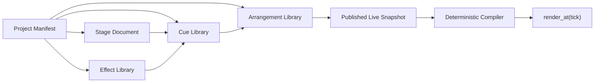

# Lumina 无音频 TempoMap、Cue 与 Arrangement 架构重构指引

> - 状态：Completed，Stage 7 退出条件已满足
> - 决策日期：2026-08-03
> - 前置状态：Stage 6 已完成；原 Stage 7 音频方向已停止
> - 推荐分支：`codex/tempo-cue-arrangement`
> - 后续阶段：Stage 7.5 Authoring Workflow / Production Layout / Effect Catalog / Dynamic Targeting

## 1. 这次为什么重构

Lumina 的核心价值是让 DJ 在可确定的音乐时间中编排灯光效果，而不是成为音频播放器或歌曲分析器。原 Stage 7 把合理的 Arrangement TempoMap 与音频资产、解码、波形、SongAnalysis、采样位置和 A/V 延迟校准绑定在一起，扩大了产品和运行时边界，也继续把舞台、效果和时间轴塞在同一份 `ShowDocument` 中。

新的产品方向明确为：

- 每个 Arrangement 自己保存确定性的 TempoMap 和拍号；默认可以是单一固定 BPM，也允许用户编写多段 BPM。
- 所有位置、长度、循环和关键帧继续使用整数 tick。
- Lumina 不导入、播放或分析音频，不显示波形，也不维护歌曲段落检测。
- 舞台、效果、效果组合和时间轴是独立、可版本化、可复用的资产。
- 一个工程可以保存多个 Arrangement，例如固定 128 BPM、带 breakdown 变速的演出版和另一套拍号配置。

这不是回退 Stage 5 的时间轴能力。`MusicalTime`、确定性 `render_at`、Play/Pause/Stop/Seek、循环、关键帧、Undo/Redo 和 60Hz 调度继续保留。

## 2. 产品路径与术语

目标用户路径：

```text
Stage → Effect Lab → Cue Builder → Arrange → Rehearse / Live
```

统一使用以下术语，避免“Effect Group”和灯具 Group 混淆：

| 概念          | 用户理解                 | 配置职责                                                   |
| ------------- | ------------------------ | ---------------------------------------------------------- |
| Stage         | 我的灯具舞台             | Fixture、Patch、Layout、Fixture Group 和 TargetSet         |
| Effect        | 一个可复用的动态算法     | EffectGraph、参数、能力和风险 metadata，不包含时间轴       |
| Cue           | 一个可直接触发的效果场景 | 把多个 Effect 绑定到 TargetSet，定义混合、参数、相位和循环 |
| Arrangement   | 一套 tempo-driven 编排   | TempoMap、拍号、长度、轨道、CueClip 和 automation          |
| Live Snapshot | 当前演出的不可变快照     | 固定 Stage、Effect、Cue 和 Arrangement revision            |

Fixture Group 表示稳定的舞台语义，例如 Front、Back、All Fixtures。TargetSet 表示某次效果使用的空间选区，例如 3×3 分区中的中间区域。连续变化通过 Spatial Mask/Weight 表达，不在播放期间修改 Group membership。

## 3. 新的配置边界



这些资产可以暂时存放在同一个工程目录或容器中，但必须拥有独立 schema、稳定 ID、revision 和引用关系。禁止重新做成一个所有内容相互内嵌的巨型 JSON。

### 3.1 Project Manifest

只负责工程索引和当前选择：

```text
ProjectManifest
  schema_version
  project_id / name
  stage_ref
  effect_library_ref
  cue_library_ref
  arrangements[]
  active_arrangement_id
```

### 3.2 Stage Document

包含 Fixture Profile 引用、Patch、Layout、Fixture Group 和预编译 TargetSet。Stage 不包含 EffectGraph、CueClip 或 Arrangement tracks。

### 3.3 Effect Definition

Effect 是与时间轴和具体舞台解耦的算法资产，保存 graph、参数 schema、默认值、capability、catalog metadata 和 risk metadata。Effect revision 不得被 Arrangement 直接内嵌复制。

### 3.4 Cue Definition

Cue 是“布局选区 + 一个或多个效果”的组合层：

```text
CueDefinition
  id / revision / name
  compatible_stage_revision
  nominal_length_ticks
  layers[]
    effect_definition_ref
    target_set_ref
    parameter_overrides
    phase / seed
    layer / priority / mix overrides
  cue_automation[]
  trigger_mode
  quantize
  capability / risk summary
```

Cue layer 接管当前全局 `EffectInstance` 的职责：它固定 Effect revision、TargetSet、parameter overrides、phase 和 seed。Effect Library 中不再保存绑定具体 Group 的全局 EffectInstance，Timeline 也不再直接引用 EffectInstance。

Cue 可以表示一个全场 Pulse、九宫格交替 Strobe、多个灯条上的渐变组合，或者一个由亮度、颜色和运动三层效果组成的完整 Look。Cue 固定引用 Effect revision，Effect 后续编辑不得静默改变已经发布的 Cue。

### 3.5 Arrangement Document

Arrangement 是独立保存、且不依赖音频的音乐时间轴：

```text
ArrangementDocument
  id / revision / name
  ppq
  tempo_map[]
    time_tick / bpm
  time_signatures[]
  length_ticks
  tracks[]
    CueClip[]
    AutomationLane[]
  markers[]            # 用户手工命名，可选，不来自音频分析
```

`CueClip` 只引用 Cue ID/revision，保存 start、duration、source offset、loop、layer 和有限的实例 override。Arrangement 不包含完整 Layout、EffectGraph 或 CueDefinition。

同一个 Stage、Effect Library 和 Cue Library 可以被多个 Arrangement 复用。编辑 TempoMap 不重新计算 clip 的 tick 位置，只改变 tick 与 wall-clock time 的确定性换算。

## 4. Tempo-driven Transport

公开配置保留 `ppq`、用户编写的 TempoMap points 和拍号信息。TempoMap 是 Arrangement 时钟能力，不代表音频或歌曲分析；配置不包含 audio asset、sample position、分析 downbeat 或任何音频从时钟。

运行时规则：

- Transport 的权威位置仍是整数 tick。
- tick↔seconds 按 tempo segment 以整数/有理中间量累计，换算边界和长时多段 tempo 必须测试。
- Effect speed 使用 cycles-per-beat 或 beat ratio，不保存音频秒数。
- 用户可以输入、微调或 Tap BPM，也可以在 Advanced Mode 编写多个 tempo point；这些都是 Arrangement 数据，不来自音频分析。
- 改变 TempoMap 不移动 CueClip；已经播放的位置从同一权威 tick 按新 map 换算。
- Live Snapshot 固定 Arrangement revision、TempoMap 和拍号；Draft 修改不得静默影响 Live。

Stage 5 的分段 TempoMap、MusicalTime 和 monotonic clock 继续作为稳定基础。后续重构可以把 TempoMap 从单体 ShowDocument 移入独立 Arrangement contract，但不得把它误删为音频能力。

## 5. 动态 Targeting 基础

这部分从原 Stage 7.5 前移，因为 Cue 没有稳定的 TargetSet 就无法成立。

- Stage 编译不可变的 TargetSet：All、Rows、Columns、Odd/Even、Checkerboard、Center/Edges、R×C Zones 和 Per-bar。
- Cue layer 引用 TargetSet；必要时 CueClip 可以选择被明确允许的 target override。
- All → 多分区 → All 通过不同 Cue 或 TargetingScene 编排，不修改全局 Group。
- 平滑展开、收缩和移动边界使用 fixture weight 或 Spatial Mask。
- compile 阶段生成 bitset、fixture index、partition index 和 spatial cache；render 热路径不做逐灯 `Vec::position`。
- 相同 Stage/Cue/Arrangement revision、tick 和 seed 必须得到相同 Frame。

Stage 7 只建立上述 contract、compiler/runtime 边界和最小 30×30 fixture 测试；完整布局编辑器、Production Catalog、丰富效果和性能矩阵仍由 Stage 7.5 完成。

## 6. 音频能力清理边界

### 必须移除

- Song 工作区、Song navigation、Song spine 和音频相关空态文案。
- AudioAsset、SongAnalysis、waveform cache、beat/downbeat/section analysis 数据。
- 音频导入、relink、解码、缓存、播放和文件访问命令。
- Rodio/Symphonia 等只服务音频链路的依赖。
- sample position、audio follower、A/V drift、audio latency 和 click/flash calibration。
- 波形、beat-grid、section、TempoMap correction 等前端组件和测试。
- Stage 7 音频 evidence、能力声明及不再适用的风险和发布门槛。

### 必须保留

- Monotonic clock、整数 MusicalTime 和 PPQ。
- Play/Pause/Stop/Seek/Loop 以及确定性顺序播放。
- Timeline clips、typed automation、关键帧和 Undo/Redo。
- Draft、Published、Live Snapshot 隔离。
- 灯光 output latency 的抽象空间可以留给 Stage 9，但当前不保留 A/V 校准产品能力。

### 基线处理策略

Stage 6 发布收口已经选择 `abd973a` 作为干净基线：`4f7a07c`、`23ec7cf`、`950fce0` 和未提交的 shared-audio-transport 均不属于交付产品树。新 Goal 应从合并后的最新 `main` 创建分支，先用 tree/dependency/dead-code gate 复核该边界，再开始 ADR-0010；不得重新合入或 cherry-pick 旧实验。

如果未来需要读取在其他渠道实际发布过的 V5 音频文档，才采用显式向前迁移：读取第一个有效 BPM 生成 Arrangement，并报告被移除的 audio、analysis、tempo changes。当前 `main` 没有该 V5 contract，不应为未发布格式预先引入兼容 runtime。

## 7. 工作区调整

一级工作区调整为：

```text
Stage | Effect Lab | Cues | Arrange | Live / Rehearse | Advanced
```

- Cues：创建、复制、版本化、循环预览和组合多个 Effect layer。
- Arrange：顶部选择或新建 Arrangement，编辑名称、BPM、拍号和长度；Library 的主要可放置资产是 Cue。
- Effect 可以作为 Advanced placement 保留，但普通路径优先放置 Cue，避免用户在时间轴重复搭建相同多层组合。
- Arrangement Library 显示多个配置及其 BPM、长度、Stage/Cue revision 状态，并支持复制成新的 BPM 版本。
- 原 Song rail、导入入口、波形区域和 A/V diagnostics 完全移除，不保留禁用占位。

## 8. 推荐实施切片

### Slice A：决策和安全基线

建立新的 ADR，固定术语、资产边界、TempoMap 所有权和迁移策略；确认 Stage 6 closure 基线不含音频 runtime，并保留 Stage 5 多段 tempo 行为。

### Slice B：移除音频方向

清理 Rust、Tauri、依赖、schema、generated types、前端 Workspace 和文案中的音频专属能力。Transport 继续使用 Stage 5 TempoMap，完整测试 Play/Pause/Stop/Seek/Loop 与 30 分钟多段 tempo 等效漂移。

### Slice C：拆分可版本化资产

实现 Project Manifest、Stage、Effect Library、Cue Library 和 Arrangement schema/ref validation。编译入口从“整份 ShowDocument”变为“解析项目依赖后编译选中的 Arrangement Snapshot”。

### Slice D：Cue 与动态 Target contract

实现 CueDefinition、Cue layer、TargetSet、revision pin、capability validation、编译缓存和确定性求值。至少验证全量 → 3×3 分区 → 全量。

### Slice E：多 Arrangement 产品路径

用 Cues 工作区替换 Song；实现 Arrangement 新建、复制、重命名、BPM/拍号/长度编辑、选择与保存；Timeline 改为 CueClip，并保留原生 PointerEvents、snap 和单次 Undo transaction。

### Slice F：迁移、原生验收和交接

完成旧工程迁移、模板重构、真实 Tauri 用户路径、性能和回归验证；更新总路线，明确交接 Stage 7.5 的未完成项。

## 9. 验收路径

用户无需打开 Raw DSL 即可完成：

1. 创建一个 Stage 和 30×30 矩阵。
2. 创建 Pulse 与 Gradient 两个 Effect。
3. 创建一个 Cue，把两个 Effect 分别绑定到 All 和 3×3 TargetSet。
4. 创建 `House 128` Arrangement，将 Cue 放置到时间轴并添加 automation。
5. 复制为 `Tempo Journey`，增加 tempo change 后保持所有 beat/tick 位置不变。
6. 在两个 Arrangement 间切换、保存、重新打开、Seek、Loop、Undo/Redo。
7. Publish 并 Take Live 后修改 Draft，Live Snapshot 输出保持不变。

退出门槛：

- 产品和代码中不存在可触达的音频导入、播放、分析、波形或 A/V 校准能力。
- Stage、Effect、Cue、Arrangement 是独立 revision contract，引用错误返回结构化 Diagnostic。
- Arrangement 配置不内嵌 Layout、EffectGraph 或 CueDefinition。
- 同一 Cue 可被至少两个不同 TempoMap Arrangement 复用。
- Effect/Cue revision 更新不会静默改写已发布 Arrangement。
- 30×30 全量 → 9 zones → 全量可确定性 Seek/Replay，并保持 60Hz 帧预算。
- `pnpm check:all`、`pnpm build`、Rust tests、schema generation/contract、migration 和真实 Tauri 路径全部通过。

## 10. Stage 7.5 的剩余范围

2026-08-04 对 Stage 7 最终实现的真实 Tauri 复审确认：资产/revision/compiler 边界已经成立，不应重新打开；但新 contract 接入时采用的 Stage、Lab/Cues 和 Arrange 临时面板没有达到 Stage 5/6 的作者工作流能力。详细证据与替换边界见 [`stage7-workflow-audit.md`](./stage7-workflow-audit.md)。

Stage 7.5 必须按以下顺序继续：

- 先完成共享 Authoring Transport/PreviewClock：Lab、Cues、Arrange 都能看见 Play/Pause/Stop、BPM、拍号、bar.beat.tick 和 loop。
- 将 zoom、snap、CueClip move/resize、键盘替代和 typed automation 迁入 production `ArrangementTimeline`。
- 建立 LayoutPreset Library；区分可表单编辑的 Basic layout 与带 editor capability 的 Generated/Advanced layout，并补齐 Save、Save As、Duplicate 和安全的 Stage upgrade/remap 流程。
- 无缝矩阵、矩形灯条、灯条墙和灯框的完整几何编辑体验。
- 30×30 及更大布局的可视化分区编辑器。
- Production Effect Catalog、历史效果审计和无效配置清理。
- 频闪、慢速氛围、空间扫描和 transition 等生产效果族。
- 多布局 golden frame、1,000 fixtures 多层 benchmark 和真实 Tauri 视觉证据。

Stage 7.5 不再负责发明 Cue/Arrangement 边界，也不逐个修补将被替换的临时面板；它先恢复 production authoring parity，再在稳定 contract 上补齐 Layout、Targeting、Effect/Cue content 和工具。权威切片与退出条件见总路线的 7.5A–7.5E。

## 11. 新 Goal 启动指引

以下文本是已经完成的 Stage 7 历史启动指引，不再用于创建新 Goal：

> 创建一个 Goal，按照 `docs/fixed-bpm-cue-arrangement-refactor.md` 重构 Lumina。Stage 6 已完成，原 Stage 7 音频方向已从产品树清理。基于最新 `main` 创建 `codex/tempo-cue-arrangement`，先建立 ADR-0010，复核无音频残留并明确保留 Stage 5 多段 TempoMap，再严格按 Slice A–F 推进：拆分 Stage、Effect、Cue、Arrangement 的版本化配置；实现 Cue、TargetSet 和多 Arrangement 用户路径；完成 schema migration、测试、真实 Tauri 验收及路线文档更新。每个切片自审并增量提交，满足退出门槛后停止，不进入 Production Catalog、AI 或真实硬件输出。

## 12. 明确非目标

- 音频导入、播放、波形、歌曲结构或能量分析。
- MIDI Clock、Ableton Link 等外部同步；如未来需要，应作为独立 adapter 重新评估。
- AI 生成编排。
- Stage 7.5 的完整 Production Effect Catalog。
- Art-Net、sACN 和真实硬件输出。
- 3D 舞台或视频映射。

## 13. 实现与验证结果

Stage 7 已在 `codex/tempo-cue-arrangement` 上按 Slice A–F 完成，严格停止在本指引边界：

- `61c150b`：ADR-0010、Stage 6/无音频基线与 Authoring Preview 问题清单。
- `040e44b`：独立 Project、Stage、Effect、Cue、Arrangement schema 与引用诊断。
- `9e67d53`：Cue compiler、TargetSet bitset/index/partition/weight cache、30×30 确定性测试。
- `8087071`：PreviewSession/RenderContext、Draft/Published/Live revision 边界、V1–V4 migration。
- `004fca4`：Stage、Effect Lab、Cues、Arrange、Live/Rehearse 无 Raw DSL 用户路径。
- `9de1301`：真实 Tauri 验收发现的大矩阵 Canvas、preview 重启和 Live catalog 隔离修复。

最终验证：`pnpm check:all`、`pnpm build`、debug Tauri app bundle、116 个前端测试、101 个 Rust unit 与 12 个 integration/contract 测试全部通过。真实 Tauri 已完成最大化、配置 1440×900 和最小 1100×720 路径；详细证据见 [`evidence/stage7-tempo-cue-arrangement/`](./evidence/stage7-tempo-cue-arrangement/README.md)。

Stage 7.5 Authoring Workflow、Production Catalog、动态可视化编辑、AI 与真实硬件输出未进入实现。后续执行应以 [`lumina-overhaul-plan.md`](./lumina-overhaul-plan.md) 的 7.5A–7.5E 和 [`stage7-workflow-audit.md`](./stage7-workflow-audit.md) 为准；本文件只保留 Stage 7 的已完成决策与验证记录。
