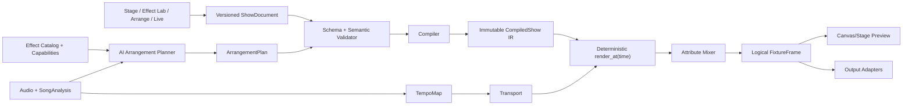
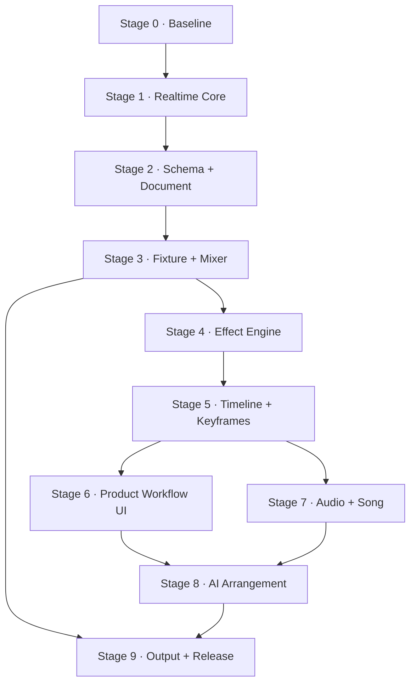
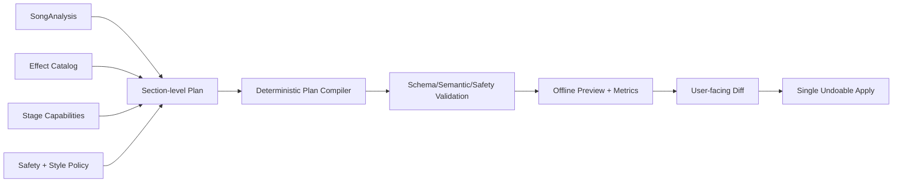

# Lumina 分阶段改造与长期 Goal 执行计划

> - 文档状态：Active
> - 基线分支：`main`
> - 基线提交：`d1d718e`
> - 建立日期：2026-08-02
> - 适用范围：Rust/Tauri 实时引擎、JSON DSL、React 编辑器、时间轴、歌曲分析、AI 编排与舞台输出

## 1. 文档目的

本文档是 Lumina 后续改造的唯一主计划，用于驱动一个跨多次对话持续执行的长期 Goal。每次实现都应从本文档读取当前 Stage、完成状态、未决设计和验证结果，而不是依赖历史聊天上下文。

建议 Goal 目标文本：

> 按照 `docs/lumina-overhaul-plan.md` 的顺序完成 Lumina Stage 0 至 Stage 9 改造；每次只推进当前最早未完成且未阻塞的 Stage，满足其退出条件后更新 Stage 状态、Progress Ledger、ADR、验证结果和下一步，不提前把 Goal 标记为完成。

本文档同时承担以下职责：

- 固定产品目标和不可破坏的系统约束。
- 明确各 Stage 的范围、依赖、交付物和退出条件。
- 为跨对话实现提供稳定的交接格式。
- 记录设计决策、兼容性、风险、测试和性能基线。
- 防止在实时内核尚不可信时过早堆叠 AI、模板或硬件协议。

## 2. 产品目标

Lumina 的目标不是普通灯控台的复刻，而是一个面向 DJ 和小型演出创作者的“音乐驱动视觉等效编排系统”：

1. 用户建立或选择舞台灯具布局。
2. 用户在 Effect Lab 中创建可复用的频闪、脉冲、渐变、追逐、空间波、颜色和运动效果。
3. 用户导入歌曲，获得 BPM、节拍、小节、段落和能量信息。
4. 用户手工或通过 AI 把效果资产编排到整首歌曲。
5. 用户在统一预览中排练、校准并安全输出到真实灯具。

最终体验路径：

```text
Stage Setup → Effect Lab → Song Analysis → Arrangement → Rehearsal → Live/Export
```

Raw JSON DSL 保留为 Advanced Mode 和 AI/自动化接口，不应继续作为普通用户的主编辑界面。

## 3. 当前基线

当前仓库已经具备：

- Tauri 2 + React 19 桌面外壳。
- JSON DSL、Rust parser/compiler 和 18 个模板。
- matrix、circle、formula、custom 布局。
- fixture group、sort 和 spread/grouped phase。
- color/dimmer Phaser step 求值。
- Live Pad、二维 Canvas 和基础 Timeline。
- `from → to` Float/Color automation。
- `pnpm build` 可通过。

当前基线不具备生产可用性，关键已知问题包括：

| 领域        | 当前问题                                                | 首次处理 Stage |
| ----------- | ------------------------------------------------------- | -------------- |
| 实时调度    | 120 BPM 时约 16Hz；固定 beat 增量会漂移                 | Stage 1        |
| 并发        | `play()` 可重复启动线程；存在 show/runtime 锁顺序反转   | Stage 1        |
| Transport   | Pause 清除 active phaser；Stop/Seek/Resume 语义不确定   | Stage 1        |
| Frame diff  | 首帧或 fixture 数量变化可能产生空/不完整 diff           | Stage 1        |
| DSL 安全    | mode 配置和颜色解析可 panic；未知字段可能被丢弃         | Stage 2        |
| Schema 漂移 | TS/Zod 与 Rust 手写 schema 已不一致                     | Stage 2        |
| 灯具属性    | 引擎只真正支持 color/dimmer                             | Stage 3        |
| 混合        | 所有 RGB/dimmer 使用 `max`，没有属性级 HTP/LTP          | Stage 3        |
| Effect      | `phaser.multiplier` 没有稳定进入运行时                  | Stage 4        |
| Keyframe    | 只有 from/to clip，没有多关键帧和结构化 target          | Stage 5        |
| Timeline    | overlap 会隐式裁剪；animation 子轨不计入宽度            | Stage 5        |
| 交互性能    | drag/resize 的 pointer move 仍触发 React state 更新     | Stage 5/6      |
| 用户路径    | 没有视觉 Effect Lab；默认窗口中央预览只有约 94px        | Stage 6        |
| 歌曲        | 没有音频、波形、tempo map、downbeat 和段落              | Stage 7        |
| AI          | 没有结构化规划、验证、修复和可解释应用流程              | Stage 8        |
| 舞台输出    | 没有 Fixture Profile、Universe、Art-Net/sACN 和故障保护 | Stage 9        |
| 测试        | Rust 当前为 0 个测试，前端没有测试命令                  | Stage 0        |

## 4. 不可破坏的系统约束

所有 Stage 都必须遵守以下约束。

### 4.1 确定性

给定相同的 `ShowDocument`、资源版本和时间点，离线求值、Canvas 预览和硬件输出必须得到相同的逻辑 Frame。实时调度只负责选择时间点和发送 Frame，不得在 scheduler 中隐藏业务状态变化。

### 4.2 单一时钟来源

- 引擎使用 monotonic clock，不使用 wall clock。
- 音乐时间用整数 tick 表示，禁止用 `f64` 直接比较事件边界。
- TempoMap 负责 tick 和 seconds/sample time 的双向映射。
- Canvas 不得用额外插值改变频闪、cut 或 snap 的语义；视觉抗锯齿必须是显式预览选项。

### 4.3 单一 Schema 契约

- `ShowDocument` 必须有 `schema_version`。
- Runtime 不接受未经验证的自由 JSON。
- 未知字段、非法引用、非法范围必须返回结构化诊断，不得静默忽略或 panic。
- Rust、JSON Schema 和 TypeScript 类型必须通过生成或契约测试保持一致。

### 4.4 属性级混合

- Intensity/Dimmer 默认 HTP。
- Color、Pan、Tilt、Zoom、Gobo 等默认 LTP，由 priority 和 activation order 决定。
- Strobe 默认 LTP，并经过安全限制器。
- Add、Multiply、Mask 等混合只能显式声明，不能隐式发生。

### 4.5 编辑态和演出态隔离

- 编辑器可以热编译草稿，但不得直接破坏正在 Live 输出的 active show。
- Live 必须使用已验证、已发布的 immutable Show Snapshot。
- 从草稿切换到 Live Snapshot 必须是显式操作，并可回滚。

### 4.6 可恢复性

- 所有用户编辑走 command/history 模型，支持 Undo/Redo。
- 工程文件使用原子保存并维护 schema migration。
- AI 生成必须先展示 diff，再由用户 Apply；Apply 后可以一次 Undo。

### 4.7 安全

- 始终保留独立于 show 的 Emergency Blackout。
- 对频闪频率、持续时间、亮度和硬件输出速率提供可配置限制。
- 输出断线、应用崩溃或 adapter 错误必须进入已定义的 fail-safe 状态。

## 5. 目标架构



### 5.1 核心数据模型

#### ShowDocument

用户可编辑、可迁移、可保存的工程模型，建议至少包含：

- `schema_version`
- `metadata`
- `stage`
- `fixture_profiles`
- `patch`
- `layout`
- `groups`
- `effect_definitions`
- `songs`
- `arrangements`
- `output_config`
- `safety_policy`

#### CompiledShow

只读运行时 IR：

- 所有 ID 和引用已解析。
- 属性已根据 Fixture Profile 类型化。
- EffectGraph 已拓扑排序或编译为可快速求值形式。
- Timeline/Automation 已转换为整数 tick 索引。
- Mixer route 和 output route 已预计算。
- 运行时不再解析 JSON、颜色字符串或自由 target path。

#### RuntimeSnapshot

不可变的 Live 输入：

- `show_revision`
- `compiled_show`
- `transport_state`
- `active_live_overrides`
- `safety_state`
- `output_health`

#### Logical FixtureFrame

与具体协议解耦的逻辑帧：

```text
FixtureId → AttributeId → TypedAttributeValue
```

预览和 Output Adapter 都消费此 Frame。

## 6. Stage 依赖与状态



| Stage | 名称                                    | 状态        | 依赖 | 核心退出信号                                |
| ----- | --------------------------------------- | ----------- | ---- | ------------------------------------------- |
| 0     | Baseline 与质量护栏                     | completed   | 无   | 测试框架、基线和 CI 可用                    |
| 1     | 实时内核与 Transport                    | completed   | 0    | Clock/Play/Pause/Stop/Seek 确定且无重复线程 |
| 2     | Versioned Document 与统一 Schema        | completed   | 1    | 单一 schema 契约、migration、零 panic       |
| 3     | Fixture Attribute、Mixer 与 Output 抽象 | completed   | 2    | 通用属性、HTP/LTP、Null/Preview Sink        |
| 4     | 可扩展 Effect Engine                    | completed   | 3    | EffectGraph/参数/空间相位可确定性求值       |
| 5     | Timeline、Keyframe 与 Undo/Redo         | completed   | 4    | 多关键帧、seek/replay、无隐式数据破坏       |
| 6     | 用户工作区与 Effect Lab                 | not_started | 5    | Stage→Effect→Arrange→Live 主路径可用        |
| 7     | Audio、TempoMap 与歌曲分析              | not_started | 5    | 波形、节拍、段落和灯光同步可验证            |
| 8     | AI 整曲编排                             | not_started | 6、7 | AI 计划可验证、可解释、可预览、可撤销       |
| 9     | 舞台输出、安全与 Release                | not_started | 3、8 | Art-Net/sACN、故障保护和发布门槛完成        |

状态只允许：`not_started`、`in_progress`、`blocked`、`completed`。

## 7. Stage 0：Baseline 与质量护栏

### 目标

在改变行为前建立可复现基线，让后续 Stage 能证明“没有破坏已有能力”并准确量化改进。

### 范围

#### 0.1 测试基础设施

- [x] 为 Rust compiler、phaser、timeline、frame diff 建立首批单元测试。
- [x] 加入至少一个端到端 golden show：DSL → compile → 指定 tick Frame。
- [x] 为前端加入测试命令和轻量组件/状态测试框架。
- [x] 为模板建立 contract test：所有模板必须通过同一 schema 和 Rust compile。
- [x] 测试禁止只断言“不崩溃”；必须断言 fixture/attribute/timing 输出。

#### 0.2 基线数据

- [x] 记录 100、500、1,000、2,000 fixtures 下 `compute_frame` 的 release 性能。
- [x] 记录当前模板 compile 时间和 bundle 大小。
- [x] 建立 10 秒 scheduler 漂移测试。
- [x] 建立重复 Play、Pause/Resume、Stop/Reset、fixture count change 的回归用例。

#### 0.3 自动化检查

- [x] 固定并文档化 Node、pnpm、Rust toolchain 版本。
- [x] 增加统一 `pnpm check`，串联 format check、TypeScript、前端测试和 Vite build。
- [x] 增加统一 Rust check：`cargo fmt --check`、`cargo clippy --all-targets -- -D warnings`、`cargo test`。
- [x] 若仓库启用 CI，CI 必须执行上述检查。

#### 0.4 诊断格式

- [x] 定义 `Diagnostic { code, severity, path, message, hint }`。
- [x] 为现有 compile error 分配稳定 code。
- [x] 前端不得只把异常写入 console；必须呈现可定位错误。

### 交付物

- 测试目录和 golden fixtures。
- 基线结果文档或 machine-readable benchmark artifact。
- `pnpm check` 和 Rust check 命令。
- 首版 Diagnostic contract。

### 退出条件

- Rust 测试数量大于 0，且覆盖当前 compile/phaser/timeline/frame diff 主路径。
- 所有 18 个模板经过前后端同一条 contract test。
- 基线性能与漂移数据已记录。
- CI/本地统一检查全部通过。
- Progress Ledger 记录基线 commit 和验证结果。

### 非目标

- 不修复 scheduler 架构。
- 不引入新 DSL 能力。
- 不重做 UI。

## 8. Stage 1：实时内核与 Transport

### 目标

把当前“能动起来”的 scheduler 改造成可测试、单实例、无漂移且具有明确 Transport 语义的实时核心。

### 设计要求

#### 1.1 Clock 与调度

- [x] 引入可注入 `Clock`：Production 使用 monotonic clock，测试使用 ManualClock。
- [x] scheduler 根据真实 elapsed time 计算当前位置，不再固定累加 `1/subdivision`。
- [x] Transport 和 renderer 解耦；renderer 提供纯函数式 `render_at(RenderTime)`。
- [x] 默认逻辑输出频率 60Hz，可配置 30/60/120Hz。
- [x] 落后时按当前真实时间重算，不通过跳过 sleep 来累积时间误差。
- [x] 移除每 tick 新建 Tokio runtime 和长时间 spin-loop。

#### 1.2 单实例生命周期

- [x] `start` 必须幂等或明确返回 `AlreadyPlaying`。
- [x] scheduler 由单个 task/thread handle 管理，可取消并 join。
- [x] Stop 完成后必须确认 worker 已退出，才能再次启动。
- [x] app shutdown 时安全停止 scheduler 和 output adapters。

#### 1.3 Transport 状态机

规范语义：

| 操作  | Cursor                 | 逻辑输出       | Active clips                  | 参数状态           |
| ----- | ---------------------- | -------------- | ----------------------------- | ------------------ |
| Play  | 从 cursor 继续         | 按时间求值     | 由 `render_at` 重建           | 由时间求值         |
| Pause | 保持                   | 保持最后一帧   | 不依赖临时列表恢复            | 保持               |
| Stop  | 回到 arrangement start | Blackout       | 清空 transient live overrides | 回到初始值         |
| Seek  | 移到目标 tick          | 立即重算目标帧 | 从 timeline 重建              | 从 automation 重建 |

- [x] 用显式 enum 表达 `Stopped/Playing/Paused/Seeking/Error`。
- [x] Stop 与 Pause 不再共用同一 backend command。
- [x] 所有状态变化发出带 revision 的单一 `engine:state-change`。

#### 1.4 并发和 Snapshot

- [x] 消除 `compiled_show` 与 `runtime` 的嵌套反向锁。
- [x] 优先使用短锁和 immutable `Arc<CompiledShow>` snapshot。
- [x] 编辑态 compile 成功后生成新 revision，不在持锁时执行昂贵计算。
- [x] 明确锁顺序并添加并发回归测试。

#### 1.5 Frame 发布

- [x] 首帧、revision 改变、fixture topology 改变时必须发送 full frame。
- [x] diff 按 fixture ID/attribute 比较，不依赖 slice `zip`。
- [x] Frame payload 包含 `show_revision`、`frame_sequence` 和逻辑时间。
- [x] 丢帧/乱序帧可由前端检测并请求 full resync。

### 验证

- ManualClock 下同一时间点重复渲染结果完全一致。
- 重复调用 Play 不会出现第二 worker。
- Play 10 分钟后逻辑时间误差满足基线中确定的容差。
- 任意 tick Seek 后的 Frame 等于从 0 顺序播放到该 tick 的 Frame。
- 并发 reload/play/stop 压力测试无死锁。
- fixture 数量变化后下一帧完整同步。

### 退出条件

- Transport 状态机和 scheduler 生命周期测试全部通过。
- 当前所有模板可在新 runtime 播放。
- Pause/Resume、Stop、Seek 行为符合上表。
- 没有嵌套反向锁和未 join worker。
- 实际输出更新频率达到配置值，漂移测试通过。

## 9. Stage 2：Versioned Document 与统一 Schema

### 目标

建立对人、UI、AI 和 Rust 运行时一致的版本化工程契约，彻底消除静默字段丢失、自由字符串引用和解析 panic。

### 推荐决策

采用 Rust document types 作为语义权威，通过 `schemars` 或等价工具生成 JSON Schema；TypeScript 类型从该 Schema 生成或通过契约测试验证。前端运行时使用生成的 JSON Schema validator，不再独立手写一份不等价的 Zod 树。

在开始实现前记录 ADR，确认最终生成工具和 checked-in artifact 策略。

### 范围

#### 2.1 三层模型

- [x] `ShowDocumentV1`：用户文件格式。
- [x] `ValidatedShow`：所有引用和范围已验证。
- [x] `CompiledShow`：运行时优化 IR。
- [x] 禁止 UI 类型直接等同于 Runtime 类型。

#### 2.2 严格验证

- [x] document struct 默认拒绝未知字段。
- [x] mode 使用 tagged enum，避免 `mode=spread` 但 spread 缺失。
- [x] 颜色使用安全 parser，支持的格式必须明确。
- [x] 验证 fixture ID、group、effect、timeline target 的存在性和唯一性。
- [x] 验证数值：BPM、width、transition、dimmer、group size、duration、tick（当前文档字段全部覆盖；BPM 沿用 Stage 1 validator，整数 tick 在 Stage 5 引入时执行）。
- [x] 禁止 `unwrap/expect/panic` 处理用户或 AI 输入。
- [x] Formula/SVG 无法编译时返回 Diagnostic，不得 fallback 成另一条曲线。

#### 2.3 Schema 版本和 Migration

- [x] 顶层加入 `schema_version`。
- [x] 建立 `migrate_document(from, to)` 管线。
- [x] 为当前模板补充 V1 migration 或一次性转换。
- [x] 保存时写入当前版本；加载旧版本时保留迁移报告。
- [x] 未知的新版本必须 fail closed，不能尝试宽松读取。

#### 2.4 Structured Reference

替换自由字符串：

```text
"phaser:circle_ripple.color"
```

为结构化引用：

```json
{
  "scope": "effect_instance",
  "instance_id": "circle-ripple-01",
  "parameter_id": "color"
}
```

- [x] ID 与 display name 完全分离。
- [x] 所有引用在 compile 时解析为 typed handle/index。

#### 2.5 Tooling

- [x] 增加 schema generation/check 命令。
- [x] CI 检查生成文件是否与 Rust 类型同步。
- [x] Monaco 使用生成的 schema 做路径、enum、范围和补全提示。
- [x] AI 可直接读取同一 JSON Schema 和 capability metadata。

### 退出条件

- Rust/JSON Schema/TypeScript contract test 通过。
- 所有模板迁移到当前 `schema_version`。
- fuzz/property tests 覆盖无 panic 解析和 compile。
- 未知字段、坏颜色、坏引用、坏 phase config 都返回稳定 Diagnostic。
- 前端不再静默剥离 pan/tilt 等未知字段。

## 10. Stage 3：Fixture Attribute、Mixer 与 Output 抽象

### 目标

从硬编码 RGB/dimmer 升级为可扩展的灯具属性系统，并保证多效果组合具有可解释的混合语义。

### 核心模型

```text
FixtureProfile
  └─ AttributeDescriptor[]
       ├─ id
       ├─ value_type
       ├─ physical_range
       ├─ default_value
       ├─ mix_policy
       └─ output_mapping
```

建议首批属性：

- `intensity`
- `color.rgb`
- `position.pan`
- `position.tilt`
- `beam.zoom`
- `beam.strobe`
- `beam.gobo`

建议值类型：Scalar、Color、Angle、Enum、Boolean。

### 范围

#### 3.1 Fixture Profile

- [x] 定义内置 Generic RGB、RGBW、Moving Head profile。
- [x] patch 引用 profile，不再只有 `spot/pixel`。
- [x] profile 定义 capability、默认值、物理范围和 protocol mapping。
- [x] layout 只描述空间位置，不承担灯具能力定义。

#### 3.2 Attribute Frame

- [x] `FixtureOutput` 改为通用 typed attribute frame。
- [x] 编译阶段把属性字符串解析为内部 AttributeHandle。
- [x] 未被 effect 写入的属性回落到 profile/default/base look。
- [x] Preview 只读取它能展示的属性，但不得改变源 Frame。

#### 3.3 Mixer

- [x] 实现 HTP、LTP、Add、Multiply、Mask。
- [x] 每次 effect write 携带 layer、priority、activation order 和 optional weight。
- [x] 属性默认 mix policy 来自 profile，可被 track/effect 显式覆盖。
- [x] LTP tie-break 必须稳定且可测试。
- [x] 冲突可生成可解释 Diagnostic/Inspector 信息。

#### 3.4 OutputSink 抽象

```text
trait OutputSink {
  capabilities()
  start()
  send(frame)
  blackout()
  health()
  stop()
}
```

- [x] `NullSink` 用于测试。
- [x] `PreviewSink` 或统一 Frame subscription 用于 Canvas。
- [x] `RecordingSink` 用于 golden frame 和离线导出。
- [x] 真实网络协议延后到 Stage 9。

#### 3.5 兼容迁移

- [x] 当前 `color/dimmer` 模板自动映射到新属性。
- [x] 明确 pan/tilt 模板此前被忽略的行为变更。
- [x] 旧 Canvas 可在过渡期通过 adapter 消费新 Frame。

### 验证

- 两个 intensity effect 以 HTP 混合。
- 两个 color/position effect 按 priority + LTP 稳定选择。
- mask/add/multiply 只在显式配置时发生。
- Generic Moving Head 的 pan/tilt 能进入 RecordingSink。
- Preview 与 RecordingSink 在同一逻辑时间消费同一 Frame revision。

### 退出条件

- 不再由核心引擎硬编码 RGB/dimmer struct。
- 属性混合矩阵和冲突测试完成。
- 当前模板兼容迁移通过。
- OutputSink contract 稳定，可支持后续协议。

## 11. Stage 4：可扩展 Effect Engine

### 目标

把 Phaser 从固定 step evaluator 升级为参数化、可组合、可预览和可被 AI 安全引用的 Effect Definition。

### Effect 数据流

```text
Time/Beat
  → Oscillator or StepSequence
  → SpatialPhase
  → Envelope/Easing
  → Transform/Clamp
  → Fixture Mask
  → Attribute Write
```

### 最小节点集

- Time/Beat input
- Constant
- StepSequence
- Sine/Triangle/Saw/Pulse oscillator
- Envelope
- SpatialPhase
- Math/Map/Clamp
- ColorGradient
- FixtureMask
- AttributeWriter

节点必须使用 typed ports，不允许运行时自由字符串连接。

### 范围

#### 4.1 EffectDefinition 与 EffectInstance

- [x] Definition 只描述可复用逻辑、参数 schema 和默认值。
- [x] Instance 保存 definition ID、target group、parameter overrides 和 seed。
- [x] 每个实例具有独立稳定 ID，Timeline 引用实例而不是 display name。
- [x] random 节点必须有 seed，相同 seed 的结果可复现（instance seed、node handle、fixture ID 与离散 cycle 派生，无共享 RNG）。

#### 4.2 Parameter Schema

- [x] 参数声明类型、默认值、范围、单位、UI hint 和 automation policy。
- [x] 首批通用参数：speed、phase、width、transition、intensity、color、direction。
- [x] `multiplier` 只保留一个定义和一个运行路径（仅在 V1/V2 migration 边界出现，runtime 统一为 `speed` handle）。
- [x] parameter override 与 automation 使用相同 typed reference。

#### 4.3 Spatial Phase

- [x] 支持按 fixture index、x、y、distance、angle、custom ordering 求相位。
- [x] 明确 spread 端点、wrap 和 grouped 语义（首尾包含、单灯固定起点、grouped 对组索引归一化、wrap 显式）。
- [x] layout 缺失或 group 为空时返回可解释结果（坐标 basis 缺失为结构化诊断；空组得到空 cache/零写入）。
- [x] 大型灯阵使用预计算排序和 phase cache。

#### 4.4 Phaser Compatibility

- [x] 把现有 Phaser 编译为 EffectGraph 或兼容 IR。
- [x] 所有现有视觉模板建立 before/after golden frame（18/18 模板、每个 instance、5 个 phase 比较 V2 migration 与 V3 Frame）。
- [x] 修正 pan/tilt 模板并标记行为变更（typed position attributes；migration report 使用 `MIGRATION_ENABLE_POSITION_ATTRIBUTES`）。

#### 4.5 Effect Catalog

- [x] EffectDefinition 增加 tags：mood、energy、density、motion、colorfulness、strobe risk。
- [x] 支持 built-in、project-local 和 user-library 三种来源。
- [x] 记录 effect revision；EffectInstance 固定引用 definition revision。
- [x] 提供 capability query，供 UI 和 AI 判断目标灯组是否支持某效果（metadata/risk filter、目标 profile 缺失属性解释、Tauri command）。

### 性能要求

- compile 阶段预计算 graph topology 和 fixture targeting。
- render 阶段不得分配大量短生命周期 Map/String。
- 对 1,000 fixtures × 多层效果建立 release benchmark。
- 若达不到 60Hz 帧预算，必须记录瓶颈和降级策略。

### 退出条件

- EffectDefinition/Instance/Parameter 模型完成。
- 最小节点集可确定性求值。
- 现有模板迁移并通过 golden frames。
- pan/tilt/color/intensity 可由统一 Effect Engine 写入。
- Effect Catalog 可供 UI/AI 查询能力和风险信息。

## 12. Stage 5：Timeline、Keyframe 与 Undo/Redo

### 目标

建立真正的音乐时间轴：效果 clip、任意多关键帧、结构化 automation、确定性 seek 和非破坏编辑。

### 时间模型

- [x] 定义 PPQ；默认 960 ticks per quarter note。
- [x] `MusicalTime` 使用整数 tick。
- [x] `TempoMap` 接口先存在，即使 Stage 7 前只有单 BPM。
- [x] event boundary、snap 和 duration 全部使用 tick。
- [x] UI 可以显示 bar.beat.tick 和 seconds，但不作为存储主值。

### Arrangement 模型

建议核心元素：

- Track
- EffectClip
- AutomationLane
- Keyframe
- Marker/Section
- Layer/Group

Keyframe 至少包含：

- `time_tick`
- `value`
- `interpolation`: hold、linear、ease、bezier
- optional in/out tangent

### 范围

#### 5.1 纯时间求值

- [x] Timeline 不保存依赖顺序 tick 的 transient `active_events` 真相。
- [x] 任意 tick 可通过索引快速查询 active clips 和 automation。
- [x] 顺序播放、从中间 Seek、Pause 后 Resume 必须得到相同结果。
- [x] automation 在 clip 结束 tick 精确输出终值。

#### 5.2 非破坏编辑

- [x] 删除当前自动裁剪 overlap 的隐式行为。
- [x] 明确 track overlap policy：layer、replace、reject 或 crossfade。
- [x] 所有裁剪/替换必须在 UI 预览并可 Undo。
- [x] 多选、复制、粘贴、duplicate、split、trim、loop 进入 command model。

#### 5.3 Undo/Redo

- [x] 建立 DocumentCommand 与 transaction。
- [x] drag 全过程只产生一个最终 history entry。
- [x] AI Apply 产生一个 transaction。
- [x] 保存点和 dirty state 可追踪。

#### 5.4 时间轴性能

- [x] pointer move 使用 DOM refs/transform 预览，不逐帧写 Zustand。
- [x] pointer up 时一次性提交 command。
- [x] 大量 clip 使用可见区域裁剪或 virtualization。
- [x] playhead 更新不触发所有 block React re-render。

#### 5.5 Automation UI

- [x] 可从参数菜单创建 lane。
- [x] 支持添加、移动、删除、框选关键帧。
- [x] 支持曲线/hold 类型和数值 inspector。
- [x] 颜色参数提供颜色编辑，角度/百分比显示正确单位。
- [x] lane 长度进入 timeline dimension 计算。

### 验证

- [x] 100 次随机 Seek 与顺序播放 Frame 一致。
- [x] clip 结束点输出精确终值。
- [x] overlap 不再静默修改其他 clip。
- [x] drag/resize 只产生一个 undo entry。
- [x] 1,000 clips 下滚动、拖动和 playhead 满足 UI 性能基线。

### 退出条件

- [x] 多关键帧和 typed automation 完成。
- [x] Transport Seek/Replay 与 Timeline 完全一致。
- [x] Undo/Redo 覆盖时间轴核心编辑。
- [x] 时间轴 pointer move 不逐帧更新全局 React state。
- [x] Accessibility 基础：键盘选择、移动、删除和可见 focus。

## 13. Stage 6：用户工作区与 Effect Lab

### 目标

把技术编辑器改造成 DJ 可以理解的产品路径，Raw DSL 退到 Advanced Mode。

### 信息架构

建议一级工作区：

1. **Stage**：灯具、布局、分组和输出检查。
2. **Effect Lab**：单效果创建、参数、目标和循环预览。
3. **Song**：音频、BPM、节拍、段落和 marker。
4. **Arrange**：效果 clip、automation 和 AI 草稿。
5. **Live/Rehearse**：Transport、Live Pad、诊断、Blackout。

### 范围

#### 6.1 Workspace Shell

- [ ] 使用可调节或可折叠 panel，不再固定 450px + 256px。
- [ ] 默认窗口建议至少 1280×800，推荐 1440×900；定义合理 min size。
- [ ] Canvas/Timeline 是主工作区，属性 Inspector 按选择上下文变化。
- [ ] 保留清晰的 project/show/song 名称和保存状态。

#### 6.2 Stage Setup

- [ ] Fixture Profile 选择、数量、ID/universe/channel 设置。
- [ ] matrix/circle/formula/custom 布局可视化编辑。
- [ ] group 创建、空间筛选、排序和测试点亮。
- [ ] fixture capability 和 patch 冲突实时提示。

#### 6.3 Effect Lab

- [ ] 新建、复制、重命名、删除、收藏 effect。
- [ ] 目标 group、属性、波形、速度、phase、width、transition 和 color controls。
- [ ] 单效果 loop preview、scrub 和 A/B comparison。
- [ ] EffectGraph 高级编辑器可后置；首版优先参数化表单和预览。
- [ ] 保存时生成 revision 和 capability/risk metadata。

#### 6.4 Arrange

- [ ] Library 支持 click-to-place 和 drag-to-place，两者都有明确提示。
- [ ] Track 名称显示用户名称，不直接显示 `phaser:id`。
- [ ] Audio waveform、section 和 marker 区域为 Stage 7 预留。
- [ ] 提供 empty state、快捷键帮助和错误恢复。

#### 6.5 Live/Rehearse

- [ ] Live Pad 支持 beat/bar quantize。
- [ ] effect 可配置 toggle、momentary、one-shot、exclusive group。
- [ ] Pause、Stop、Blackout 视觉层级不同，Blackout 始终可见。
- [ ] 显示 FPS、frame lag、output adapter、last error 和 show revision。
- [ ] 编辑草稿和 Live Snapshot 状态明确区分。

#### 6.6 Accessibility

- [ ] 所有 icon-only button 有可访问名称。
- [ ] timeline block、keyframe、resize、delete 支持键盘替代。
- [ ] 交互目标尺寸、对比度、focus ring 和 reduced motion 满足基线。
- [ ] 不以双击作为唯一删除入口。

### 用户验收路径

新用户应能在不编辑 JSON 的情况下：

1. 创建 4×4 RGB 灯阵。
2. 创建红色脉冲效果并保存。
3. 把效果放到 8 小节 Timeline。
4. 添加 intensity automation。
5. 播放、暂停、Seek、Stop。
6. 切到 Rehearse 并触发同一效果。

### 退出条件

- 上述路径不需要打开 DSL Editor。
- 默认窗口能同时提供可用 Canvas 和主要控制。
- Effect Lab 产物可直接进入 Arrange 和 Live。
- 核心路径完成键盘和错误状态验证。
- Raw DSL 与视觉编辑不会互相静默覆盖。

## 14. Stage 7：Audio、TempoMap 与歌曲分析

### 目标

让编排真正围绕歌曲，而不是只有一个全局 BPM slider。

### 分阶段策略

先支持可靠的手工节拍/段落校正，再接自动分析；自动检测结果始终允许用户修正。

### 范围

#### 7.1 Audio Asset

- [ ] 导入常用本地音频格式，并把资源引用保存为可迁移 URI/asset ID。
- [ ] 生成并缓存多分辨率 waveform peaks。
- [ ] 保存 duration、sample rate、channels 和 content hash。
- [ ] 文件丢失时提供 relink，不破坏 arrangement。

#### 7.2 TempoMap

- [ ] 支持 BPM、time signature、downbeat 和 tempo change marker。
- [ ] 实现 tick ↔ seconds/sample position 映射。
- [ ] 用户可 tap tempo、拖动 beat grid、设置 downbeat。
- [ ] 灯光 scheduler 与 audio playback 使用同一 transport timeline。

#### 7.3 自动分析

- [ ] BPM 候选与置信度。
- [ ] Beat/downbeat 列表。
- [ ] Section 候选：intro、build、drop、break、outro 等。
- [ ] Energy curve 和可选 onset density。
- [ ] 分析结果标记 source/version/confidence，允许人工覆盖。

#### 7.4 延迟与同步

- [ ] 支持 audio output latency 和 lighting output latency offset。
- [ ] 提供 click/flash calibration 工具。
- [ ] Seek、loop、pause 后音频和灯光重新锁定。
- [ ] 长时间播放同步误差有自动化测试。

### SongAnalysis 数据

至少包含：

- audio asset ID/hash
- duration
- tempo map
- time signatures
- beats/downbeats
- sections
- energy curve
- analysis version/model
- confidence
- user overrides

### 退出条件

- 一首歌可以导入、显示波形并手工对齐 downbeat。
- TempoMap 能驱动 Timeline 和实时引擎。
- 自动分析可运行且结果可修正。
- 30 分钟同步测试满足已记录容差。
- SongAnalysis 可作为 Stage 8 的稳定结构化输入。

## 15. Stage 8：AI 整曲编排

### 目标

AI 根据歌曲结构、能量和可用 Effect Catalog 生成可验证、可解释、可撤销的整曲编排，而不是直接输出不受控灯具帧。

### AI 管线



### 核心原则

- AI 不直接控制 scheduler 或 OutputSink。
- AI 不生成逐帧 fixture 数值。
- AI 只能引用当前 capability registry 中存在的 effect、group 和 parameter。
- 所有 AI 输出先进入草稿 revision。
- 对生成内容保留 prompt、model/provider、schema version 和 provenance。

### 范围

#### 8.1 ArrangementPlan Schema

建议包含：

- song/analysis revision
- stage revision
- global style intent
- section plans
- effect placements
- parameter automation intents
- transition intents
- safety budget
- explanation/rationale

#### 8.2 Capability Context

- [ ] 只向 AI 暴露可用 group、fixture capability、effect catalog 和参数范围。
- [ ] 对上下文做稳定排序和 token-budget 控制。
- [ ] 使用 ID + display metadata，禁止 AI 猜测 ID。
- [ ] 明确不支持的属性和风险限制。

#### 8.3 两阶段生成

1. 生成 section-level 编排计划。
2. 用户可调整密度/风格后，再展开 clip 和 automation。

- [ ] 展开由 deterministic compiler 执行，不依赖第二次自由文本猜测。
- [ ] 相同 plan + catalog revision 生成相同 arrangement。

#### 8.4 验证与修复

- [ ] Schema validation。
- [ ] 引用和 capability validation。
- [ ] overlap/layer validation。
- [ ] 全黑、持续满亮、过密频闪、过度同时变化检测。
- [ ] 超预算时生成结构化修复请求或确定性降级。
- [ ] 修复次数有限，失败时保留可读 Diagnostic。

#### 8.5 用户控制

- [ ] 生成前选择风格、强度、颜色限制、频闪限制和保留区段。
- [ ] 生成后以 section/track diff 展示新增、修改和删除。
- [ ] 用户可局部接受某些 section。
- [ ] Apply 是单个 Undo transaction。
- [ ] 手工锁定的 clip/track 不被 AI 修改。

#### 8.6 Provider 抽象

- [ ] AI provider 与核心 plan schema 解耦。
- [ ] secrets 不进入 ShowDocument、日志和诊断。
- [ ] mock provider 支持离线测试。
- [ ] 模型变化不影响 deterministic compiler contract。

### 评估集

建立固定歌曲特征夹具，至少覆盖：

- 稳定四拍电子音乐。
- 半拍/双拍 BPM 歧义。
- 多段 drop/build/break。
- 低能量长 intro。
- 灯组能力不足。
- 禁止频闪政策。
- 用户锁定部分 arrangement。

评估指标：schema success、reference success、black frame ratio、strobe budget、section coverage、重复度、用户修改量。

### 退出条件

- AI 可为固定 SongAnalysis 生成通过验证的 ArrangementPlan。
- 输出只引用真实 capability/effect ID。
- 生成结果可离线预演、解释、局部接受和一次 Undo。
- 安全策略不可被 prompt 绕过。
- mock provider 下测试完全离线可重复。

## 16. Stage 9：舞台输出、安全与 Release

### 目标

把统一逻辑 Frame 安全、可观察地输出到真实设备，并达到可发布桌面产品的最低标准。

### 输出优先级

1. Art-Net。
2. sACN/E1.31。
3. 可选 USB DMX adapter。
4. MIDI Clock/Ableton Link/OSC 作为同步或控制 adapter。

### 范围

#### 9.1 Universe 与 Channel Mapping

- [ ] Fixture Profile 映射到 universe/address/channel。
- [ ] 检测地址冲突、越界和 profile footprint。
- [ ] 支持 8-bit/16-bit channel 和 coarse/fine 顺序。
- [ ] 颜色、角度、strobe 等逻辑值统一转换、clamp 和 gamma/calibration。

#### 9.2 Adapter 生命周期

- [ ] start/health/send/blackout/stop。
- [ ] 固定输出频率、backpressure 和 frame drop 指标。
- [ ] 网络断开和重连策略。
- [ ] adapter 错误不阻塞 renderer。
- [ ] 提供 capture/record 模式，测试无需真实设备。

#### 9.3 Safety

- [ ] Emergency Blackout 不依赖 ShowDocument 和 AI。
- [ ] Strobe limiter：频率、持续时间、占空比和全局禁用。
- [ ] Master intensity limiter。
- [ ] 输出启动前 patch/protocol/safety checklist。
- [ ] crash/close/adapter failure 的 fail-safe 行为有平台测试。

#### 9.4 Rehearsal 与 Diagnostics

- [ ] 显示 renderer FPS、output FPS、queue depth、dropped frames、latency。
- [ ] Universe monitor 和 fixture inspector。
- [ ] Test pattern、identify fixture、channel check。
- [ ] Offline recording 与真实输出 Frame 可对比。

#### 9.5 Release Hardening

- [ ] macOS/Windows 生产构建与签名流程。
- [ ] CSP、安全能力和文件访问范围收紧。
- [ ] schema migration 和项目恢复测试。
- [ ] crash diagnostics 不包含歌曲、prompt、token 或用户私密内容。
- [ ] 用户文档：First Show、Fixture Setup、Effect Lab、AI Arrange、Live Safety。

### 退出条件

- Art-Net 和 sACN 至少一个完成真实设备验证，另一个完成 adapter/capture 测试。
- Blackout 和 fail-safe 在故障注入测试中通过。
- 30 分钟全链路演出测试无失控、死锁和不可恢复漂移。
- Release build、migration、恢复和隐私检查通过。
- 所有 Stage 的剩余风险均被关闭或明确接受。

## 17. 全局 Definition of Done

任何任务只有同时满足以下条件才可以在 Progress Ledger 标记完成：

以下勾选状态已在 2026-08-02 的 Stage 4+5 scoped Goal 最终收口重新验证。

- [x] 实现与当前 Stage 设计一致；若偏离，已有 ADR。
- [x] 没有无关重构、调试日志、死代码或生成噪音。
- [x] `pnpm build` 通过；仅保留既有 Vite 大 chunk 警告。
- [x] 当前阶段规定的前端测试通过（27 files / 52 tests）。
- [x] `cargo fmt --check` 通过。
- [x] `cargo clippy --all-targets -- -D warnings` 通过，或例外已记录。
- [x] `cargo test` 通过且新增行为有测试（73 unit + 12 integration/contracts = 85）。
- [x] 对实时路径的修改包含确定性、Seek/Replay 或性能验证（100 次随机 Seek、1,000 clip index、1,000 fixtures × 4 effect layers p95 481.125µs）。
- [x] 对 schema 的修改包含 migration、生成文件和模板检查（V0→V1→V2→V3→V4 report、V1–V4 Rust→JSON Schema→TypeScript/capability artifacts、18/18 V4 模板 contract）。
- [x] 对 UI 的修改包含空态、错误态、键盘路径和真实窗口验证（typed lane/keyframe/overlap/component states；原生 Tauri IPC、V4 `combined`、时间轴/typed automation 可访问性树与焦点交接）。
- [x] 相关文档、Stage checklist、ADR 和 Progress Ledger 已更新。
- [x] 已进行自审并形成符合仓库规范的增量 commit。

## 18. 跨对话 Goal 执行协议

### 18.1 每次对话开始

1. 读取本文档。
2. 读取当前 Goal 状态。
3. 检查 git branch、status 和最近 commits。
4. 查看 Stage Status、Progress Ledger、ADR Register 和 Open Risks。
5. 选择最早未完成且依赖已完成的 Stage。
6. 从该 Stage 中选择一个可以在当前对话完成并验证的垂直切片。
7. 在开始修改前明确本次切片和退出信号。

### 18.2 每次对话中

- 不同时大范围推进多个 Stage。
- 不因为后续功能有吸引力而跳过当前 Stage 的质量门槛。
- 每完成一个可验证切片就自审并提交。
- 发现架构分歧时先记录 ADR，再实现。
- 发现不属于当前 Stage 的问题时加入 Open Risks/Backlog，不顺手扩 scope。
- 工作区已有用户改动时必须保留；无法安全绕开时停止并说明。

### 18.3 每次对话结束

必须更新：

- Stage checklist/status。
- Progress Ledger。
- 新增或更新的 ADR。
- 验证命令和结果。
- 新风险和已关闭风险。
- 下一次对话的唯一推荐切片。

未显式限定范围的总 Goal，只有在 Stage 0 至 Stage 9 全部满足退出条件、全局 Definition of Done 通过且没有未处置的 release blocker 时才可以标记 complete。若用户明确给出 terminal Stage，则只在该范围内的所有依赖与退出条件、全局 Definition of Done 和 scoped release blocker 处置完成后结束；不得自动进入后续 Stage。

### 18.4 对话交接模板

```md
## Handoff

- Current Stage:
- Slice completed:
- Commits:
- Files changed:
- Validation:
- ADRs added/updated:
- Risks opened/closed:
- Remaining exit criteria:
- Recommended next slice:
```

## Handoff

- Current Stage: Stage 5 先前已完成；“Stage 5 后置稳定性修复”已完成，Stage 6 保持 `not_started`。
- Slice completed: rAF DOM preview/shared snap、clip duration/width 保持、单 command/cancel、popover 编辑键边界、默认真实最大化/min-size/响应式布局、聚焦回归与真实 Tauri 全矩阵均完成。
- Commits: 当前分支 `fix/timeline-drag-window-experience` stacked 在未合并的 Stage 5 最终提交 `6ffce7a`；拖拽 `f5e7faa`；窗口 `254974b`；popover/真实矩阵 `b8d84f8`；最终治理为本切片提交。
- Files changed: shared TimelineGeometry、clip/keyframe rAF interaction、grid/toolbar、editable-target guard、Tauri window lifecycle/config、responsive Editor/Canvas/Control/Timeline/Library、tests、screenshots、Evidence/Ledger/Open Risks/Handoff。
- Validation: `pnpm check:all` 通过；30 frontend files/61 tests；Rust fmt/strict Clippy/85 tests/contracts；schema/typecheck/Vite build；真实 keyframe snap/cancel/play、clip move/cross/resize、Undo/Redo、popover Backspace，以及 max/common/min window matrix 全部通过。
- ADRs added/updated: 无；本切片遵循 ADR-0003 的原生 PointerEvent、DOM preview、单次 document transaction 与 history 边界，不改变 Stage 5 架构。
- Risks opened/closed: R-016、R-017、R-018 已关闭。
- Remaining exit criteria: 无；本 scoped Goal 的实现、回归、真实窗口证据、文档与统一门禁均完成。
- Recommended next slice: 停止实现并保持 Stage 6 `not_started`；等待用户明确要求 merge/open PR 后再发布 stacked work。

## 19. ADR 规范

重要架构决策写入 `docs/adr/NNNN-title.md`，至少包含：

- Status：Proposed/Accepted/Superseded。
- Context。
- Decision。
- Alternatives considered。
- Consequences。
- Migration/rollback。
- Related Stage/commits。

预期 ADR：

| ID       | 决策                                | Stage | 状态     |
| -------- | ----------------------------------- | ----- | -------- |
| ADR-0001 | Clock、Transport 与 render_at 边界  | 1     | accepted |
| ADR-0002 | Schema 权威来源与代码生成链         | 2     | accepted |
| ADR-0003 | MusicalTime PPQ 与 TempoMap         | 5     | accepted |
| ADR-0004 | Fixture Attribute 与 mix policy     | 3     | accepted |
| ADR-0005 | EffectGraph 节点和 typed ports      | 4     | accepted |
| ADR-0006 | Draft 与 Live Snapshot 发布模型     | 6     | pending  |
| ADR-0007 | Audio analysis 与缓存策略           | 7     | pending  |
| ADR-0008 | AI ArrangementPlan 与 provider 边界 | 8     | pending  |
| ADR-0009 | OutputSink fail-safe 与 Blackout    | 9     | pending  |

## 20. Progress Ledger

每次追加一行，不删除历史记录。验证失败也应记录，并在后续行注明关闭。

| Date       | Stage    | Slice                     | Status    | Commit(s)   | Validation                                                               | Decisions/Risks                                             | Next                                        |
| ---------- | -------- | ------------------------- | --------- | ----------- | ------------------------------------------------------------------------ | ----------------------------------------------------------- | ------------------------------------------- |
| 2026-08-02 | Planning | 建立分阶段改造规格        | completed | docs commit | 基线审计：`pnpm build` 通过；`cargo test` 为 0 tests                     | 当前系统定位为 PoC；实时可信度优先于 AI 功能                | Stage 0：建立 Rust/Frontend 测试与 baseline |
| 2026-08-02 | 0        | Rust 行为基线             | failed    | none        | 首次严格 Clippy 发现 13 个存量 lint                                      | 等价机械清理，不改变 scheduler 行为                         | 清理后复跑全部 Rust 门槛                    |
| 2026-08-02 | 0        | Rust 行为基线             | completed | 本切片提交  | `pnpm build`；fmt；Clippy；`cargo test` 10 passed                        | 新增 R-009；无 ADR                                          | 前端测试 runner + 18 模板 contract          |
| 2026-08-02 | 0        | 前端 runner + 模板        | failed    | none        | jsdom 30 在 Node 20 无法启动 Vitest worker                               | 记录 R-010；改用 Vitest 官方 happy-dom                      | 复跑前端与 Rust template contract           |
| 2026-08-02 | 0        | 前端 runner + 模板        | completed | 本切片提交  | `pnpm test` 3 passed；`cargo test` 11 passed；build                      | R-010 closed；18/18 双侧 contract                           | release benchmark + 10 秒 drift baseline    |
| 2026-08-02 | 0        | release 基线              | completed | 本切片提交  | 4 档 fixture + 18 模板 + bundle + 10 秒 drift                            | 新增 R-011；基线 source `f1cdbb0`                           | Transport/topology 回归夹具                 |
| 2026-08-02 | 0        | Transport 回归夹具        | completed | 本切片提交  | `cargo test` 16 passed；MockRuntime 生命周期可执行                       | 确认 R-001/R-009；新增 R-012                                | toolchain + unified checks + CI             |
| 2026-08-02 | 0        | toolchain + checks        | failed    | none        | 4 个存量 Prettier 文件；sandbox 阻止 rustup temp                         | 纯格式化；记录 R-013                                        | 复跑统一前端/Rust 门槛                      |
| 2026-08-02 | 0        | toolchain + checks        | completed | 本切片提交  | `pnpm check`；同版本 stable `pnpm check:rust`                            | R-013 closed；CI 调用同一命令                               | Diagnostic contract + UI error              |
| 2026-08-02 | 0        | Diagnostic contract       | failed    | none        | serde 错误文本断言错误地假设固定措辞/列号                                | 改为验证稳定 code、path、hint 与实际位置                    | 修正断言并复跑统一门槛                      |
| 2026-08-02 | 0        | Diagnostic contract       | completed | 本切片提交  | `pnpm check:all`；真实窗口 error/keyboard/ARIA 验证                      | R-014 closed；Stage 0 全部退出条件满足                      | Stage 1：ADR-0001 + ManualClock/Transport   |
| 2026-08-02 | 1        | Clock + Transport         | failed    | none        | Cargo 不接受两个位置测试过滤参数                                         | 改为执行完整 Rust test suite                                | 全量验证 Clock/Transport 与存量契约         |
| 2026-08-02 | 1        | Clock + Transport         | completed | 本切片提交  | `cargo test` 24 passed；ManualClock 10 分钟零累计误差                    | ADR-0001 accepted；既有 Stage 1 风险仍 open                 | 纯 `render_at` + Seek/template contract     |
| 2026-08-02 | 1        | 纯 render_at              | completed | 本切片提交  | `pnpm check:all`；28 Rust tests/contracts；18/18 模板                    | Seek=顺序求值；automation/multiplier 时间重建               | revision snapshot + Frame publisher         |
| 2026-08-02 | 1        | Snapshot + Frame          | completed | 本切片提交  | `pnpm check:all`；32 Rust/8 frontend tests                               | R-009 closed；revision/sequence/full resync                 | 单 Tokio worker + Transport integration     |
| 2026-08-02 | 1        | 单 worker integration     | failed    | none        | paused Tokio timer 每两次 advance 才调度 worker                          | 测试调度假设错误；改用真实 30/60/120Hz 窗口                 | 复跑实际发布频率与完整 checks               |
| 2026-08-02 | 1        | 单 worker integration     | completed | 本切片提交  | `pnpm check:all`；33 Rust/8 frontend tests                               | R-012 closed；R-001/R-011 待压力验证                        | concurrent stress + loaded drift artifact   |
| 2026-08-02 | 1        | loaded runtime 验证       | failed    | none        | 精确 toolchain 受 managed sandbox 的 rustup temp 阻止                    | 复用 R-013 缓解：以同版本 stable 执行                       | stable release harness                      |
| 2026-08-02 | 1        | loaded runtime 验证       | failed    | none        | 整数纳秒 tick 使零漂移断言产生 0.012ms 量化误差                          | 基线容差定为 0.1ms，保留量化误差可观测值                    | 复跑 release harness                        |
| 2026-08-02 | 1        | 并发 + loaded runtime     | completed | 本切片提交  | stress 通过；36k ticks/18m evaluations；0.012ms drift                    | R-001/R-011 closed；artifact source `c73a54a`               | Preview raw Frame + 真实 Tauri 验收         |
| 2026-08-02 | 1        | 并发 + loaded runtime     | failed    | none        | Prettier 无 Rust parser，组合命令在 checks 前退出                        | Rust 改由 Cargo fmt；前端/文档仍用 Prettier                 | 分离格式化后复跑统一门禁                    |
| 2026-08-02 | 1        | 并发 + loaded runtime     | failed    | none        | 未覆盖环境的 Cargo fmt 再触发 rustup temp 权限错误                       | 所有本地 Rust 命令统一显式使用同版本 stable                 | stable fmt 后复跑统一门禁                   |
| 2026-08-02 | 1        | 并发 + loaded runtime     | completed | 本切片提交  | `pnpm check:all`；34 Rust/8 frontend tests                               | 格式化/toolchain 执行问题均关闭                             | Preview raw Frame + 真实 Tauri 验收         |
| 2026-08-02 | 1        | Preview raw Frame         | completed | 本切片提交  | `pnpm check:all`；34 Rust/10 frontend tests                              | R-004 closed；移除隐式 80ms 插值                            | 真实 Tauri 窗口验收                         |
| 2026-08-02 | 1        | 真实 Tauri 窗口验收       | failed    | none        | 窗口/IPC 正常；宿主前台为 loginwindow，输入不可投递                      | 属验证环境限制；不改变 runtime 架构                         | 自动化 UI command + shutdown 回归           |
| 2026-08-02 | 1        | UI + app lifecycle        | completed | 本切片提交  | native revision 1/Quit 0；35 Rust/12 frontend tests                      | 临时观测日志已移除；无新产品风险                            | 最终 Stage 0+1 验证与文档收口               |
| 2026-08-02 | 0+1      | scoped Goal 收口          | completed | 本切片提交  | 35 Rust/12 frontend；build；S0/S1 release baselines                      | 全局 DoD 通过；Stage 2 保持 not_started                     | 停止，不进入 Stage 2                        |
| 2026-08-02 | 0+1      | 新 Goal 交接审计          | failed    | none        | frontend 12 passed；pinned Rust 因 sandbox rustup temp 被阻止            | 复用 R-013 同版本 stable 缓解，不视为产品回归               | stable 工具链复跑门禁与 release harness     |
| 2026-08-02 | 0+1      | 新 Goal 交接审计          | completed | none        | 35 Rust/12 frontend；S0/S1 release harness；0.012ms drift                | Stage 0/1 全部退出条件确认；开始 Stage 2                    | ADR-0002 + versioned contract               |
| 2026-08-02 | 2        | Versioned contract        | completed | `0ce3cbb`   | schema check；38 Rust/14 frontend；18/18 V1 templates                    | ADR-0002 accepted；R-002 部分缓解仍 open                    | `ValidatedShow` + strict diagnostics        |
| 2026-08-02 | 2        | Strict contract gate      | failed    | none        | frontend/build 通过；strict Clippy 命中 `filter_map_bool_then`           | 等价迭代器写法修正；无行为或架构变化                        | 修正后重跑统一门禁                          |
| 2026-08-02 | 2        | Strict contract gate      | completed | `06e14e3`   | `check:all`；48 Rust/16 frontend；18/18 templates；0.012ms drift         | Stage 2 全部退出条件满足；R-002 closed                      | Stage 3 ADR-0004 + Fixture Profile          |
| 2026-08-02 | 3        | Fixture Profile + V2      | failed    | none        | Rust 52 项通过；frontend 2 项仍断言 schema V1                            | 测试期望未随 V2 更新；实现/contract 无回归                  | 修正版本断言并复跑统一门禁                  |
| 2026-08-02 | 3        | Fixture Profile + V2      | completed | 本切片提交  | `check:all`；52 Rust/16 frontend；18/18 V2 templates                     | ADR-0004 accepted；R-003 仍 open                            | typed Attribute Frame + Canvas adapter      |
| 2026-08-02 | 3        | Attribute Frame           | failed    | none        | 新增 range contract 初跑受 `expect_err` 的 `Debug` bound 阻止            | 测试写法问题；改为显式匹配 `Result`                         | 复跑 Rust 全目标测试                        |
| 2026-08-02 | 3        | Attribute Frame gate      | failed    | none        | 58 Rust/18 frontend 通过；Clippy 命中 `map_entry`                        | 等价改用 `entry().or_insert_with()`                         | 修正后复跑 strict Clippy 与完整门禁         |
| 2026-08-02 | 3        | Attribute Frame           | completed | 本切片提交  | build/fmt/Clippy/schema；58 Rust/18 frontend；0.012ms drift              | 3.2/3.5 完成；R-003 仍 open                                 | attribute Mixer + conflict inspection       |
| 2026-08-02 | 3        | Attribute Mixer           | failed    | none        | 62/63 Rust 通过；LTP weight=1 的 LAB 路径把白色舍入为 254                | 权重 0/1 必须精确保留端点                                   | 修正端点并复跑混合矩阵                      |
| 2026-08-02 | 3        | Attribute Mixer           | completed | 本切片提交  | 63 Rust/18 frontend；gates；0.012ms；81.44×                              | R-003 closed；ADR-0004 补充稳定 layer stack                 | Null/Preview/Recording OutputSink           |
| 2026-08-02 | 3        | OutputSink                | failed    | none        | Rust compile 指出 `mut` 修正误命中 play guard                            | 精确恢复 transport mutable guard                            | 复跑 Rust/Clippy 与 sink matrix             |
| 2026-08-02 | 3        | OutputSink + close        | completed | 本切片提交  | 68 Rust/18 frontend；gates；0.012ms；73.93×                              | Stage 3 exits；ADR-0004；无新风险                           | scoped Goal 最终审计                        |
| 2026-08-02 | 2+3      | scoped Goal 收口          | completed | 本切片提交  | clean full gate；18/18 V2；36k ticks/18m evals                           | 全局 DoD 通过；Stage 4 not_started                          | 停止，不进入 Stage 4                        |
| 2026-08-02 | 4        | Effect core 验证          | failed    | none        | Cargo 不接受多个位置测试过滤参数                                         | 测试命令调用错误；改为执行完整 Rust suite                   | 全量验证 typed parameter 与兼容 runtime     |
| 2026-08-02 | 4        | Effect identity           | completed | 本切片提交  | 70 Rust tests/contracts；既有 18/18 V2 模板保持确定性                    | ADR-0005 accepted；新增 R-015                               | V3 Definition/Instance document contract    |
| 2026-08-02 | 4        | V3 frontend gate          | failed    | none        | AJV strict mode 拒绝未知 `uint64` format                                 | seed 改为精确 16 位 hex，避免 JS 精度损失                   | 重生成 V3 artifacts 并复跑前端              |
| 2026-08-02 | 4        | V3 Rust gate              | failed    | none        | 62/63 unit 通过；旧断言仍期望 Phaser target path                         | 更新为 V3 EffectInstance 诊断路径                           | 复跑完整 Rust suite                         |
| 2026-08-02 | 4        | V3 effect contract        | completed | 本切片提交  | 72 Rust/18 frontend；18/18 V3 templates compile/render                   | typed ports/seed/migration；R-015 仍 open                   | typed graph evaluator                       |
| 2026-08-02 | 4        | Typed graph evaluator     | completed | 本切片提交  | `check:all`；72 Rust/18 frontend；18/18 V3 typed graph render            | topo IR/spatial cache；R-015 closed                         | Catalog query + compatibility/perf gates    |
| 2026-08-02 | 4        | Catalog + Stage close     | completed | 本切片提交  | `check:all`；74 Rust/18 frontend；18/18 migration golden；0.540ms p95    | Stage 4 exits；R-015 closed；ADR-0005                       | Stage 5 ADR-0003 + integer MusicalTime      |
| 2026-08-02 | 5        | MusicalTime + TempoMap    | completed | 本切片提交  | strict Clippy；77 Rust tests/contracts；整数/分段 tempo roundtrip        | ADR-0003 accepted；Stage 5 in_progress                      | V4 arrangement contract + pure tick query   |
| 2026-08-02 | 5        | V4 arrangement contract   | completed | 本切片提交  | `check:all`；80 Rust tests/contracts；18 frontend；18/18 V4 templates    | typed keyframes；无损 layer/reject；R-006 部分缓解          | pure indexed tick evaluator                 |
| 2026-08-02 | 5        | Pure tick evaluator       | completed | 本切片提交  | `check:all`；85 Rust tests/contracts；100 Seek；1,000 clip index         | 删除 stateful executor；四类 overlap；LAB/Hermite           | DocumentCommand + history                   |
| 2026-08-02 | 5        | DocumentCommand/history   | completed | 本切片提交  | `check:all`；85 Rust/25 frontend；atomic transactions；Undo/Redo         | drag 单 entry；save/dirty；AI Apply 边界                    | timeline DOM/performance + Automation UI    |
| 2026-08-02 | 5        | Timeline DOM/performance  | completed | 本切片提交  | `check:all`；85 Rust/33 frontend；1,000 clip DOM=24；零帧级 React commit | DOM preview；viewport culling；playhead isolation；无新风险 | Automation UI + typed inspector             |
| 2026-08-02 | 5        | Typed lane creation       | completed | 本切片提交  | `check:all`；85 Rust/38 frontend；typed target/default/revision/menu     | target 唯一；override 优先；无新风险                        | multi-keyframe row + inspector              |
| 2026-08-02 | 5        | Multi-keyframe UI         | failed    | none        | 首次 `check:all` 仅发现 inspector Prettier 漂移                          | 纯格式化；无行为或架构变化                                  | 格式化后复跑完整门禁                        |
| 2026-08-02 | 5        | Multi-keyframe UI         | completed | 本切片提交  | `check:all`；85 Rust/48 frontend；DOM drag/box/keyboard/typed inspector  | 派生时间显示；单位只在 UI 转换；无新风险                    | overlap preview + final UI gate             |
| 2026-08-02 | 5        | Overlap preview test      | failed    | none        | 52 项中 51 通过；测试缺少 Base UI Popover root context                   | 测试夹具问题；实现路径无异常                                | 补根上下文并复跑                            |
| 2026-08-02 | 5        | Overlap preview           | completed | 本切片提交  | `check:all`；85 Rust/52 frontend；preview→confirm→Undo                   | 半开边界；纯 plan；单 transaction；无新风险                 | final native UI + Stage 5 audit             |
| 2026-08-02 | 5        | Native UI + focus gate    | completed | `1e0f880`   | Tauri IPC/V4/Timeline/typed labels；pointer→keyboard focus；完整 checks  | 屏幕捕获权限仅限制截图留档；未形成产品风险                  | Stage 4+5 scoped Goal 最终审计              |
| 2026-08-02 | 4+5      | scoped Goal 收口          | completed | 本切片提交  | 85 Rust/52 frontend；18/18 V4；100 Seek；1k DOM=24；p95 481.125µs        | 全局 DoD 通过；R-006 residual accepted；Stage 6 not_started | 停止，不进入 Stage 6                        |
| 2026-08-02 | 5 后置   | 拖拽回归首测              | failed    | none        | 20 项中 19 项通过；旧夹具把已占用 tick 当作可用 quarter                  | 测试期望错误；实现与 document contract 无回归               | 修正夹具后复跑聚焦矩阵                      |
| 2026-08-02 | 5 后置   | DOM preview + shared snap | completed | 本切片提交  | panel 17 files/32 tests；`pnpm build`；原生窗口/AX 基线                  | R-016 closed；stacked 在 Stage 5 `6ffce7a`                  | 最大化/min-size + layout matrix             |
| 2026-08-02 | 5 后置   | Window + layout matrix    | completed | 本切片提交  | window/panel/canvas 20 files/37 tests；build；max/common/min native AX   | R-017 closed；Ready 后执行真实非全屏 Zoom                   | popover 编辑键事件边界                      |
| 2026-08-02 | 5 后置   | Popover keyboard boundary | completed | 本切片提交  | focused 3 files/5 tests；build；native input Delete/Backspace            | R-018 closed；portal 编辑事件不再进入时间轴快捷键           | 完整统一门禁                                |
| 2026-08-02 | 5 后置   | Native drag matrix        | completed | 本切片提交  | clip move/cross/resize；keyframe snap/cancel/play；Undo/Redo；screens    | preview=commit tick；move duration/width 保持               | 完整统一门禁                                |
| 2026-08-02 | 5 后置   | scoped Goal final gate    | completed | 本切片提交  | `check:all`；61 frontend；85 Rust；schema/type/build/fmt/Clippy          | R-016/R-017/R-018 closed；Stage 6 not_started               | 停止；等待显式 publish 指令                 |

## 21. Open Risks

| ID    | Risk                                                | Severity | Owner Stage | Mitigation                                                                    | Status   |
| ----- | --------------------------------------------------- | -------- | ----------- | ----------------------------------------------------------------------------- | -------- |
| R-001 | scheduler 重复线程或锁反转导致演出冻结              | critical | 1           | 单 worker、统一锁策略、压力测试                                               | closed   |
| R-002 | schema 漂移导致用户/AI 字段静默丢失                 | critical | 2           | Rust 权威、strict semantic gate、generated schema/TS/capability、AJV contract | closed   |
| R-003 | 所有属性使用 max 混合产生错误颜色/运动              | high     | 3           | 属性级 HTP/LTP/Add/Multiply/Mask、稳定 tie-break 与 conflict inspection       | closed   |
| R-004 | Preview 80ms 插值掩盖真实频闪输出                   | high     | 1/3         | 预览消费原始 Frame；平滑改为显式选项                                          | closed   |
| R-005 | Raw DSL 热编译破坏 Live active show                 | critical | 6           | Stage 1 immutable revision；Stage 6 显式 Draft/Live 发布                      | open     |
| R-006 | 没有歌曲时间模型导致 AI 编排不可复现                | high     | 7           | Stage 5 可复现 arrangement 已完成；SongAnalysis residual 明确转交 Stage 7     | accepted |
| R-007 | AI 直接生成无效或不安全效果                         | critical | 8           | typed plan、capability、validator、safety budget                              | open     |
| R-008 | 硬件故障时无法自动 Blackout                         | critical | 9           | 独立 safety controller 和 fail-safe tests                                     | open     |
| R-009 | 首帧或 fixture topology 变化被 zip diff 丢弃        | high     | 1           | revision/topology 强制 full frame，并按 fixture ID diff                       | closed   |
| R-010 | jsdom 30 无法在固定 Node 20 启动测试 worker         | medium   | 0           | 改用 Vitest 官方支持的 happy-dom                                              | closed   |
| R-011 | timer-only 漂移基线未覆盖 Tauri/锁/render load      | medium   | 1           | ManualClock 确定性测试 + loaded runtime 压力测试                              | closed   |
| R-012 | Stop 被 UI 同时当作 Pause，导致 active phaser 丢失  | high     | 1           | 显式 Transport enum 与独立 Pause/Stop command                                 | closed   |
| R-013 | managed sandbox 内精确 toolchain 恢复下载超时       | low      | 0           | 同版本 stable 完整验证；干净 CI 执行 pin                                      | closed   |
| R-014 | compile/bridge 异常只写 console，用户无法定位       | high     | 0           | 稳定 Diagnostic envelope、前端 normalizer 与错误 Alert                        | closed   |
| R-015 | legacy Phaser 与 EffectGraph 过渡期存在双重 IR      | high     | 4           | typed graph evaluator 已替代 CompiledPhaser；旧 evaluator/runtime field 删除  | closed   |
| R-016 | 高频拖拽预览、分裂 snap 与 width 清空导致时间轴漂移 | high     | 5 后置      | rAF DOM preview、共享 TimelineGeometry、源快照、单 transaction 与聚焦回归     | closed   |
| R-017 | 默认小窗口与布局约束不足压缩或裁切主编辑区          | medium   | 5 后置      | 默认最大化、合理 min-size、1440×900/最小窗口布局矩阵和真实 Tauri 验收         | closed   |
| R-018 | popover 输入编辑键冒泡后误删 clip/keyframe/lane     | high     | 5 后置      | 编辑目标识别；clip/keyframe/lane/history shortcuts guard；unit + native test  | closed   |

## 22. Deferred Backlog

以下能力不应抢占 Stage 0 至 Stage 5 的核心改造：

- 3D 舞台和真实光束体积渲染。
- 多用户云协作。
- 在线 Effect Marketplace。
- 视频/Projection Mapping。
- 手机遥控器。
- 云端歌曲库和版权资源。
- 插件 SDK。
- 高级视觉节点编辑器。

这些能力只有在底层 ShowDocument、EffectGraph、Timeline 和 OutputSink 稳定后才进入独立规划。

## 23. 最终成功标准

完成全部改造后，Lumina 应能稳定完成以下闭环：

1. 用户无须编辑 JSON 即可建立舞台和灯组。
2. 用户创建包含颜色、亮度、位置和频闪的可复用效果。
3. 用户导入歌曲并校正 BPM、downbeat 和段落。
4. 用户手工或通过 AI 生成整曲效果编排。
5. 任意 Seek、Pause/Resume、离线渲染和顺序播放结果一致。
6. Preview 与真实 Output Adapter 消费同一逻辑 Frame。
7. 多效果组合遵循明确的属性级混合规则。
8. AI 输出全部经过 schema、capability、冲突和安全验证。
9. 演出中具备可观察状态、延迟校准、Blackout 和 fail-safe。
10. 30 分钟全链路演出测试无不可恢复漂移、死锁或输出失控。
