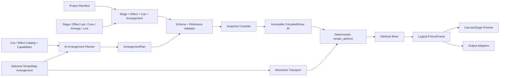
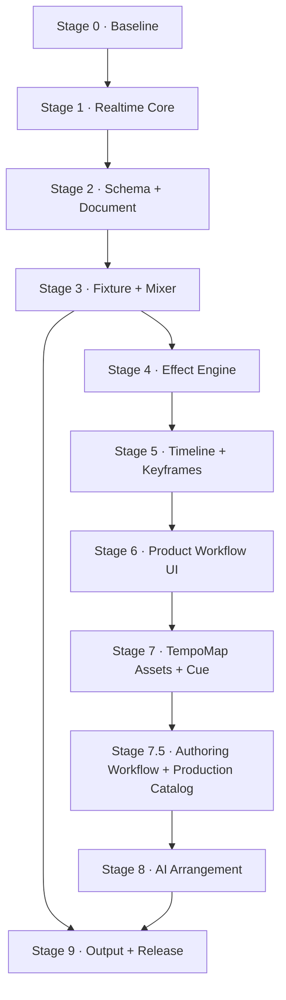
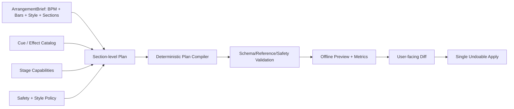

# Lumina 分阶段改造与长期 Goal 执行计划

> - 文档状态：Active
> - 基线分支：`main`
> - Stage 6 稳定基线：`abd973a`；交付分支：`codex/stage6-dj-workspace`
> - 已取消方向：原 Stage 7 Audio/Song 实验；相关提交未进入交付分支，未提交 runtime 仅保留在本地恢复 stash
> - 原始规划基线：`d1d718e`
> - 建立日期：2026-08-02
> - 方向调整日期：2026-08-03
> - 适用范围：Rust/Tauri 实时引擎、版本化资产、React 编辑器、TempoMap 时间轴、AI 编排与舞台输出

## 1. 文档目的

本文档是 Lumina 后续改造的唯一主计划，用于驱动一个跨多次对话持续执行的长期 Goal。每次实现都应从本文档读取当前 Stage、完成状态、未决设计和验证结果，而不是依赖历史聊天上下文。

建议 Goal 目标文本：

> 按照 `docs/lumina-overhaul-plan.md` 的顺序完成 Lumina Stage 0 至 Stage 9（包含 Stage 7.5）改造；每次只推进当前最早未完成且未阻塞的 Stage，满足其退出条件后更新 Stage 状态、Progress Ledger、ADR、验证结果和下一步，不提前把 Goal 标记为完成。

本文档同时承担以下职责：

- 固定产品目标和不可破坏的系统约束。
- 明确各 Stage 的范围、依赖、交付物和退出条件。
- 为跨对话实现提供稳定的交接格式。
- 记录设计决策、兼容性、风险、测试和性能基线。
- 防止在实时内核尚不可信时过早堆叠 AI、模板或硬件协议。

## 2. 产品目标

Lumina 的目标不是普通灯控台或音频播放器的复刻，而是一个面向 DJ 和小型演出创作者的“无音频依赖、TempoMap 驱动的视觉编排系统”：

1. 用户建立或选择舞台灯具布局。
2. 用户在 Effect Lab 中创建可复用的频闪、脉冲、渐变、追逐、空间波、颜色和运动效果。
3. 用户把一个或多个 Effect 与舞台 TargetSet 组合成可直接触发和复用的 Cue。
4. 用户为 Arrangement 配置默认固定 BPM 或多段 TempoMap，把 Cue 和 automation 编排到整数拍点时间轴，并保存多个配置。
5. 用户在统一预览中排练并安全输出到真实灯具；后续 AI 只生成经过验证的 Cue/Arrangement 计划。

最终体验路径：

```text
Stage Setup → Effect Lab → Cue Builder → TempoMap Arrangement → Rehearsal → Live/Export
```

Raw JSON DSL 保留为 Advanced Mode 和 AI/自动化接口，不应继续作为普通用户的主编辑界面。

音频导入、播放、波形、歌曲分析、音频驱动的 beat-grid 校正和 A/V 延迟校准不再属于产品目标；用户编写的多段 TempoMap 完整保留。详细重构边界见 [`fixed-bpm-cue-arrangement-refactor.md`](./fixed-bpm-cue-arrangement-refactor.md)。

## 3. 当前基线

当前仓库已经具备：

- Tauri 2 + React 19 桌面外壳。
- JSON DSL、Rust parser/compiler 和 18 个模板。
- matrix、circle、formula、custom 布局。
- fixture group、sort 和 spread/grouped phase。
- color/dimmer Phaser step 求值。
- Live Pad、二维 Canvas 和基础 Timeline。
- `from → to` Float/Color automation。
- `pnpm build` 可通过。

当前基线不具备生产可用性，关键已知问题包括：

| 领域        | 当前问题                                                     | 首次处理 Stage |
| ----------- | ------------------------------------------------------------ | -------------- |
| 实时调度    | 120 BPM 时约 16Hz；固定 beat 增量会漂移                      | Stage 1        |
| 并发        | `play()` 可重复启动线程；存在 show/runtime 锁顺序反转        | Stage 1        |
| Transport   | Pause 清除 active phaser；Stop/Seek/Resume 语义不确定        | Stage 1        |
| Frame diff  | 首帧或 fixture 数量变化可能产生空/不完整 diff                | Stage 1        |
| DSL 安全    | mode 配置和颜色解析可 panic；未知字段可能被丢弃              | Stage 2        |
| Schema 漂移 | TS/Zod 与 Rust 手写 schema 已不一致                          | Stage 2        |
| 灯具属性    | 引擎只真正支持 color/dimmer                                  | Stage 3        |
| 混合        | 所有 RGB/dimmer 使用 `max`，没有属性级 HTP/LTP               | Stage 3        |
| Effect      | `phaser.multiplier` 没有稳定进入运行时                       | Stage 4        |
| Keyframe    | 只有 from/to clip，没有多关键帧和结构化 target               | Stage 5        |
| Timeline    | overlap 会隐式裁剪；animation 子轨不计入宽度                 | Stage 5        |
| 交互性能    | drag/resize 的 pointer move 仍触发 React state 更新          | Stage 5/6      |
| 用户路径    | 没有视觉 Effect Lab；默认窗口中央预览只有约 94px             | Stage 6        |
| 配置边界    | Stage、Effect、EffectInstance 和 Timeline 仍耦合在单一文档   | Stage 7        |
| Cue/多编排  | 没有“布局选区 + 多效果”的复用层，也不能保存多个 BPM 编排     | Stage 7        |
| 音频实验    | 已产生未合并的 Audio/Song 代码，需退出产品与运行时边界       | Stage 7        |
| 生产内容    | 历史布局/效果重复、视觉价值不明且缺少动态 TargetSet          | Stage 7.5      |
| 作者工作流  | Stage 7 新资产已接通，但布局、预览时钟和 Timeline 功能不完整 | Stage 7.5      |
| AI          | 没有结构化规划、验证、修复和可解释应用流程                   | Stage 8        |
| 舞台输出    | 没有 Fixture Profile、Universe、Art-Net/sACN 和故障保护      | Stage 9        |
| 测试        | Rust 当前为 0 个测试，前端没有测试命令                       | Stage 0        |

## 4. 不可破坏的系统约束

所有 Stage 都必须遵守以下约束。

### 4.1 确定性

给定相同的 Stage、Effect、Cue、Arrangement revisions 和时间点，离线求值、Canvas 预览和硬件输出必须得到相同的逻辑 Frame。实时调度只负责选择时间点和发送 Frame，不得在 scheduler 中隐藏业务状态变化。

### 4.2 单一时钟来源

- 引擎使用 monotonic clock，不使用 wall clock。
- 音乐时间用整数 tick 表示，禁止用 `f64` 直接比较事件边界。
- 每个 Arrangement 拥有自己的确定性 TempoMap、拍号和 PPQ；默认可以是单一固定 BPM，也允许用户编写多段 BPM。
- TempoMap 负责 tick 和 seconds 的双向映射，但不包含 sample position、音频分析 downbeat 或音频从时钟。
- Canvas 不得用额外插值改变频闪、cut 或 snap 的语义；视觉抗锯齿必须是显式预览选项。

### 4.3 单一 Schema 契约

- 每一种可持久化资产都必须有 `schema_version`；ProjectManifest 只保存可验证引用。
- Runtime 不接受未经验证的自由 JSON。
- 未知字段、非法引用、非法范围必须返回结构化诊断，不得静默忽略或 panic。
- Rust、JSON Schema 和 TypeScript 类型必须通过生成或契约测试保持一致。

### 4.4 属性级混合

- Intensity/Dimmer 默认 HTP。
- Color、Pan、Tilt、Zoom、Gobo 等默认 LTP，由 priority 和 activation order 决定。
- Strobe 默认 LTP，并经过安全限制器。
- Add、Multiply、Mask 等混合只能显式声明，不能隐式发生。

### 4.5 编辑态和演出态隔离

- 编辑器可以热编译草稿，但不得直接破坏正在 Live 输出的 active show。
- Live 必须使用已验证、已发布的 immutable Show Snapshot。
- 从草稿切换到 Live Snapshot 必须是显式操作，并可回滚。

### 4.6 可恢复性

- 所有用户编辑走 command/history 模型，支持 Undo/Redo。
- 工程文件使用原子保存并维护 schema migration。
- AI 生成必须先展示 diff，再由用户 Apply；Apply 后可以一次 Undo。

### 4.7 安全

- 始终保留独立于 show 的 Emergency Blackout。
- 对频闪频率、持续时间、亮度和硬件输出速率提供可配置限制。
- 输出断线、应用崩溃或 adapter 错误必须进入已定义的 fail-safe 状态。

## 5. 目标架构



### 5.1 核心数据模型

#### ProjectManifest 与版本化资产

ProjectManifest 只保存工程索引和引用，不继续承载完整 show。用户资产拆为独立 revision contract：

- `schema_version`
- `stage_ref` → Fixture Profile、Patch、Layout、Fixture Group、TargetSet
- `effect_library_ref` → target-agnostic EffectDefinition
- `cue_library_ref` → Effect + TargetSet + mix/parameter/phase 组合
- `arrangements[]` → 独立的 TempoMap-driven Timeline 配置
- `active_arrangement_id`

各资产拥有稳定 ID、revision 和引用验证；Arrangement 不得内嵌 Layout、EffectGraph 或 CueDefinition。具体 contract 见无音频 TempoMap 重构指引。

#### CompiledShow

只读运行时 IR：

- 所有 ID 和引用已解析。
- 属性已根据 Fixture Profile 类型化。
- EffectGraph 已拓扑排序或编译为可快速求值形式。
- Timeline/Automation 已转换为整数 tick 索引。
- Mixer route 和 output route 已预计算。
- 运行时不再解析 JSON、颜色字符串或自由 target path。

#### RuntimeSnapshot

不可变的 Live 输入：

- `project/stage/effect/cue/arrangement revisions`
- `compiled_show`
- `transport_state`
- `active_live_overrides`
- `safety_state`
- `output_health`

#### Logical FixtureFrame

与具体协议解耦的逻辑帧：

```text
FixtureId → AttributeId → TypedAttributeValue
```

预览和 Output Adapter 都消费此 Frame。

## 6. Stage 依赖与状态



| Stage | 名称                                                            | 状态        | 依赖   | 核心退出信号                                  |
| ----- | --------------------------------------------------------------- | ----------- | ------ | --------------------------------------------- |
| 0     | Baseline 与质量护栏                                             | completed   | 无     | 测试框架、基线和 CI 可用                      |
| 1     | 实时内核与 Transport                                            | completed   | 0      | Clock/Play/Pause/Stop/Seek 确定且无重复线程   |
| 2     | Versioned Document 与统一 Schema                                | completed   | 1      | 单一 schema 契约、migration、零 panic         |
| 3     | Fixture Attribute、Mixer 与 Output 抽象                         | completed   | 2      | 通用属性、HTP/LTP、Null/Preview Sink          |
| 4     | 可扩展 Effect Engine                                            | completed   | 3      | EffectGraph/参数/空间相位可确定性求值         |
| 5     | Timeline、Keyframe 与 Undo/Redo                                 | completed   | 4      | 多关键帧、seek/replay、无隐式数据破坏         |
| 6     | 用户工作区与 Effect Lab                                         | completed   | 5      | Stage→Effect→Arrange→Live 主路径可用          |
| 7     | TempoMap 资产边界、Cue 与多 Arrangement                         | completed   | 6      | 音频退出；Stage/Effect/Cue/Arrangement 解耦   |
| 7.5   | Authoring Workflow、Production Layout、Catalog 与动态 Targeting | in_progress | 7      | 完整布局/预览/Timeline 路径与生产目录通过验收 |
| 8     | AI TempoMap 编排                                                | not_started | 7、7.5 | AI 计划可验证、可解释、可预览、可撤销         |
| 9     | 舞台输出、安全与 Release                                        | not_started | 3、8   | Art-Net/sACN、故障保护和发布门槛完成          |

状态只允许：`not_started`、`in_progress`、`blocked`、`completed`。

## 7. Stage 0：Baseline 与质量护栏

### 目标

在改变行为前建立可复现基线，让后续 Stage 能证明“没有破坏已有能力”并准确量化改进。

### 范围

#### 0.1 测试基础设施

- [x] 为 Rust compiler、phaser、timeline、frame diff 建立首批单元测试。
- [x] 加入至少一个端到端 golden show：DSL → compile → 指定 tick Frame。
- [x] 为前端加入测试命令和轻量组件/状态测试框架。
- [x] 为模板建立 contract test：所有模板必须通过同一 schema 和 Rust compile。
- [x] 测试禁止只断言“不崩溃”；必须断言 fixture/attribute/timing 输出。

#### 0.2 基线数据

- [x] 记录 100、500、1,000、2,000 fixtures 下 `compute_frame` 的 release 性能。
- [x] 记录当前模板 compile 时间和 bundle 大小。
- [x] 建立 10 秒 scheduler 漂移测试。
- [x] 建立重复 Play、Pause/Resume、Stop/Reset、fixture count change 的回归用例。

#### 0.3 自动化检查

- [x] 固定并文档化 Node、pnpm、Rust toolchain 版本。
- [x] 增加统一 `pnpm check`，串联 format check、TypeScript、前端测试和 Vite build。
- [x] 增加统一 Rust check：`cargo fmt --check`、`cargo clippy --all-targets -- -D warnings`、`cargo test`。
- [x] 若仓库启用 CI，CI 必须执行上述检查。

#### 0.4 诊断格式

- [x] 定义 `Diagnostic { code, severity, path, message, hint }`。
- [x] 为现有 compile error 分配稳定 code。
- [x] 前端不得只把异常写入 console；必须呈现可定位错误。

### 交付物

- 测试目录和 golden fixtures。
- 基线结果文档或 machine-readable benchmark artifact。
- `pnpm check` 和 Rust check 命令。
- 首版 Diagnostic contract。

### 退出条件

- Rust 测试数量大于 0，且覆盖当前 compile/phaser/timeline/frame diff 主路径。
- 所有 18 个模板经过前后端同一条 contract test。
- 基线性能与漂移数据已记录。
- CI/本地统一检查全部通过。
- Progress Ledger 记录基线 commit 和验证结果。

### 非目标

- 不修复 scheduler 架构。
- 不引入新 DSL 能力。
- 不重做 UI。

## 8. Stage 1：实时内核与 Transport

### 目标

把当前“能动起来”的 scheduler 改造成可测试、单实例、无漂移且具有明确 Transport 语义的实时核心。

### 设计要求

#### 1.1 Clock 与调度

- [x] 引入可注入 `Clock`：Production 使用 monotonic clock，测试使用 ManualClock。
- [x] scheduler 根据真实 elapsed time 计算当前位置，不再固定累加 `1/subdivision`。
- [x] Transport 和 renderer 解耦；renderer 提供纯函数式 `render_at(RenderTime)`。
- [x] 默认逻辑输出频率 60Hz，可配置 30/60/120Hz。
- [x] 落后时按当前真实时间重算，不通过跳过 sleep 来累积时间误差。
- [x] 移除每 tick 新建 Tokio runtime 和长时间 spin-loop。

#### 1.2 单实例生命周期

- [x] `start` 必须幂等或明确返回 `AlreadyPlaying`。
- [x] scheduler 由单个 task/thread handle 管理，可取消并 join。
- [x] Stop 完成后必须确认 worker 已退出，才能再次启动。
- [x] app shutdown 时安全停止 scheduler 和 output adapters。

#### 1.3 Transport 状态机

规范语义：

| 操作  | Cursor                 | 逻辑输出       | Active clips                  | 参数状态           |
| ----- | ---------------------- | -------------- | ----------------------------- | ------------------ |
| Play  | 从 cursor 继续         | 按时间求值     | 由 `render_at` 重建           | 由时间求值         |
| Pause | 保持                   | 保持最后一帧   | 不依赖临时列表恢复            | 保持               |
| Stop  | 回到 arrangement start | Blackout       | 清空 transient live overrides | 回到初始值         |
| Seek  | 移到目标 tick          | 立即重算目标帧 | 从 timeline 重建              | 从 automation 重建 |

- [x] 用显式 enum 表达 `Stopped/Playing/Paused/Seeking/Error`。
- [x] Stop 与 Pause 不再共用同一 backend command。
- [x] 所有状态变化发出带 revision 的单一 `engine:state-change`。

#### 1.4 并发和 Snapshot

- [x] 消除 `compiled_show` 与 `runtime` 的嵌套反向锁。
- [x] 优先使用短锁和 immutable `Arc<CompiledShow>` snapshot。
- [x] 编辑态 compile 成功后生成新 revision，不在持锁时执行昂贵计算。
- [x] 明确锁顺序并添加并发回归测试。

#### 1.5 Frame 发布

- [x] 首帧、revision 改变、fixture topology 改变时必须发送 full frame。
- [x] diff 按 fixture ID/attribute 比较，不依赖 slice `zip`。
- [x] Frame payload 包含 `show_revision`、`frame_sequence` 和逻辑时间。
- [x] 丢帧/乱序帧可由前端检测并请求 full resync。

### 验证

- ManualClock 下同一时间点重复渲染结果完全一致。
- 重复调用 Play 不会出现第二 worker。
- Play 10 分钟后逻辑时间误差满足基线中确定的容差。
- 任意 tick Seek 后的 Frame 等于从 0 顺序播放到该 tick 的 Frame。
- 并发 reload/play/stop 压力测试无死锁。
- fixture 数量变化后下一帧完整同步。

### 退出条件

- Transport 状态机和 scheduler 生命周期测试全部通过。
- 当前所有模板可在新 runtime 播放。
- Pause/Resume、Stop、Seek 行为符合上表。
- 没有嵌套反向锁和未 join worker。
- 实际输出更新频率达到配置值，漂移测试通过。

## 9. Stage 2：Versioned Document 与统一 Schema

### 目标

建立对人、UI、AI 和 Rust 运行时一致的版本化工程契约，彻底消除静默字段丢失、自由字符串引用和解析 panic。

### 推荐决策

采用 Rust document types 作为语义权威，通过 `schemars` 或等价工具生成 JSON Schema；TypeScript 类型从该 Schema 生成或通过契约测试验证。前端运行时使用生成的 JSON Schema validator，不再独立手写一份不等价的 Zod 树。

在开始实现前记录 ADR，确认最终生成工具和 checked-in artifact 策略。

### 范围

#### 2.1 三层模型

- [x] `ShowDocumentV1`：用户文件格式。
- [x] `ValidatedShow`：所有引用和范围已验证。
- [x] `CompiledShow`：运行时优化 IR。
- [x] 禁止 UI 类型直接等同于 Runtime 类型。

#### 2.2 严格验证

- [x] document struct 默认拒绝未知字段。
- [x] mode 使用 tagged enum，避免 `mode=spread` 但 spread 缺失。
- [x] 颜色使用安全 parser，支持的格式必须明确。
- [x] 验证 fixture ID、group、effect、timeline target 的存在性和唯一性。
- [x] 验证数值：BPM、width、transition、dimmer、group size、duration、tick（当前文档字段全部覆盖；BPM 沿用 Stage 1 validator，整数 tick 在 Stage 5 引入时执行）。
- [x] 禁止 `unwrap/expect/panic` 处理用户或 AI 输入。
- [x] Formula/SVG 无法编译时返回 Diagnostic，不得 fallback 成另一条曲线。

#### 2.3 Schema 版本和 Migration

- [x] 顶层加入 `schema_version`。
- [x] 建立 `migrate_document(from, to)` 管线。
- [x] 为当前模板补充 V1 migration 或一次性转换。
- [x] 保存时写入当前版本；加载旧版本时保留迁移报告。
- [x] 未知的新版本必须 fail closed，不能尝试宽松读取。

#### 2.4 Structured Reference

替换自由字符串：

```text
"phaser:circle_ripple.color"
```

为结构化引用：

```json
{
  "scope": "effect_instance",
  "instance_id": "circle-ripple-01",
  "parameter_id": "color"
}
```

- [x] ID 与 display name 完全分离。
- [x] 所有引用在 compile 时解析为 typed handle/index。

#### 2.5 Tooling

- [x] 增加 schema generation/check 命令。
- [x] CI 检查生成文件是否与 Rust 类型同步。
- [x] Monaco 使用生成的 schema 做路径、enum、范围和补全提示。
- [x] AI 可直接读取同一 JSON Schema 和 capability metadata。

### 退出条件

- Rust/JSON Schema/TypeScript contract test 通过。
- 所有模板迁移到当前 `schema_version`。
- fuzz/property tests 覆盖无 panic 解析和 compile。
- 未知字段、坏颜色、坏引用、坏 phase config 都返回稳定 Diagnostic。
- 前端不再静默剥离 pan/tilt 等未知字段。

## 10. Stage 3：Fixture Attribute、Mixer 与 Output 抽象

### 目标

从硬编码 RGB/dimmer 升级为可扩展的灯具属性系统，并保证多效果组合具有可解释的混合语义。

### 核心模型

```text
FixtureProfile
  └─ AttributeDescriptor[]
       ├─ id
       ├─ value_type
       ├─ physical_range
       ├─ default_value
       ├─ mix_policy
       └─ output_mapping
```

建议首批属性：

- `intensity`
- `color.rgb`
- `position.pan`
- `position.tilt`
- `beam.zoom`
- `beam.strobe`
- `beam.gobo`

建议值类型：Scalar、Color、Angle、Enum、Boolean。

### 范围

#### 3.1 Fixture Profile

- [x] 定义内置 Generic RGB、RGBW、Moving Head profile。
- [x] patch 引用 profile，不再只有 `spot/pixel`。
- [x] profile 定义 capability、默认值、物理范围和 protocol mapping。
- [x] layout 只描述空间位置，不承担灯具能力定义。

#### 3.2 Attribute Frame

- [x] `FixtureOutput` 改为通用 typed attribute frame。
- [x] 编译阶段把属性字符串解析为内部 AttributeHandle。
- [x] 未被 effect 写入的属性回落到 profile/default/base look。
- [x] Preview 只读取它能展示的属性，但不得改变源 Frame。

#### 3.3 Mixer

- [x] 实现 HTP、LTP、Add、Multiply、Mask。
- [x] 每次 effect write 携带 layer、priority、activation order 和 optional weight。
- [x] 属性默认 mix policy 来自 profile，可被 track/effect 显式覆盖。
- [x] LTP tie-break 必须稳定且可测试。
- [x] 冲突可生成可解释 Diagnostic/Inspector 信息。

#### 3.4 OutputSink 抽象

```text
trait OutputSink {
  capabilities()
  start()
  send(frame)
  blackout()
  health()
  stop()
}
```

- [x] `NullSink` 用于测试。
- [x] `PreviewSink` 或统一 Frame subscription 用于 Canvas。
- [x] `RecordingSink` 用于 golden frame 和离线导出。
- [x] 真实网络协议延后到 Stage 9。

#### 3.5 兼容迁移

- [x] 当前 `color/dimmer` 模板自动映射到新属性。
- [x] 明确 pan/tilt 模板此前被忽略的行为变更。
- [x] 旧 Canvas 可在过渡期通过 adapter 消费新 Frame。

### 验证

- 两个 intensity effect 以 HTP 混合。
- 两个 color/position effect 按 priority + LTP 稳定选择。
- mask/add/multiply 只在显式配置时发生。
- Generic Moving Head 的 pan/tilt 能进入 RecordingSink。
- Preview 与 RecordingSink 在同一逻辑时间消费同一 Frame revision。

### 退出条件

- 不再由核心引擎硬编码 RGB/dimmer struct。
- 属性混合矩阵和冲突测试完成。
- 当前模板兼容迁移通过。
- OutputSink contract 稳定，可支持后续协议。

## 11. Stage 4：可扩展 Effect Engine

### 目标

把 Phaser 从固定 step evaluator 升级为参数化、可组合、可预览和可被 AI 安全引用的 Effect Definition。

### Effect 数据流

```text
Time/Beat
  → Oscillator or StepSequence
  → SpatialPhase
  → Envelope/Easing
  → Transform/Clamp
  → Fixture Mask
  → Attribute Write
```

### 最小节点集

- Time/Beat input
- Constant
- StepSequence
- Sine/Triangle/Saw/Pulse oscillator
- Envelope
- SpatialPhase
- Math/Map/Clamp
- ColorGradient
- FixtureMask
- AttributeWriter

节点必须使用 typed ports，不允许运行时自由字符串连接。

### 范围

#### 4.1 EffectDefinition 与 EffectInstance

- [x] Definition 只描述可复用逻辑、参数 schema 和默认值。
- [x] Instance 保存 definition ID、target group、parameter overrides 和 seed。
- [x] 每个实例具有独立稳定 ID，Timeline 引用实例而不是 display name。
- [x] random 节点必须有 seed，相同 seed 的结果可复现（instance seed、node handle、fixture ID 与离散 cycle 派生，无共享 RNG）。

#### 4.2 Parameter Schema

- [x] 参数声明类型、默认值、范围、单位、UI hint 和 automation policy。
- [x] 首批通用参数：speed、phase、width、transition、intensity、color、direction。
- [x] `multiplier` 只保留一个定义和一个运行路径（仅在 V1/V2 migration 边界出现，runtime 统一为 `speed` handle）。
- [x] parameter override 与 automation 使用相同 typed reference。

#### 4.3 Spatial Phase

- [x] 支持按 fixture index、x、y、distance、angle、custom ordering 求相位。
- [x] 明确 spread 端点、wrap 和 grouped 语义（首尾包含、单灯固定起点、grouped 对组索引归一化、wrap 显式）。
- [x] layout 缺失或 group 为空时返回可解释结果（坐标 basis 缺失为结构化诊断；空组得到空 cache/零写入）。
- [x] 大型灯阵使用预计算排序和 phase cache。

#### 4.4 Phaser Compatibility

- [x] 把现有 Phaser 编译为 EffectGraph 或兼容 IR。
- [x] 所有现有视觉模板建立 before/after golden frame（18/18 模板、每个 instance、5 个 phase 比较 V2 migration 与 V3 Frame）。
- [x] 修正 pan/tilt 模板并标记行为变更（typed position attributes；migration report 使用 `MIGRATION_ENABLE_POSITION_ATTRIBUTES`）。

#### 4.5 Effect Catalog

- [x] EffectDefinition 增加 tags：mood、energy、density、motion、colorfulness、strobe risk。
- [x] 支持 built-in、project-local 和 user-library 三种来源。
- [x] 记录 effect revision；EffectInstance 固定引用 definition revision。
- [x] 提供 capability query，供 UI 和 AI 判断目标灯组是否支持某效果（metadata/risk filter、目标 profile 缺失属性解释、Tauri command）。

### 性能要求

- compile 阶段预计算 graph topology 和 fixture targeting。
- render 阶段不得分配大量短生命周期 Map/String。
- 对 1,000 fixtures × 多层效果建立 release benchmark。
- 若达不到 60Hz 帧预算，必须记录瓶颈和降级策略。

### 退出条件

- EffectDefinition/Instance/Parameter 模型完成。
- 最小节点集可确定性求值。
- 现有模板迁移并通过 golden frames。
- pan/tilt/color/intensity 可由统一 Effect Engine 写入。
- Effect Catalog 可供 UI/AI 查询能力和风险信息。

## 12. Stage 5：Timeline、Keyframe 与 Undo/Redo

### 目标

建立真正的音乐时间轴：效果 clip、任意多关键帧、结构化 automation、确定性 seek 和非破坏编辑。

### 时间模型

- [x] 定义 PPQ；默认 960 ticks per quarter note。
- [x] `MusicalTime` 使用整数 tick。
- [x] `TempoMap` 支持默认固定 BPM 与多段 tempo；它是 Arrangement 时钟能力，不依赖音频或歌曲分析。
- [x] event boundary、snap 和 duration 全部使用 tick。
- [x] UI 可以显示 bar.beat.tick 和 seconds，但不作为存储主值。

### Arrangement 模型

建议核心元素：

- Track
- EffectClip
- AutomationLane
- Keyframe
- Marker/Section
- Layer/Group

Keyframe 至少包含：

- `time_tick`
- `value`
- `interpolation`: hold、linear、ease、bezier
- optional in/out tangent

### 范围

#### 5.1 纯时间求值

- [x] Timeline 不保存依赖顺序 tick 的 transient `active_events` 真相。
- [x] 任意 tick 可通过索引快速查询 active clips 和 automation。
- [x] 顺序播放、从中间 Seek、Pause 后 Resume 必须得到相同结果。
- [x] automation 在 clip 结束 tick 精确输出终值。

#### 5.2 非破坏编辑

- [x] 删除当前自动裁剪 overlap 的隐式行为。
- [x] 明确 track overlap policy：layer、replace、reject 或 crossfade。
- [x] 所有裁剪/替换必须在 UI 预览并可 Undo。
- [x] 多选、复制、粘贴、duplicate、split、trim、loop 进入 command model。

#### 5.3 Undo/Redo

- [x] 建立 DocumentCommand 与 transaction。
- [x] drag 全过程只产生一个最终 history entry。
- [x] AI Apply 产生一个 transaction。
- [x] 保存点和 dirty state 可追踪。

#### 5.4 时间轴性能

- [x] pointer move 使用 DOM refs/transform 预览，不逐帧写 Zustand。
- [x] pointer up 时一次性提交 command。
- [x] 大量 clip 使用可见区域裁剪或 virtualization。
- [x] playhead 更新不触发所有 block React re-render。

#### 5.5 Automation UI

- [x] 可从参数菜单创建 lane。
- [x] 支持添加、移动、删除、框选关键帧。
- [x] 支持曲线/hold 类型和数值 inspector。
- [x] 颜色参数提供颜色编辑，角度/百分比显示正确单位。
- [x] lane 长度进入 timeline dimension 计算。

### 验证

- [x] 100 次随机 Seek 与顺序播放 Frame 一致。
- [x] clip 结束点输出精确终值。
- [x] overlap 不再静默修改其他 clip。
- [x] drag/resize 只产生一个 undo entry。
- [x] 1,000 clips 下滚动、拖动和 playhead 满足 UI 性能基线。

### 退出条件

- [x] 多关键帧和 typed automation 完成。
- [x] Transport Seek/Replay 与 Timeline 完全一致。
- [x] Undo/Redo 覆盖时间轴核心编辑。
- [x] 时间轴 pointer move 不逐帧更新全局 React state。
- [x] Accessibility 基础：键盘选择、移动、删除和可见 focus。

## 13. Stage 6：用户工作区与 Effect Lab

### 目标

把技术编辑器改造成 DJ 可以理解的产品路径，Raw DSL 退到 Advanced Mode。

### 信息架构

> 2026-08-03 方向调整：Stage 6 的工作区外壳、Stage Setup、Effect Lab、Arrange 和 Live 验收保持有效；Song 已从 Stage 6 交付产品中移除。Cue 与多 Arrangement 只属于下一 Goal，本 Stage 不实现也不保留占位。

Stage 6 交付的一级工作区：

1. **Stage**：灯具、布局、分组和输出检查。
2. **Effect Lab**：单效果创建、参数、目标和循环预览。
3. **Arrange**：在 TempoMap、整数 tick 时间轴编排 Effect clip 和 automation。
4. **Live/Rehearse**：Transport、Live Pad、诊断、Blackout。

### 范围

#### 6.1 Workspace Shell

- [x] 使用可调节或可折叠 panel，不再固定 450px + 256px。
- [x] 默认窗口建议至少 1280×800，推荐 1440×900；定义合理 min size。
- [x] Canvas/Timeline 是主工作区，属性 Inspector 按选择上下文变化。
- [x] 保留清晰的 project/show 名称和保存状态；Stage 7 改为 project/stage/arrangement identity。

#### 6.2 Stage Setup

- [x] Fixture Profile 选择、数量、ID/universe/channel 设置。
- [x] matrix/circle/formula/custom 布局可视化编辑。
- [x] group 创建、空间筛选、排序和测试点亮。
- [x] fixture capability 和 patch 冲突实时提示。

#### 6.3 Effect Lab

- [x] 新建、复制、重命名、删除、收藏 effect。
- [x] 目标 group、属性、波形、速度、phase、width、transition 和 color controls。
- [x] 单效果 loop preview、scrub 和 A/B comparison。
- [x] EffectGraph 高级编辑器可后置；首版优先参数化表单和预览。
- [x] 保存时生成 revision 和 capability/risk metadata。

#### 6.4 Arrange

- [x] Library 支持 click-to-place 和 drag-to-place，两者都有明确提示。
- [x] Track 名称显示用户名称，不直接显示 `phaser:id`。
- [x] Stage 6 曾为上下文 spine 预留区域；Stage 7 将其改为 Arrangement selector、BPM 和 Cue Library，不保留音频占位。
- [x] 提供 empty state、快捷键帮助和错误恢复。

#### 6.5 Live/Rehearse

- [x] Live Pad 支持 beat/bar quantize。
- [x] effect 可配置 toggle、momentary、one-shot、exclusive group。
- [x] Pause、Stop、Blackout 视觉层级不同，Blackout 始终可见。
- [x] 显示 FPS、frame lag、output adapter、last error 和 show revision。
- [x] 编辑草稿和 Live Snapshot 状态明确区分。

#### 6.6 Accessibility

- [x] 所有 icon-only button 有可访问名称。
- [x] timeline block、keyframe、resize、delete 支持键盘替代。
- [x] 交互目标尺寸、对比度、focus ring 和 reduced motion 满足基线。
- [x] 不以双击作为唯一删除入口。

### 用户验收路径

新用户应能在不编辑 JSON 的情况下：

1. 创建 4×4 RGB 灯阵。
2. 创建红色脉冲效果并保存。
3. 把效果放到 8 小节 Timeline。
4. 添加 intensity automation。
5. 播放、暂停、Seek、Stop。
6. 切到 Rehearse 并触发同一效果。

### 退出条件

- [x] 上述路径不需要打开 DSL Editor。
- [x] 默认窗口能同时提供可用 Canvas 和主要控制。
- [x] Effect Lab 产物可直接进入 Arrange 和 Live。
- [x] 核心路径完成键盘和错误状态验证。
- [x] Raw DSL 与视觉编辑不会互相静默覆盖。

## 14. Stage 7：TempoMap 资产边界、Cue 与多 Arrangement

### 目标

退出音频产品方向，完整保留 Stage 5 多段 TempoMap 拍点时间轴，并把当前单体 ShowDocument 拆为 Stage、Effect、Cue 和 Arrangement 四层可版本化资产。完整执行规格见 [`fixed-bpm-cue-arrangement-refactor.md`](./fixed-bpm-cue-arrangement-refactor.md)。

### 基线策略

- Stage 6 交付分支直接从 closure `abd973a` 建立；`4f7a07c`、`23ec7cf`、`950fce0` 和未提交 shared-audio-transport 均未进入最终历史或产品树。
- 本地恢复 stash 只用于审计和灾难恢复；下一 Goal 不得合并或 cherry-pick 其中的音频 runtime。
- 如果 V5 音频 schema 已发布，则向前迁移为无音频 Arrangement，保留原有 TempoMap/拍号并明确报告被移除的音频信息。
- 两种路径都不得使用 destructive reset 处理用户工作树。

### 范围

#### 7.0 Authoring Preview、Rehearsal 与 Live 边界

- [x] Authoring Preview 使用当前 Draft、选择对象和 playhead，写入独立 preview sink，永不自动 Publish/Take Live。
- [x] Rehearsal 显式选择 Draft 或 Published Revision；Live 只读取 Take Live 后的 immutable snapshot。
- [x] PreviewSession/RenderContext 覆盖 Stage、Effect、Cue、Arrangement，并与 Live 复用 deterministic compiler/evaluator。
- [x] Canvas 根据编辑上下文立即展示结果；切换工作区按明确规则保留资产、Arrangement、playhead、loop 和 preview mode。
- [x] Draft Preview、Published Rehearsal、Live isolation 与工作区切换均有状态机、集成测试和真实 Tauri 证据。

#### 7.1 音频能力退出

> 以下基线清理已在 Stage 6 发布收口中完成；不表示 Stage 7 的资产/Cue 重构已经开始。

- [x] 删除 Song workspace、Song spine、音频导入/播放/缓存/波形/分析/校准 UI 与命令。
- [x] 删除 AudioAsset、SongAnalysis、sample position、audio follower 和 A/V drift runtime。
- [x] 删除 Rodio/Symphonia 等仅服务音频的依赖、capability 和测试。
- [x] 保留 MusicalTime、多段 TempoMap/拍号换算、Play/Pause/Stop/Seek/Loop 和确定性 scheduler。

#### 7.2 独立资产 Contract

- [x] 定义 ProjectManifest，只保存 Stage、Effect Library、Cue Library 和 Arrangement 引用。
- [x] StageDocument 只保存 Patch、Layout、Fixture Group 和 TargetSet。
- [x] EffectDefinition 保持 target-agnostic，不包含 Timeline。
- [x] 每类资产拥有独立 schema version、稳定 ID、revision 和 reference validator。
- [x] Arrangement 不内嵌 Layout、EffectGraph 或 CueDefinition。

#### 7.3 Cue 与 TargetSet

- [x] CueDefinition 组合一个或多个 Effect layer、TargetSet、参数、phase、seed、mix 和 trigger policy。
- [x] Cue 固定引用 Effect revision；更新 Effect 不静默改变既有 Cue。
- [x] Fixture Group 保持静态；All/Rows/Columns/R×C Zones/Checkerboard 等 TargetSet 在 compile 阶段预计算。
- [x] 支持硬切 TargetSet 和 fixture weight/spatial mask 边界，为 Stage 7.5 动态分区打底。
- [x] render 热路径使用 bitset/index/cache，不对 Group Vec 做逐灯线性查找。

#### 7.4 TempoMap-driven Arrangement

- [x] Arrangement 保存 TempoMap、拍号、PPQ、长度、CueClip tracks、automation 和可选人工 marker。
- [x] CueClip 固定引用 Cue revision，只允许受控的实例 override。
- [x] 同一工程可创建、复制、重命名、选择和保存多个 Arrangement。
- [x] 修改 TempoMap 不移动 clip/keyframe 的 tick；Draft 修改不影响 Published/Live revision。
- [x] 单段/多段 tempo 的 tick ↔ seconds 边界、30 分钟等效漂移和随机 Seek 有自动化测试。

#### 7.5 用户路径调整

- [x] 一级工作区变为 Stage、Effect Lab、Cues、Arrange、Live/Rehearse。
- [x] Cues 提供创建、组合、版本化、loop preview 和 capability/risk summary。
- [x] Arrange 提供 Arrangement selector、TempoMap/拍号/长度编辑和 Cue Library。
- [x] 普通用户主要放置 Cue；单 Effect placement 可保留为 Advanced 能力。
- [x] 原 Song、waveform、section 和 A/V diagnostics 不保留禁用占位。

#### 7.6 Migration 与 Compiler

- [x] 编译入口解析 project dependency graph，再生成选中 Arrangement 的 immutable snapshot。
- [x] 引用缺失、revision 过期、循环依赖和 capability 不匹配返回结构化 Diagnostic。
- [x] 旧 V1–V4 工程迁移到默认 Stage/Effect/Cue/Arrangement；当前不存在已发布 V5，未引入其音频 runtime。
- [x] Raw DSL/Advanced Mode 能查看独立资产，但不能重新把它们静默合并成单体配置。

### 用户验收路径

用户不打开 Raw DSL 即可创建 Stage 和 Effect，把多个 Effect 组合成 Cue，创建 `House 128` Arrangement，将 Cue 放入时间轴，再复制为包含多段 tempo 的 `Tempo Journey`。两个 Arrangement 共享 Cue revision，但拥有独立 TempoMap、长度、Timeline 和保存状态。

### 退出条件

- 产品和运行时中不存在可触达的音频导入、播放、分析、波形或 A/V 校准能力。
- Stage、Effect、Cue、Arrangement 独立版本化并通过引用、migration 和 schema contract。
- Cue 可组合多个 Effect/TargetSet，Arrangement 只引用 Cue revision。
- 至少两个不同 BPM Arrangement 可保存、重开、切换、Seek、Loop、Undo/Redo 和 Publish/Take Live。
- 30×30 全量 → 3×3 zones → 全量的最小 contract 可确定性求值并满足 60Hz gate。

## 14.5. Stage 7.5：Authoring Workflow、Production Layout、Effect Catalog 与动态 Targeting

### 目标

在 Stage 7 已稳定的资产、revision、PreviewSession 和 Cue contract 上，先恢复生产级作者工作流，再建立面向大型点阵和矩形灯条的布局资产、动态分区工具及有实际视觉价值的 Effect/Cue Catalog。Stage 7.5 不重新发明 Project/Stage/Effect/Cue/Arrangement 边界，但允许通过新 ADR 增加 LayoutPreset 引用和共享 Authoring Transport。

2026-08-04 的真实 Tauri 与源码审计确认：当前 Stage、Effect Lab、Cues 与 Arrange 都能接入新 contract，但 Stage Apply 缺少 revision upgrade 路径，Lab/Cue 缺少可理解的 BPM/拍号 transport，新的 `CueTimelinePanel` 也没有迁移 Stage 5/6 的 zoom、snap、resize 和 automation 编辑。完整证据和替换边界见 [`stage7-workflow-audit.md`](./stage7-workflow-audit.md)。

### 7.5A Authoring Workflow Foundation

- [x] 建立共享 Authoring Transport：Play/Pause/Stop/Seek/Loop、bar.beat.tick、当前 BPM、拍号和视觉 beat/bar meter。
- [x] Effect/Cue PreviewClock 支持 Local BPM/拍号/循环小节与 Follow Arrangement；Preview 设置只属于 session，不写入 Effect/Cue。
- [x] Arrange 使用完整 TempoMap/TimeSignatureMap，当前 BPM 和 ruler 随 playhead 变化；不得退化为只读取首个 tempo point 或固定 4/4。
- [x] 将成熟 Timeline 的 zoom、snap、CueClip resize、键盘操作、selection inspector 和 typed automation lane/curve/keyframe 能力迁移到统一 `ArrangementTimeline`。
- [x] 高频 drag/resize 继续使用 PointerEvents + DOM ref preview，并以单次 Undo transaction 提交。
- [x] action-local Diagnostic 显示原因、影响和 recovery action；Header 只保留全局摘要，不作为唯一反馈面。
- [x] 完成 ADR-0011，固定 PreviewClock、Authoring Transport 与 CueClip Timeline 的状态和命令边界。

2026-08-04：7.5A 已按 [`stage7-5a-acceptance.md`](./stage7-5a-acceptance.md) 完成 scoped
验收。Stage 7.5 总状态继续为 `in_progress`，因为 7.5B–7.5E 不属于本切片；不得据此提前实现
LayoutPreset、动态 Targeting 或 Production Catalog。

### 7.5B LayoutPreset 与 Stage 工作流

- [ ] 新增独立、可版本化 LayoutPreset/Definition；Project manifest 保存 layout refs，Stage 显式引用选中的 layout revision。
- [ ] Stage 左侧改为 Layout Library，按 Basic 与 Generated/Advanced 分区；Group/TargetSet 移到当前 Stage 的次级视图。
- [ ] Basic 支持 matrix、circle、strip/bar、wall、frame；Generated/Advanced 支持 formula、SVG path、custom 和算法生成，并声明 `form`、`parameter_schema`、`advanced_only` 或 `read_only` editor capability。
- [ ] 支持 Duplicate、Save Draft、Save As、Rename、Delete 和 Use on Stage；保存布局不应自动改写当前 Stage/Cue/Arrangement。
- [ ] Use on Stage 在提交前显示 Cue/TargetSet 影响；兼容 topology 可显式升级，非兼容时提供 remap、保留旧 Stage revision 或创建新 Stage。
- [ ] 移除当前“工程存在任意 Cue 就无反馈阻止 Apply”的临时流程；不得通过静默改写 Cue revision 规避引用校验。
- [ ] 支持 n×n/rows×columns 无缝矩阵、矩形灯条、灯条墙和灯框；fixture size 与 gap/pitch 分离，gap 可以为 0。
- [ ] 完成 ADR-0012，固定 LayoutPreset、Stage revision upgrade、动态 TargetSet 与 Spatial Mask 边界。

### 7.5C Production Targeting

- [ ] 提供 30×30 的 R×C Zones、Rows、Columns、Checkerboard、Center/Edges、Fixture IDs 和 Per-bar TargetingScene 可视化编辑。
- [ ] 完成 hard switch、weighted transition、phase continuity 和 beat/bar snap。
- [ ] All → 多分区 → All 通过 immutable TargetSet/TargetingScene 编排，不在播放中修改 Fixture Group membership。
- [ ] TargetSet 支持命名、复制、预览、引用影响检查，并继续使用 compiler bitset/index/cache 热路径。

### 7.5D Production Effect/Cue Catalog

- [ ] 用 Effect parameter schema 驱动完整编辑器，覆盖 waveform、speed、phase、width、transition、颜色、强度和 A/B revision preview。
- [ ] Cue Builder 改为 layer list + selected-layer editor，并支持 reorder、mute/solo、duplicate 和受控 override。
- [ ] 审计历史配置，将其分类为保留、重写、合并、隐藏或 legacy fixture；将被重写的旧界面不先行修补。
- [ ] 建立覆盖频闪/节奏、慢速氛围、空间扫描、gradient 和 transition 的 Production Effect/Cue Catalog。
- [ ] 每个效果提供有效参数、capability、energy/density/motion、适用布局和 strobe risk metadata。

### 7.5E 验证与收口

- [ ] 建立多布局、多 tick golden frame 和 1,000 fixtures 多层 release benchmark。
- [ ] 真实 Tauri 验证 Layout → Effect → Cue → Arrangement → Rehearse/Live；全程不需要 Raw DSL，也不需要先进入 Live 才能预览或播放 Authoring Draft。
- [ ] 覆盖最大化、1440×900、1100×720、键盘路径、保存重开、inline error recovery 和 Draft/Published/Live 隔离。
- [ ] 迁移完成后删除无调用者的 V4-only Stage Setup/Timeline shell；删除前先迁移其中已有测试覆盖的 layout、snap、resize、automation 和 keyboard 行为。

### 退出条件

- Stage 左侧存在可复制的 Basic/Generated Layout Library；右侧能 Save/Save As，并能在 Canvas 预览后安全应用到 Stage。
- Stage topology 变化提供明确的 Cue/TargetSet impact 与 upgrade/remap 路径，不存在点击无响应或只在 Header 截断报错。
- Effect Lab、Cues、Arrange 均有一致的 Play/Pause/Stop、BPM、拍号、bar.beat.tick 和 loop 语义；Live 仅承担 rehearsal/live safety boundary。
- Arrangement Timeline 恢复 zoom、snap、CueClip move/resize、typed automation curve/keyframe、键盘替代和单 transaction Undo/Redo。
- 无缝矩阵与矩形灯条能正确创建、分组、Target、预览和寻址。
- 30×30 All → 多分区 → All 可任意 Seek/Replay，且多分区并行保持 60Hz frame budget。
- Production Catalog 可被用户、Cue Builder 和 Stage 8 capability query 稳定引用。
- 无视觉价值的历史配置不再出现在产品目录，但 migration/golden fixture 仍可读取。

## 15. Stage 8：AI TempoMap 编排

### 目标

AI 根据用户给出的 BPM、长度、风格、可选人工段落和可用 Cue Catalog，生成可验证、可解释、可撤销的 Arrangement 草稿，而不是分析音频或直接输出灯具帧。

### AI 管线



### 核心原则

- AI 不导入或分析音频，不猜测真实歌曲结构。
- AI 不直接控制 scheduler 或 OutputSink，也不生成逐帧 fixture 数值。
- AI 优先引用真实 Cue ID/revision；需要更细粒度时只能引用 capability registry 中存在的 Effect、TargetSet 和参数。
- 所有 AI 输出进入新的 Arrangement Draft revision，并保留 prompt、provider/model、schema version、输入 revisions 和 provenance。

### 范围

#### 8.1 ArrangementBrief 与 ArrangementPlan

输入至少包含 BPM、拍号、总小节数、风格、密度/能量意图、颜色/频闪限制，以及可选的人工 section markers。Plan 包含 stage/cue catalog revisions、section plans、Cue placements、automation/transition intents、safety budget 和 rationale。

#### 8.2 Capability Context

- [ ] 只向 AI 暴露可用 Stage capability、TargetSet、Cue/Effect Catalog 和参数范围。
- [ ] 上下文稳定排序并受 token budget 控制；使用 ID + display metadata，禁止猜测 ID。
- [ ] revision 过期、能力不足和风险限制必须在生成前后可见。

#### 8.3 两阶段生成

1. 生成按小节/人工 section 划分的结构计划。
2. 用户调整密度、重复度和风格后，由 deterministic compiler 展开 CueClip 和 automation。

- [ ] 相同 brief + plan + catalog revisions 产生相同 Arrangement。
- [ ] AI 不通过第二次自由文本调用直接拼接 Timeline JSON。

#### 8.4 验证与修复

- [ ] Schema、引用、capability、overlap/layer 和 TempoMap 边界验证。
- [ ] 检测全黑、持续满亮、过密频闪、重复过度和同时变化超预算。
- [ ] 超预算时使用有限次数的结构化修复或确定性降级，失败保留可读 Diagnostic。

#### 8.5 用户控制

- [ ] 生成前选择目标 Arrangement、风格、强度、颜色、频闪限制、长度和受保护小节。
- [ ] 生成后按 section/track 展示新增、修改和删除；支持局部接受。
- [ ] Apply 是单个 Undo transaction，手工锁定的 CueClip/track 不被修改。

#### 8.6 Provider 抽象

- [ ] AI provider 与 ArrangementPlan schema 解耦；secret 不进入 Project、日志或诊断。
- [ ] mock provider 支持完全离线、确定性测试。

### 评估集

建立不依赖音频的固定 brief，至少覆盖 120 BPM/128 bars、128 BPM/64 bars、174 BPM/96 bars、人工 build/drop/break markers、灯具能力不足、禁止频闪和部分 Arrangement 锁定。

评估指标：schema success、reference success、black frame ratio、strobe budget、section coverage、重复度和用户修改量。

### 退出条件

- AI 可为固定 ArrangementBrief 生成通过验证的 ArrangementPlan。
- 输出只引用真实 Stage/TargetSet/Cue/Effect revision。
- 生成结果可离线预演、解释、局部接受并一次 Undo。
- 安全策略不可被 prompt 绕过；mock provider 下测试完全离线可重复。

## 16. Stage 9：舞台输出、安全与 Release

### 目标

把统一逻辑 Frame 安全、可观察地输出到真实设备，并达到可发布桌面产品的最低标准。

### 输出优先级

1. Art-Net。
2. sACN/E1.31。
3. 可选 USB DMX adapter。
4. MIDI Clock/Ableton Link/OSC 作为同步或控制 adapter。

### 范围

#### 9.1 Universe 与 Channel Mapping

- [ ] Fixture Profile 映射到 universe/address/channel。
- [ ] 检测地址冲突、越界和 profile footprint。
- [ ] 支持 8-bit/16-bit channel 和 coarse/fine 顺序。
- [ ] 颜色、角度、strobe 等逻辑值统一转换、clamp 和 gamma/calibration。

#### 9.2 Adapter 生命周期

- [ ] start/health/send/blackout/stop。
- [ ] 固定输出频率、backpressure 和 frame drop 指标。
- [ ] 网络断开和重连策略。
- [ ] adapter 错误不阻塞 renderer。
- [ ] 提供 capture/record 模式，测试无需真实设备。

#### 9.3 Safety

- [ ] Emergency Blackout 不依赖 ShowDocument 和 AI。
- [ ] Strobe limiter：频率、持续时间、占空比和全局禁用。
- [ ] Master intensity limiter。
- [ ] 输出启动前 patch/protocol/safety checklist。
- [ ] crash/close/adapter failure 的 fail-safe 行为有平台测试。

#### 9.4 Rehearsal 与 Diagnostics

- [ ] 显示 renderer FPS、output FPS、queue depth、dropped frames、latency。
- [ ] Universe monitor 和 fixture inspector。
- [ ] Test pattern、identify fixture、channel check。
- [ ] Offline recording 与真实输出 Frame 可对比。

#### 9.5 Release Hardening

- [ ] macOS/Windows 生产构建与签名流程。
- [ ] CSP、安全能力和文件访问范围收紧。
- [ ] schema migration 和项目恢复测试。
- [ ] crash diagnostics 不包含工程内容、prompt、token 或用户私密信息。
- [ ] 用户文档：First Show、Fixture Setup、Effect Lab、AI Arrange、Live Safety。

### 退出条件

- Art-Net 和 sACN 至少一个完成真实设备验证，另一个完成 adapter/capture 测试。
- Blackout 和 fail-safe 在故障注入测试中通过。
- 30 分钟全链路演出测试无失控、死锁和不可恢复漂移。
- Release build、migration、恢复和隐私检查通过。
- 所有 Stage 的剩余风险均被关闭或明确接受。

## 17. 全局 Definition of Done

任何任务只有同时满足以下条件才可以在 Progress Ledger 标记完成：

以下勾选状态已在 2026-08-04 的 Stage 7.5A 最终收口重新验证。

- [x] 实现与当前 Stage 设计一致；若偏离，已有 ADR。
- [x] 没有无关重构、调试日志、死代码或生成噪音。
- [x] `pnpm build` 通过；仅保留既有 Vite 大 chunk 警告。
- [x] 当前阶段规定的前端测试通过（55 files / 141 tests，包含 1,000-CueClip viewport 断言）。
- [x] `cargo fmt --check` 通过。
- [x] `cargo clippy --all-targets -- -D warnings` 通过，或例外已记录。
- [x] `cargo test` 通过且新增行为有测试（101 unit + 12 integration/contracts = 113）。
- [x] 对实时路径的修改包含确定性、Seek/Replay 或性能验证（30×30 All→3×3 zones→All、100 次随机 Seek、30 分钟多段 TempoMap、60Hz 平均帧预算）。
- [x] 对 schema 的修改包含 migration、生成文件和模板检查（V1–V4→Project assets、6 类独立 contract、reference/revision/cycle/capability diagnostics）。
- [x] 对 UI 的修改包含状态机、回归和真实窗口验证（Draft Preview、Published Rehearsal、Live isolation；当前宿主最大化 1240×768，既有窗口配置/最小尺寸 contract 保留；完整无 Raw DSL 路径）。
- [x] 相关文档、Stage checklist、ADR 和 Progress Ledger 已更新。
- [x] 已进行自审并形成符合仓库规范的增量 commit。

## 18. 跨对话 Goal 执行协议

### 18.1 每次对话开始

1. 读取本文档。
2. 读取当前 Goal 状态。
3. 检查 git branch、status 和最近 commits。
4. 查看 Stage Status、Progress Ledger、ADR Register 和 Open Risks。
5. 选择最早未完成且依赖已完成的 Stage。
6. 从该 Stage 中选择一个可以在当前对话完成并验证的垂直切片。
7. 在开始修改前明确本次切片和退出信号。

### 18.2 每次对话中

- 不同时大范围推进多个 Stage。
- 不因为后续功能有吸引力而跳过当前 Stage 的质量门槛。
- 每完成一个可验证切片就自审并提交。
- 发现架构分歧时先记录 ADR，再实现。
- 发现不属于当前 Stage 的问题时加入 Open Risks/Backlog，不顺手扩 scope。
- 工作区已有用户改动时必须保留；无法安全绕开时停止并说明。

### 18.3 每次对话结束

必须更新：

- Stage checklist/status。
- Progress Ledger。
- 新增或更新的 ADR。
- 验证命令和结果。
- 新风险和已关闭风险。
- 下一次对话的唯一推荐切片。

未显式限定范围的总 Goal，只有在 Stage 0 至 Stage 9 全部满足退出条件、全局 Definition of Done 通过且没有未处置的 release blocker 时才可以标记 complete。若用户明确给出 terminal Stage，则只在该范围内的所有依赖与退出条件、全局 Definition of Done 和 scoped release blocker 处置完成后结束；不得自动进入后续 Stage。

### 18.4 对话交接模板

```md
## Handoff

- Current Stage:
- Slice completed:
- Commits:
- Files changed:
- Validation:
- ADRs added/updated:
- Risks opened/closed:
- Remaining exit criteria:
- Recommended next slice:
```

## Handoff

- Current Stage: Stage 7.5 为 `in_progress`；Stage 7.5A Authoring Workflow Foundation 已完成 scoped 退出，7.5B–7.5E 未开始。
- Slice completed: 共享 Authoring PreviewClock/Transport 已接入 Effect Lab、Cues、Arrange；最小 `CueTimelinePanel` 已由 production `ArrangementTimeline` 替换；Stage 7 资产、revision pin、PreviewSession/RenderContext 与 Draft/Published/Live 边界保留。
- Commits: `18f864c`、`cd90388`、`c5223c5`、`e8b2bdd`，以及本次 7.5A 验收/交接提交。
- Files changed: 新增 `src/authoring/` transport/clock/UI、`src/workspace/arrange/ArrangementTimeline.tsx` 与 CueClip/automation adapter；删除临时 `CueTimelinePanel`；新增 ADR-0011、parity matrix 和 acceptance 记录。
- Validation: `pnpm test` 55 files/141 tests；`pnpm build`；`pnpm format:check`；`pnpm check:rust`（101 unit + 12 integration/contracts）；app-only debug bundle 与真实 Tauri Lab→Cues→Arrange→Rehearse、保存重开路径。
- ADRs added/updated: ADR-0011 Accepted，并补充实现提交；ADR-0001、ADR-0003、ADR-0010 继续成立；ADR-0012 仍 Pending。
- Risks opened/closed: R-029、R-030 closed；R-031 的 Arrangement 临时双实现已移除，但 V4-only Stage Setup/Timeline reference shell 仍按 7.5E 删除门槛保持 open；R-028 未触碰。
- Remaining exit criteria: 7.5A 无剩余 scoped blocker。Stage 7.5B LayoutPreset、7.5C Targeting、7.5D Catalog、7.5E 总验收均未开始。
- Recommended next slice: 停止当前 Goal。只有新的显式 Goal 才开始 7.5B LayoutPreset/Stage upgrade；不得顺带进入动态 Targeting 或 Catalog。

## 19. ADR 规范

重要架构决策写入 `docs/adr/NNNN-title.md`，至少包含：

- Status：Proposed/Accepted/Superseded。
- Context。
- Decision。
- Alternatives considered。
- Consequences。
- Migration/rollback。
- Related Stage/commits。

预期 ADR：

| ID       | 决策                                                      | Stage | 状态                             |
| -------- | --------------------------------------------------------- | ----- | -------------------------------- |
| ADR-0001 | Clock、Transport 与 render_at 边界                        | 1     | accepted                         |
| ADR-0002 | Schema 权威来源与代码生成链                               | 2     | accepted                         |
| ADR-0003 | MusicalTime PPQ 与多段 TempoMap                           | 5     | accepted；音频方向撤销后继续保留 |
| ADR-0004 | Fixture Attribute 与 mix policy                           | 3     | accepted                         |
| ADR-0005 | EffectGraph 节点和 typed ports                            | 4     | accepted                         |
| ADR-0006 | Draft 与 Live Snapshot 发布模型                           | 6     | accepted                         |
| ADR-0007 | Audio analysis 与缓存策略                                 | 7     | superseded                       |
| ADR-0008 | AI ArrangementPlan 与 provider 边界                       | 8     | pending                          |
| ADR-0009 | OutputSink fail-safe 与 Blackout                          | 9     | pending                          |
| ADR-0010 | TempoMap 与 Stage/Effect/Cue/Arrangement 资产边界         | 7     | accepted                         |
| ADR-0011 | Authoring Preview Clock、Transport 与 CueClip Timeline    | 7.5   | accepted                         |
| ADR-0012 | LayoutPreset、Stage upgrade 与动态 TargetSet/Spatial Mask | 7.5   | accepted                         |

## 20. Progress Ledger

每次追加一行，不删除历史记录。验证失败也应记录，并在后续行注明关闭。

| Date       | Stage    | Slice                          | Status     | Commit(s)               | Validation                                                                     | Decisions/Risks                                                | Next                                        |
| ---------- | -------- | ------------------------------ | ---------- | ----------------------- | ------------------------------------------------------------------------------ | -------------------------------------------------------------- | ------------------------------------------- |
| 2026-08-02 | Planning | 建立分阶段改造规格             | completed  | docs commit             | 基线审计：`pnpm build` 通过；`cargo test` 为 0 tests                           | 当前系统定位为 PoC；实时可信度优先于 AI 功能                   | Stage 0：建立 Rust/Frontend 测试与 baseline |
| 2026-08-02 | 0        | Rust 行为基线                  | failed     | none                    | 首次严格 Clippy 发现 13 个存量 lint                                            | 等价机械清理，不改变 scheduler 行为                            | 清理后复跑全部 Rust 门槛                    |
| 2026-08-02 | 0        | Rust 行为基线                  | completed  | 本切片提交              | `pnpm build`；fmt；Clippy；`cargo test` 10 passed                              | 新增 R-009；无 ADR                                             | 前端测试 runner + 18 模板 contract          |
| 2026-08-02 | 0        | 前端 runner + 模板             | failed     | none                    | jsdom 30 在 Node 20 无法启动 Vitest worker                                     | 记录 R-010；改用 Vitest 官方 happy-dom                         | 复跑前端与 Rust template contract           |
| 2026-08-02 | 0        | 前端 runner + 模板             | completed  | 本切片提交              | `pnpm test` 3 passed；`cargo test` 11 passed；build                            | R-010 closed；18/18 双侧 contract                              | release benchmark + 10 秒 drift baseline    |
| 2026-08-02 | 0        | release 基线                   | completed  | 本切片提交              | 4 档 fixture + 18 模板 + bundle + 10 秒 drift                                  | 新增 R-011；基线 source `f1cdbb0`                              | Transport/topology 回归夹具                 |
| 2026-08-02 | 0        | Transport 回归夹具             | completed  | 本切片提交              | `cargo test` 16 passed；MockRuntime 生命周期可执行                             | 确认 R-001/R-009；新增 R-012                                   | toolchain + unified checks + CI             |
| 2026-08-02 | 0        | toolchain + checks             | failed     | none                    | 4 个存量 Prettier 文件；sandbox 阻止 rustup temp                               | 纯格式化；记录 R-013                                           | 复跑统一前端/Rust 门槛                      |
| 2026-08-02 | 0        | toolchain + checks             | completed  | 本切片提交              | `pnpm check`；同版本 stable `pnpm check:rust`                                  | R-013 closed；CI 调用同一命令                                  | Diagnostic contract + UI error              |
| 2026-08-02 | 0        | Diagnostic contract            | failed     | none                    | serde 错误文本断言错误地假设固定措辞/列号                                      | 改为验证稳定 code、path、hint 与实际位置                       | 修正断言并复跑统一门槛                      |
| 2026-08-02 | 0        | Diagnostic contract            | completed  | 本切片提交              | `pnpm check:all`；真实窗口 error/keyboard/ARIA 验证                            | R-014 closed；Stage 0 全部退出条件满足                         | Stage 1：ADR-0001 + ManualClock/Transport   |
| 2026-08-02 | 1        | Clock + Transport              | failed     | none                    | Cargo 不接受两个位置测试过滤参数                                               | 改为执行完整 Rust test suite                                   | 全量验证 Clock/Transport 与存量契约         |
| 2026-08-02 | 1        | Clock + Transport              | completed  | 本切片提交              | `cargo test` 24 passed；ManualClock 10 分钟零累计误差                          | ADR-0001 accepted；既有 Stage 1 风险仍 open                    | 纯 `render_at` + Seek/template contract     |
| 2026-08-02 | 1        | 纯 render_at                   | completed  | 本切片提交              | `pnpm check:all`；28 Rust tests/contracts；18/18 模板                          | Seek=顺序求值；automation/multiplier 时间重建                  | revision snapshot + Frame publisher         |
| 2026-08-02 | 1        | Snapshot + Frame               | completed  | 本切片提交              | `pnpm check:all`；32 Rust/8 frontend tests                                     | R-009 closed；revision/sequence/full resync                    | 单 Tokio worker + Transport integration     |
| 2026-08-02 | 1        | 单 worker integration          | failed     | none                    | paused Tokio timer 每两次 advance 才调度 worker                                | 测试调度假设错误；改用真实 30/60/120Hz 窗口                    | 复跑实际发布频率与完整 checks               |
| 2026-08-02 | 1        | 单 worker integration          | completed  | 本切片提交              | `pnpm check:all`；33 Rust/8 frontend tests                                     | R-012 closed；R-001/R-011 待压力验证                           | concurrent stress + loaded drift artifact   |
| 2026-08-02 | 1        | loaded runtime 验证            | failed     | none                    | 精确 toolchain 受 managed sandbox 的 rustup temp 阻止                          | 复用 R-013 缓解：以同版本 stable 执行                          | stable release harness                      |
| 2026-08-02 | 1        | loaded runtime 验证            | failed     | none                    | 整数纳秒 tick 使零漂移断言产生 0.012ms 量化误差                                | 基线容差定为 0.1ms，保留量化误差可观测值                       | 复跑 release harness                        |
| 2026-08-02 | 1        | 并发 + loaded runtime          | completed  | 本切片提交              | stress 通过；36k ticks/18m evaluations；0.012ms drift                          | R-001/R-011 closed；artifact source `c73a54a`                  | Preview raw Frame + 真实 Tauri 验收         |
| 2026-08-02 | 1        | 并发 + loaded runtime          | failed     | none                    | Prettier 无 Rust parser，组合命令在 checks 前退出                              | Rust 改由 Cargo fmt；前端/文档仍用 Prettier                    | 分离格式化后复跑统一门禁                    |
| 2026-08-02 | 1        | 并发 + loaded runtime          | failed     | none                    | 未覆盖环境的 Cargo fmt 再触发 rustup temp 权限错误                             | 所有本地 Rust 命令统一显式使用同版本 stable                    | stable fmt 后复跑统一门禁                   |
| 2026-08-02 | 1        | 并发 + loaded runtime          | completed  | 本切片提交              | `pnpm check:all`；34 Rust/8 frontend tests                                     | 格式化/toolchain 执行问题均关闭                                | Preview raw Frame + 真实 Tauri 验收         |
| 2026-08-02 | 1        | Preview raw Frame              | completed  | 本切片提交              | `pnpm check:all`；34 Rust/10 frontend tests                                    | R-004 closed；移除隐式 80ms 插值                               | 真实 Tauri 窗口验收                         |
| 2026-08-02 | 1        | 真实 Tauri 窗口验收            | failed     | none                    | 窗口/IPC 正常；宿主前台为 loginwindow，输入不可投递                            | 属验证环境限制；不改变 runtime 架构                            | 自动化 UI command + shutdown 回归           |
| 2026-08-02 | 1        | UI + app lifecycle             | completed  | 本切片提交              | native revision 1/Quit 0；35 Rust/12 frontend tests                            | 临时观测日志已移除；无新产品风险                               | 最终 Stage 0+1 验证与文档收口               |
| 2026-08-02 | 0+1      | scoped Goal 收口               | completed  | 本切片提交              | 35 Rust/12 frontend；build；S0/S1 release baselines                            | 全局 DoD 通过；Stage 2 保持 not_started                        | 停止，不进入 Stage 2                        |
| 2026-08-02 | 0+1      | 新 Goal 交接审计               | failed     | none                    | frontend 12 passed；pinned Rust 因 sandbox rustup temp 被阻止                  | 复用 R-013 同版本 stable 缓解，不视为产品回归                  | stable 工具链复跑门禁与 release harness     |
| 2026-08-02 | 0+1      | 新 Goal 交接审计               | completed  | none                    | 35 Rust/12 frontend；S0/S1 release harness；0.012ms drift                      | Stage 0/1 全部退出条件确认；开始 Stage 2                       | ADR-0002 + versioned contract               |
| 2026-08-02 | 2        | Versioned contract             | completed  | `0ce3cbb`               | schema check；38 Rust/14 frontend；18/18 V1 templates                          | ADR-0002 accepted；R-002 部分缓解仍 open                       | `ValidatedShow` + strict diagnostics        |
| 2026-08-02 | 2        | Strict contract gate           | failed     | none                    | frontend/build 通过；strict Clippy 命中 `filter_map_bool_then`                 | 等价迭代器写法修正；无行为或架构变化                           | 修正后重跑统一门禁                          |
| 2026-08-02 | 2        | Strict contract gate           | completed  | `06e14e3`               | `check:all`；48 Rust/16 frontend；18/18 templates；0.012ms drift               | Stage 2 全部退出条件满足；R-002 closed                         | Stage 3 ADR-0004 + Fixture Profile          |
| 2026-08-02 | 3        | Fixture Profile + V2           | failed     | none                    | Rust 52 项通过；frontend 2 项仍断言 schema V1                                  | 测试期望未随 V2 更新；实现/contract 无回归                     | 修正版本断言并复跑统一门禁                  |
| 2026-08-02 | 3        | Fixture Profile + V2           | completed  | 本切片提交              | `check:all`；52 Rust/16 frontend；18/18 V2 templates                           | ADR-0004 accepted；R-003 仍 open                               | typed Attribute Frame + Canvas adapter      |
| 2026-08-02 | 3        | Attribute Frame                | failed     | none                    | 新增 range contract 初跑受 `expect_err` 的 `Debug` bound 阻止                  | 测试写法问题；改为显式匹配 `Result`                            | 复跑 Rust 全目标测试                        |
| 2026-08-02 | 3        | Attribute Frame gate           | failed     | none                    | 58 Rust/18 frontend 通过；Clippy 命中 `map_entry`                              | 等价改用 `entry().or_insert_with()`                            | 修正后复跑 strict Clippy 与完整门禁         |
| 2026-08-02 | 3        | Attribute Frame                | completed  | 本切片提交              | build/fmt/Clippy/schema；58 Rust/18 frontend；0.012ms drift                    | 3.2/3.5 完成；R-003 仍 open                                    | attribute Mixer + conflict inspection       |
| 2026-08-02 | 3        | Attribute Mixer                | failed     | none                    | 62/63 Rust 通过；LTP weight=1 的 LAB 路径把白色舍入为 254                      | 权重 0/1 必须精确保留端点                                      | 修正端点并复跑混合矩阵                      |
| 2026-08-02 | 3        | Attribute Mixer                | completed  | 本切片提交              | 63 Rust/18 frontend；gates；0.012ms；81.44×                                    | R-003 closed；ADR-0004 补充稳定 layer stack                    | Null/Preview/Recording OutputSink           |
| 2026-08-02 | 3        | OutputSink                     | failed     | none                    | Rust compile 指出 `mut` 修正误命中 play guard                                  | 精确恢复 transport mutable guard                               | 复跑 Rust/Clippy 与 sink matrix             |
| 2026-08-02 | 3        | OutputSink + close             | completed  | 本切片提交              | 68 Rust/18 frontend；gates；0.012ms；73.93×                                    | Stage 3 exits；ADR-0004；无新风险                              | scoped Goal 最终审计                        |
| 2026-08-02 | 2+3      | scoped Goal 收口               | completed  | 本切片提交              | clean full gate；18/18 V2；36k ticks/18m evals                                 | 全局 DoD 通过；Stage 4 not_started                             | 停止，不进入 Stage 4                        |
| 2026-08-02 | 4        | Effect core 验证               | failed     | none                    | Cargo 不接受多个位置测试过滤参数                                               | 测试命令调用错误；改为执行完整 Rust suite                      | 全量验证 typed parameter 与兼容 runtime     |
| 2026-08-02 | 4        | Effect identity                | completed  | 本切片提交              | 70 Rust tests/contracts；既有 18/18 V2 模板保持确定性                          | ADR-0005 accepted；新增 R-015                                  | V3 Definition/Instance document contract    |
| 2026-08-02 | 4        | V3 frontend gate               | failed     | none                    | AJV strict mode 拒绝未知 `uint64` format                                       | seed 改为精确 16 位 hex，避免 JS 精度损失                      | 重生成 V3 artifacts 并复跑前端              |
| 2026-08-02 | 4        | V3 Rust gate                   | failed     | none                    | 62/63 unit 通过；旧断言仍期望 Phaser target path                               | 更新为 V3 EffectInstance 诊断路径                              | 复跑完整 Rust suite                         |
| 2026-08-02 | 4        | V3 effect contract             | completed  | 本切片提交              | 72 Rust/18 frontend；18/18 V3 templates compile/render                         | typed ports/seed/migration；R-015 仍 open                      | typed graph evaluator                       |
| 2026-08-02 | 4        | Typed graph evaluator          | completed  | 本切片提交              | `check:all`；72 Rust/18 frontend；18/18 V3 typed graph render                  | topo IR/spatial cache；R-015 closed                            | Catalog query + compatibility/perf gates    |
| 2026-08-02 | 4        | Catalog + Stage close          | completed  | 本切片提交              | `check:all`；74 Rust/18 frontend；18/18 migration golden；0.540ms p95          | Stage 4 exits；R-015 closed；ADR-0005                          | Stage 5 ADR-0003 + integer MusicalTime      |
| 2026-08-02 | 5        | MusicalTime + TempoMap         | completed  | 本切片提交              | strict Clippy；77 Rust tests/contracts；整数/分段 tempo roundtrip              | ADR-0003 accepted；Stage 5 in_progress                         | V4 arrangement contract + pure tick query   |
| 2026-08-02 | 5        | V4 arrangement contract        | completed  | 本切片提交              | `check:all`；80 Rust tests/contracts；18 frontend；18/18 V4 templates          | typed keyframes；无损 layer/reject；R-006 部分缓解             | pure indexed tick evaluator                 |
| 2026-08-02 | 5        | Pure tick evaluator            | completed  | 本切片提交              | `check:all`；85 Rust tests/contracts；100 Seek；1,000 clip index               | 删除 stateful executor；四类 overlap；LAB/Hermite              | DocumentCommand + history                   |
| 2026-08-02 | 5        | DocumentCommand/history        | completed  | 本切片提交              | `check:all`；85 Rust/25 frontend；atomic transactions；Undo/Redo               | drag 单 entry；save/dirty；AI Apply 边界                       | timeline DOM/performance + Automation UI    |
| 2026-08-02 | 5        | Timeline DOM/performance       | completed  | 本切片提交              | `check:all`；85 Rust/33 frontend；1,000 clip DOM=24；零帧级 React commit       | DOM preview；viewport culling；playhead isolation；无新风险    | Automation UI + typed inspector             |
| 2026-08-02 | 5        | Typed lane creation            | completed  | 本切片提交              | `check:all`；85 Rust/38 frontend；typed target/default/revision/menu           | target 唯一；override 优先；无新风险                           | multi-keyframe row + inspector              |
| 2026-08-02 | 5        | Multi-keyframe UI              | failed     | none                    | 首次 `check:all` 仅发现 inspector Prettier 漂移                                | 纯格式化；无行为或架构变化                                     | 格式化后复跑完整门禁                        |
| 2026-08-02 | 5        | Multi-keyframe UI              | completed  | 本切片提交              | `check:all`；85 Rust/48 frontend；DOM drag/box/keyboard/typed inspector        | 派生时间显示；单位只在 UI 转换；无新风险                       | overlap preview + final UI gate             |
| 2026-08-02 | 5        | Overlap preview test           | failed     | none                    | 52 项中 51 通过；测试缺少 Base UI Popover root context                         | 测试夹具问题；实现路径无异常                                   | 补根上下文并复跑                            |
| 2026-08-02 | 5        | Overlap preview                | completed  | 本切片提交              | `check:all`；85 Rust/52 frontend；preview→confirm→Undo                         | 半开边界；纯 plan；单 transaction；无新风险                    | final native UI + Stage 5 audit             |
| 2026-08-02 | 5        | Native UI + focus gate         | completed  | `1e0f880`               | Tauri IPC/V4/Timeline/typed labels；pointer→keyboard focus；完整 checks        | 屏幕捕获权限仅限制截图留档；未形成产品风险                     | Stage 4+5 scoped Goal 最终审计              |
| 2026-08-02 | 4+5      | scoped Goal 收口               | completed  | 本切片提交              | 85 Rust/52 frontend；18/18 V4；100 Seek；1k DOM=24；p95 481.125µs              | 全局 DoD 通过；R-006 residual accepted；Stage 6 not_started    | 停止，不进入 Stage 6                        |
| 2026-08-02 | 5 后置   | 拖拽回归首测                   | failed     | none                    | 20 项中 19 项通过；旧夹具把已占用 tick 当作可用 quarter                        | 测试期望错误；实现与 document contract 无回归                  | 修正夹具后复跑聚焦矩阵                      |
| 2026-08-02 | 5 后置   | DOM preview + shared snap      | completed  | 本切片提交              | panel 17 files/32 tests；`pnpm build`；原生窗口/AX 基线                        | R-016 closed；stacked 在 Stage 5 `6ffce7a`                     | 最大化/min-size + layout matrix             |
| 2026-08-02 | 5 后置   | Window + layout matrix         | completed  | 本切片提交              | window/panel/canvas 20 files/37 tests；build；max/common/min native AX         | R-017 closed；Ready 后执行真实非全屏 Zoom                      | popover 编辑键事件边界                      |
| 2026-08-02 | 5 后置   | Popover keyboard boundary      | completed  | 本切片提交              | focused 3 files/5 tests；build；native input Delete/Backspace                  | R-018 closed；portal 编辑事件不再进入时间轴快捷键              | 完整统一门禁                                |
| 2026-08-02 | 5 后置   | Native drag matrix             | completed  | 本切片提交              | clip move/cross/resize；keyframe snap/cancel/play；Undo/Redo；screens          | preview=commit tick；move duration/width 保持                  | 完整统一门禁                                |
| 2026-08-02 | 5 后置   | scoped Goal final gate         | completed  | 本切片提交              | Node 22.20.0；`check:all`；61 frontend；85 Rust；全门禁                        | R-016/R-017/R-018 closed；Stage 6 not_started                  | 停止；等待显式 publish 指令                 |
| 2026-08-02 | 6        | 原生 UI 与路径基线             | completed  | 本切片提交              | 6 native screenshots；max/common/min；DSL→Timeline→Play/Stop                   | `main@3a690c0`；R-005 open；Stage 6 in_progress                | Workspace Shell + revisions                 |
| 2026-08-02 | 6        | Snapshot separation 首测       | failed     | none                    | Rust compile：`expect_err` 需要 `ShowSnapshot: Debug`                          | 测试写法约束；产品类型不增加无用 `Debug`                       | 改为显式匹配 `Result`                       |
| 2026-08-02 | 6        | Snapshot strict gate           | failed     | none                    | 3 behavior tests 通过；Clippy 命中 `needless_borrow`                           | 纯 lint；不改变 publish/activate 语义                          | 修正借用并复跑全 Rust 门禁                  |
| 2026-08-02 | 6        | Draft/Published/Live core      | completed  | 本切片提交              | 74 Rust + contracts；strict Clippy；typecheck；concurrent reload stress        | ADR-0006 accepted；R-005 后端边界完成                          | 紧凑 Workspace Shell + revision UI          |
| 2026-08-02 | 6        | Workspace Shell 首测           | failed     | none                    | typecheck 仅发现 shadcn ScrollArea 与 WorkspaceLibrary 未使用 import           | 删除无用 import；不改变组件行为                                | 重跑 frontend 与真实 Tauri                  |
| 2026-08-02 | 6        | 紧凑 Workspace Shell           | completed  | 本切片提交              | `check:all`；67 frontend；86 Rust；4 native screenshots；AX names              | npm official shadcn；Canvas/Timeline 主区；Advanced DSL        | Stage Setup 可视化编辑                      |
| 2026-08-02 | 6        | revision 原生点击复核          | failed     | none                    | 截图后窗口被宿主关闭；重启时 macOS 仅暴露 `loginwindow`，无可访问窗口          | backend + frontend integration 均通过；不判定产品回归          | 完整原生用户路径时重跑 Publish/Take live    |
| 2026-08-02 | 6        | Stage Setup 组件首测           | failed     | none                    | happy-dom 缺 `getAnimations`；ScrollArea cleanup failed                        | 测试 mock layout；产品仍用真实 ScrollArea                      | 重跑全 frontend                             |
| 2026-08-02 | 6        | Stage Setup + preview          | completed  | 本切片提交              | `check:all`；76 frontend；87 Rust；max/min native + test light                 | generated profiles；pure preview；atomic command               | Effect Lab                                  |
| 2026-08-02 | 6        | revision 原生点击复核          | completed  | 本切片提交              | native AX/screens：`r2/r1 → r2/r2`                                             | R-005 closed；显式 Publish 与 Take live                        | 保持边界进入 Effect Lab                     |
| 2026-08-02 | 6        | Effect Lab 原生留证            | failed     | none                    | clean Tauri ×2；CG window 存在；AX 0 windows；capture 黑 WebView               | 无效截图不提交；browser 仅做 design QA                         | Arrange/Live 后重跑完整 native path         |
| 2026-08-02 | 6        | Effect Lab implementation      | completed  | 本切片提交              | `check:all`；84 frontend；88 Rust；1440×900 browser QA                         | atomic revision；one compile；rAF Canvas；A/B cache            | Arrange placement                           |
| 2026-08-02 | 6        | Arrange visual workflow        | completed  | 本切片提交              | `check:all`；90 frontend；88 Rust；1440×900 + min browser QA                   | Draft revision 直入 Library；native drag；统一 snap            | Live Pad + safety hierarchy                 |
| 2026-08-02 | 6        | Live/Rehearse controls         | completed  | 本切片提交              | `check:all`；96 frontend；92 Rust；max/min browser QA                          | quantize queue；Blackout latch；Live catalog                   | layout + accessibility                      |
| 2026-08-02 | 6        | Layout + accessibility         | completed  | 本切片提交              | `check:all`；101 frontend；92 Rust；1440×900/min browser QA                    | visual layout params；keyboard resize 单 Undo；无嵌套控件      | Stage 6 原生路径 closure                    |
| 2026-08-03 | 6        | 原生路径收口复核               | blocked    | none                    | debug `.app` 构建通过；CG window `1512×892`；AX `0 windows`；系统锁屏          | GUI 会话锁定；不以 browser 截图替代 Tauri 证据                 | 解锁后重跑无 DSL 完整路径                   |
| 2026-08-03 | 6        | 原生验收发现 Seek 缺口         | failed     | none                    | 其余无 DSL 路径通过；Pause `17.3.187`；ruler click 不改变 cursor               | Arrange 没有 transport seek handler；Stage 6 不提前关闭        | 增加 pointer/keyboard ruler Seek            |
| 2026-08-03 | 6        | 原生无 DSL 路径 closure        | completed  | `abd973a`               | `check:all` 102 frontend/92 Rust；32 beats；automation；r2；Pad；Seek/Stop     | ruler 直接复用 backend transport；DOM ref playhead 保持        | Stage 6 发布收口                            |
| 2026-08-03 | 7        | V5 song/tempo experiment       | superseded | `4f7a07c`（已反向提交） | 85 Rust unit；102 frontend；历史 30min equivalent mapping test                 | ADR-0007 Superseded；不是当前 schema/capability                | 无；旧方向取消                              |
| 2026-08-03 | 7        | 默认 debug DMG bundle          | superseded | none                    | `.app` 曾生成；`bundle_dmg.sh` 在本机 post-build 失败                          | 音频原生验收取消；R-019 仅保留给 Stage 9 release               | 无；旧方向取消                              |
| 2026-08-03 | 7        | Audio import experiment        | superseded | `23ec7cf`（已反向提交） | 历史 checks 与 2 张截图已随反向提交退出产品树                                  | AudioAsset/relink/waveform 不再是当前能力                      | 无；旧方向取消                              |
| 2026-08-03 | 7        | Manual TempoMap experiment     | superseded | `950fce0`（已反向提交） | 历史 DOM-ref drag 与 correction matrix                                         | beat-grid/downbeat/override UI 不再是当前能力                  | 无；旧方向取消                              |
| 2026-08-03 | 7        | TempoMap 原生留证              | cancelled  | none                    | 未完成证据未进入分支                                                           | 产品方向取消，不再等待该 gate                                  | 无                                          |
| 2026-08-03 | 7        | Shared audio transport         | cancelled  | none；WIP stash         | 未提交实现已隔离，未作为产品或测试证据                                         | Rodio follower/offset/calibration 从未进入交付树               | 无；旧方向取消                              |
| 2026-08-03 | Planning | Stage 7 产品方向重置           | completed  | 文档切片                | 审计 Stage/Lab/Song/Arrange；核对 Stage 7 commits 与未提交 audio runtime       | Audio/Song 方向 superseded；TempoMap + Cue + 多 Arrangement    | 新 Goal：ADR-0010 + 资产 contract           |
| 2026-08-03 | 6        | 旧 Audio/Song 安全撤出         | completed  | `1f84fdc`               | 45 frontend files / 103 tests；source/dependency/command/type/evidence audit   | 恢复 stash 保留；交付分支从 `abd973a` 建立干净提交边界         | 多段 tempo 回归与最终门禁                   |
| 2026-08-03 | 6        | 多段 TempoMap 长时回归         | completed  | `27c2ebf`               | 120→60 BPM 两段、30 分钟等效 tick↔microseconds 往返误差 0                      | TempoMap 是 Arrangement 时钟，不等同于音频能力                 | 统一门禁与原生复核                          |
| 2026-08-03 | 6        | Stage 6 发布最终门禁           | completed  | 本切片提交              | `check:all`；103 frontend；93 Rust；schema；strict Clippy；build；debug app    | 原生四工作区无 Song；4×4→Pulse→Arrange→automation→Live；无 DSL | push、PR、merge 后停止                      |
| 2026-08-03 | 7        | ADR + 原生预览边界基线         | completed  | `61c150b`               | `main/origin@aa14242`；源码/依赖/命令无音频审计；真实 Tauri 四工作区走查       | ADR-0010 accepted；新增 R-024                                  | 独立资产 schema + PreviewSession contract   |
| 2026-08-03 | 7        | 独立资产 schema + refs         | completed  | `040e44b`               | 6 independent schemas；Rust 9 / frontend 3；schema check；typecheck；Clippy    | 缺失/stale/cycle/capability 结构化诊断；R-006 部分缓解         | Project compiler + TargetSet cache          |
| 2026-08-03 | 7        | Cue compiler + TargetSet       | completed  | `9e67d53`               | 30×30 All/3×3 zones；revision pin；100 random Seek；60Hz 平均预算              | bitset/index/partition/weight cache；R-021/R-022 后端闭环      | PreviewSession + migration                  |
| 2026-08-03 | 7        | Preview + revision boundary    | completed  | `8087071`               | Draft/Rehearsal/Live 状态机；V1–V4 migration；多 Arrangement save/reopen       | compiler/evaluator 复用；snapshot 与 sink 分离；R-024 后端闭环 | Cue-first 工作区                            |
| 2026-08-03 | 7        | Cue-first 用户路径             | completed  | `004fca4`               | Cues/Arrange/Live；PointerEvents 单 transaction；frontend 114 tests            | 普通路径放 Cue；Advanced 显式单层 Cue wrapper                  | 真实 Tauri 无 DSL 验收                      |
| 2026-08-03 | 7        | 原生 30×30 路径首测            | failed     | none                    | 900 灯 Canvas 饥饿；播放时第二 Effect 重启 preview；Live 目录重复实例          | 新增 R-025/R-026/R-027；不以自动 Take Live 规避                | 修复并增加回归                              |
| 2026-08-03 | 7        | 原生预览性能与隔离修复         | completed  | `9de1301`               | dirty Canvas；Effect 切换回归；Live catalog 只含 2 个 Arrangement 实例         | R-025/R-026/R-027 closed                                       | 完整重开、窗口与 snapshot gate              |
| 2026-08-03 | 7        | Stage 7 最终收口               | completed  | 本切片提交              | `check:all`；116 frontend；113 Rust；schema/Clippy/build；真实 Tauri 窗口矩阵  | R-006/R-021/R-022/R-024 closed；Stage 7.5 未开始               | 停止，等待显式合并                          |
| 2026-08-04 | 7→7.5    | 作者工作流复审                 | completed  | docs audit              | 真实 Tauri Stage/Lab/Cues/Arrange/Live；源码调用与 contract 对照               | 新增 R-028–R-031；Stage 7 contract 保留，7.5 先补工作流基础    | ADR-0011 + 7.5A Authoring Workflow          |
| 2026-08-04 | 7.5A     | ADR + Timeline parity          | completed  | 本切片提交              | 指定文档复核；Prettier；capability parity matrix                               | ADR-0011 accepted；R-029–R-031 open                            | musical time + Authoring Transport          |
| 2026-08-04 | 7.5A     | PreviewClock + Transport       | completed  | `cd90388`、`c5223c5`    | Local/Follow；3/4、4/4、多 tempo；workspace/Draft-Live tests；131 frontend     | R-029 closed；Preview 设置不进入 ProjectBundle                 | production ArrangementTimeline              |
| 2026-08-04 | 7.5A     | Production ArrangementTimeline | completed  | `e8b2bdd`               | zoom/snap；CueClip move/resize/keyboard/inspector；typed automation；141 tests | R-030 closed；Pointer move 为 rAF DOM preview + 单 transaction | native app + save/reopen gate               |
| 2026-08-04 | 7.5A     | Scoped final gate              | completed  | 本次交接提交            | build/format；strict Rust；debug app；真实 Lab→Cue→Arrange→Rehearse/reopen     | R-031 Arrangement half closed；Stage shell residual 保持 open  | 停止；等待显式 7.5B Goal                    |
| 2026-08-05 | 7.5B/C   | ADR + contract/impact mapping  | completed  | 本切片提交              | 最新 `main@a725ee6`；指定文档与旧 Stage Setup/compiler/test mapping            | ADR-0012 accepted；R-028/R-031 保持 open                       | Layout asset schema + explicit migration    |

## 21. Open Risks

| ID    | Risk                                                                                  | Severity | Owner Stage | Mitigation                                                                                  | Status |
| ----- | ------------------------------------------------------------------------------------- | -------- | ----------- | ------------------------------------------------------------------------------------------- | ------ |
| R-001 | scheduler 重复线程或锁反转导致演出冻结                                                | critical | 1           | 单 worker、统一锁策略、压力测试                                                             | closed |
| R-002 | schema 漂移导致用户/AI 字段静默丢失                                                   | critical | 2           | Rust 权威、strict semantic gate、generated schema/TS/capability、AJV contract               | closed |
| R-003 | 所有属性使用 max 混合产生错误颜色/运动                                                | high     | 3           | 属性级 HTP/LTP/Add/Multiply/Mask、稳定 tie-break 与 conflict inspection                     | closed |
| R-004 | Preview 80ms 插值掩盖真实频闪输出                                                     | high     | 1/3         | 预览消费原始 Frame；平滑改为显式选项                                                        | closed |
| R-005 | Raw DSL 热编译破坏 Live active show                                                   | critical | 6           | immutable revisions；Draft preview；显式 Publish 与 Take live；native AX 复核               | closed |
| R-006 | 单体配置与不稳定资产引用导致 AI 编排不可复现                                          | high     | 7           | 独立 Stage/Effect/Cue/Arrangement revision；版本化 TempoMap；deterministic compiler         | closed |
| R-007 | AI 直接生成无效或不安全效果                                                           | critical | 8           | typed plan、capability、validator、safety budget                                            | open   |
| R-008 | 硬件故障时无法自动 Blackout                                                           | critical | 9           | 独立 safety controller 和 fail-safe tests                                                   | open   |
| R-009 | 首帧或 fixture topology 变化被 zip diff 丢弃                                          | high     | 1           | revision/topology 强制 full frame，并按 fixture ID diff                                     | closed |
| R-010 | jsdom 30 无法在固定 Node 20 启动测试 worker                                           | medium   | 0           | 改用 Vitest 官方支持的 happy-dom                                                            | closed |
| R-011 | timer-only 漂移基线未覆盖 Tauri/锁/render load                                        | medium   | 1           | ManualClock 确定性测试 + loaded runtime 压力测试                                            | closed |
| R-012 | Stop 被 UI 同时当作 Pause，导致 active phaser 丢失                                    | high     | 1           | 显式 Transport enum 与独立 Pause/Stop command                                               | closed |
| R-013 | managed sandbox 内精确 toolchain 恢复下载超时                                         | low      | 0           | 同版本 stable 完整验证；干净 CI 执行 pin                                                    | closed |
| R-014 | compile/bridge 异常只写 console，用户无法定位                                         | high     | 0           | 稳定 Diagnostic envelope、前端 normalizer 与错误 Alert                                      | closed |
| R-015 | legacy Phaser 与 EffectGraph 过渡期存在双重 IR                                        | high     | 4           | typed graph evaluator 已替代 CompiledPhaser；旧 evaluator/runtime field 删除                | closed |
| R-016 | 高频拖拽预览、分裂 snap 与 width 清空导致时间轴漂移                                   | high     | 5 后置      | rAF DOM preview、共享 TimelineGeometry、源快照、单 transaction 与聚焦回归                   | closed |
| R-017 | 默认小窗口与布局约束不足压缩或裁切主编辑区                                            | medium   | 5 后置      | 默认最大化、合理 min-size、1440×900/最小窗口布局矩阵和真实 Tauri 验收                       | closed |
| R-018 | popover 输入编辑键冒泡后误删 clip/keyframe/lane                                       | high     | 5 后置      | 编辑目标识别；clip/keyframe/lane/history shortcuts guard；unit + native test                | closed |
| R-019 | macOS 默认 debug DMG bundler 在 app 生成后失败                                        | medium   | 9           | app-only bundle 已通过；发布阶段统一诊断默认 DMG post-build                                 | open   |
| R-020 | 真实 CoreAudio 设备与常见 codec 播放尚缺原生留证                                      | medium   | 7           | 产品方向移除音频导入、播放和分析，不再需要该验收                                            | closed |
| R-021 | Effect/Cue revision 更新静默改写既有 Arrangement                                      | critical | 7           | 所有引用固定 ID+revision；显式 upgrade/diff；Published Snapshot immutable                   | closed |
| R-022 | 播放中修改 Group membership 破坏 Seek/Replay 确定性                                   | high     | 7/7.5       | immutable TargetSet；compile bitset；连续变化使用 Spatial Mask/Weight                       | closed |
| R-023 | 已停止的 Stage 7 音频改动混入无音频新基线                                             | high     | 7           | 从 `abd973a` 形成干净交付分支；提交、依赖、命令、source 与 evidence 均已审计                | closed |
| R-024 | 隐式 Canvas context 混用 Draft layout/Live frame，并在切换时重置 preview session      | critical | 7           | 独立 PreviewSession/RenderContext；layout+frame 原子绑定 snapshot identity；状态机/原生回归 | closed |
| R-025 | 30×30 Canvas 无变化时持续重绘导致 WebView 主线程饥饿                                  | high     | 7           | dirty-frame rendering；批量轮廓；大矩阵关闭 glow；Canvas 回归                               | closed |
| R-026 | 播放 tick 进入 preview session effect 依赖，导致切换 Effect 时反复 cleanup/restart    | high     | 7           | tick 使用 ref/独立 rAF；session 只在 context/snapshot identity 变化时重建                   | closed |
| R-027 | Live 目录暴露内部 Cue authoring preview instance                                      | critical | 7           | Live catalog 过滤 `__effect_preview__` 与 `__cue__:`；原生与 Rust 回归                      | closed |
| R-028 | Stage topology 修改被任意 Cue 硬阻塞，且没有 dependency impact、upgrade 或 remap 路径 | critical | 7.5         | LayoutPreset + Stage impact diff；显式 upgrade/remap/keep-old/create-new transaction        | open   |
| R-029 | Lab/Cue/Arrange 的作者时钟隐藏且语义分裂，首 BPM、固定 PPQ/4/4 造成错误预览           | high     | 7.5         | 共享 AuthoringTransport/PreviewClock；读取完整 TempoMap/TimeSignatureMap；原生回归          | closed |
| R-030 | 最小 CueTimelinePanel 丢失 zoom、snap、resize、键盘和 typed automation 编辑           | critical | 7.5         | production ArrangementTimeline + CueClip adapter；rAF DOM preview；单 transaction           | closed |
| R-031 | 无调用者的 V4 Stage Setup/Timeline reference shell 可能与当前资产工作区继续漂移       | medium   | 7.5         | 临时 CueTimelinePanel 已删除且共享 kernel 已迁移；Stage shell 等到 7.5B 迁移、7.5E 删除     | open   |

## 22. Deferred Backlog

以下能力不纳入当前主路线；只有新的产品决策才能重新引入：

- 音频导入、播放、波形、歌曲结构/能量分析和 A/V 同步。
- MIDI Clock、Ableton Link、OSC clock 等外部节拍源。
- 3D 舞台和真实光束体积渲染。
- 多用户云协作。
- 在线 Effect Marketplace。
- 视频/Projection Mapping。
- 手机遥控器。
- 插件 SDK。
- 高级视觉节点编辑器。

这些能力只有在版本化资产边界、EffectGraph、Cue/Arrangement 和 OutputSink 稳定后才进入独立规划。

## 23. 最终成功标准

完成全部改造后，Lumina 应能稳定完成以下闭环：

1. 用户无须编辑 JSON 即可建立舞台和灯组。
2. 用户创建包含颜色、亮度、位置和频闪的可复用效果。
3. 用户把 TargetSet 与多个 Effect 组合成可版本化、可直接触发的 Cue。
4. 用户保存并切换多个 TempoMap-driven Arrangement，手工或通过 AI 编排 CueClip 和 automation。
5. 任意 Seek、Pause/Resume、离线渲染和顺序播放结果一致。
6. Preview 与真实 Output Adapter 消费同一逻辑 Frame。
7. 多效果组合遵循明确的属性级混合规则。
8. AI 输出全部经过 schema、capability、冲突和安全验证。
9. 演出中具备可观察状态、输出诊断、Blackout 和 fail-safe。
10. 30 分钟全链路演出测试无不可恢复漂移、死锁或输出失控。
