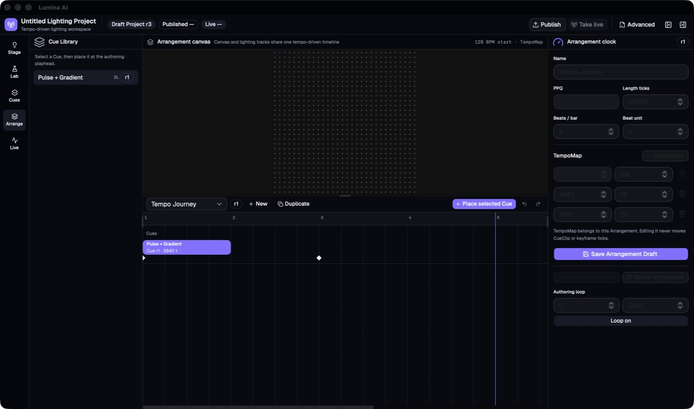
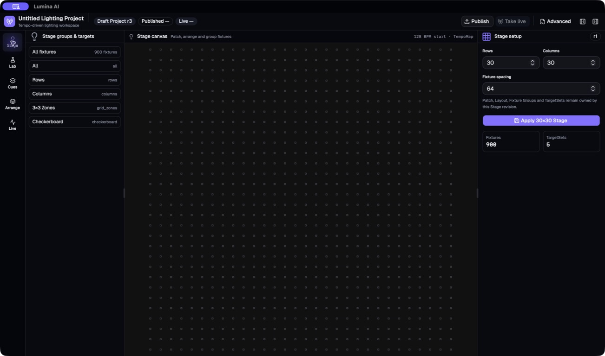
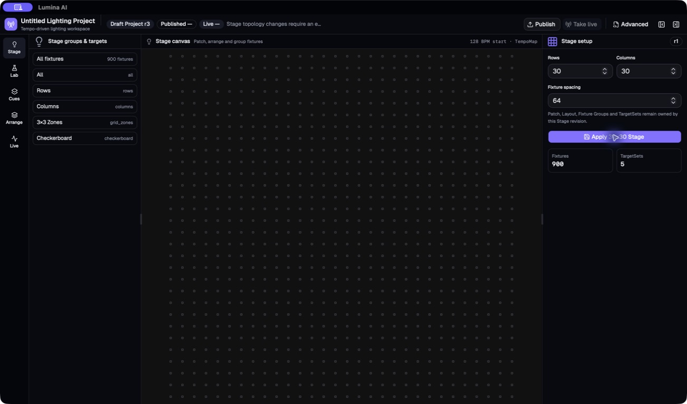
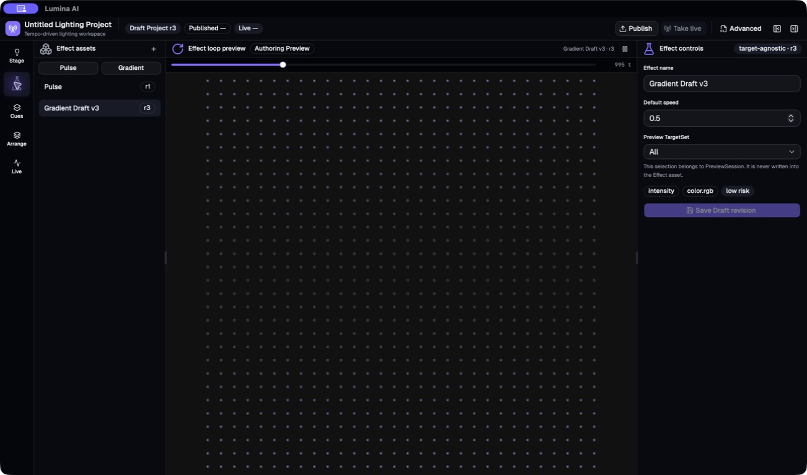
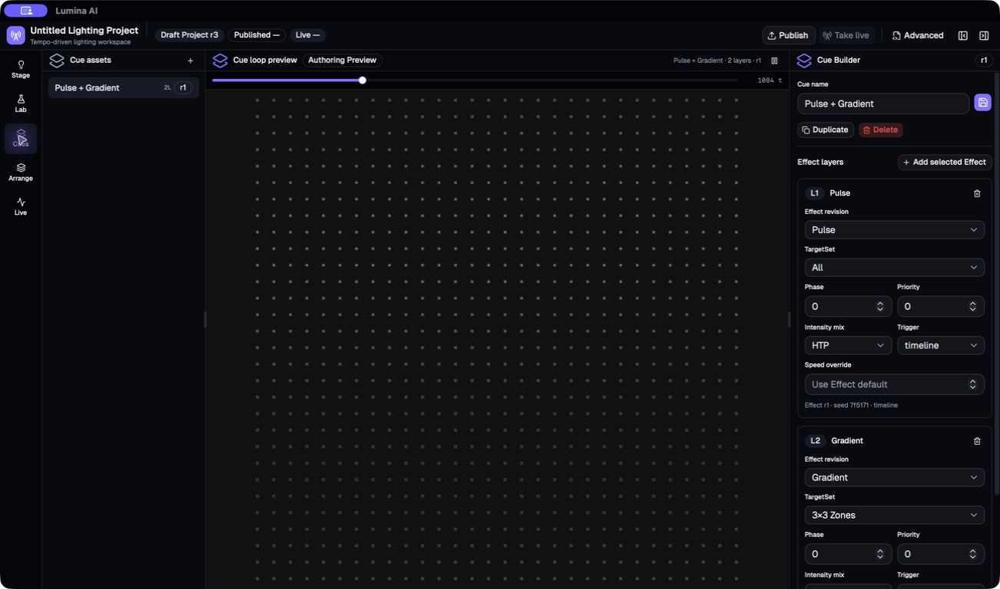
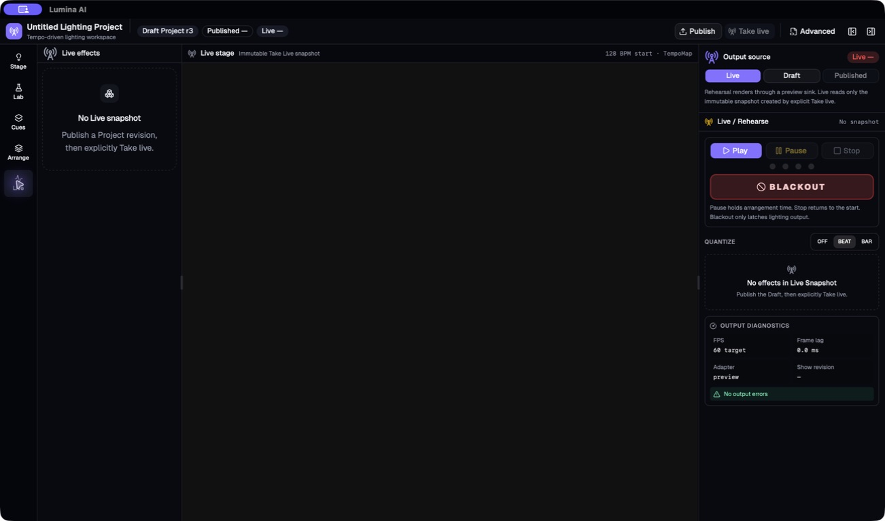

# Stage 7 工作流审计与 Stage 7.5 调整建议

> - 审计日期：2026-08-04
> - 审计基线：`codex/tempo-cue-arrangement@646f336`
> - 审计方式：真实 Tauri 应用、当前持久化 Stage 7 工程、源码与资产 contract 对照
> - 结论：Stage 7 的资产与运行时边界保持；Stage 7.5 必须先补齐作者工作流，再进入 Production Catalog

## 1. 总体判断

Stage 7 已正确建立 Project、Stage、Effect、Cue、Arrangement、TargetSet、PreviewSession 和
Draft/Published/Live revision 边界。Authoring Preview 不再依赖 Take Live，30×30 Canvas、Cue revision pin、
多 Arrangement 和多段 TempoMap 也都有可复现基础。

当前主要问题不是这些 contract 失效，而是为了接入新 contract，新工作区采用了功能较少的临时界面：

- Stage 主路径只剩矩阵表单，原有 circle/formula/custom、Group 编辑和 Draft layout preview 已脱离主路径。
- `Apply Stage` 在工程存在任意 Cue 时硬阻塞，但产品没有 Cue Stage-revision upgrade 流程。
- Effect Lab 与 Cues 只有小型 Play/Pause 和 raw tick scrub，没有可理解的 BPM、拍号、bar/beat/tick 或 Stop。
- Arrange 使用新的最小 `CueTimelinePanel`，没有迁移旧 Timeline 的 zoom、snap、resize 和 automation 编辑能力。
- 完整 Play/Pause/Stop/beat meter 只出现在 Live/Rehearse，造成“要进入 Live 才像是在播放”的认知。

因此不建议重新打开 Stage 7 的资产重构，也不建议分别给临时面板打补丁。Stage 7.5 应增加一个强制的
Authoring Workflow Foundation，先建立共享预览时钟、生产级 CueClip Timeline 和 LayoutPreset 工作流，
再实现动态 Targeting 与 Production Effect/Cue Catalog。

## 2. 现场流程与健康度

### Step 1：Arrange — 功能回归，健康度：差

- 能选择多个 Arrangement、放置和移动 CueClip，也能看到 TempoMap 与已存在的 automation keyframe。
- 工作区没有 Play/Pause/Stop、当前 BPM、拍号和 bar.beat.tick；Canvas 只显示起始 BPM。
- 时间轴使用固定 `48px/beat`，没有 zoom 或 snap 控制。
- automation 只显示成不可聚焦的菱形 `span`，没有 lane、曲线、参数、关键帧添加/移动/数值编辑入口。
- CueClip 只支持移动和删除；缺少 resize、键盘移动/缩放、duplicate、source offset 和 selection inspector。

### Step 2：Stage — 信息架构不匹配，健康度：差

- 左侧标题是 `Stage groups & targets`，内容是只读 Group/TargetSet，而不是用户保存的布局列表。
- 右侧只支持 matrix rows/columns/spacing；contract 已支持 circle、formula、SVG path 和 custom。
- 用户无法复制布局、保存当前布局或另存为新布局，也无法理解当前修改是在编辑布局还是整个 Stage。
- Canvas Draft preview 正常，这是后续 LayoutPreset editor 应复用的稳定基础。

### Step 3：Apply Stage — 被依赖关系硬阻塞，健康度：阻塞

- 只要 `bundle.cues.length > 0`，Apply 就直接返回，不区分 Cue 是否实际引用当前 Stage revision。
- 错误只进入顶部全局状态行，在当前宽度被截断为 `Stage topology changes require an e…`。
- 按钮附近、Inspector 和 Canvas 都没有错误、依赖影响或下一步操作。
- 后端 validator 要求显式升级 Cue，但前端没有 upgrade、remap、keep old revision 或 Save As 流程。

这不是单个按钮 Bug。Stage 7.5 的 LayoutPreset 与 Stage upgrade transaction 会替换此流程，因此无需先给
旧 Apply 按钮增加绕过逻辑；新流程必须消除静默/截断阻塞。

### Step 4：Effect Lab — 可预览但时钟不可理解，健康度：一般

- Effect Draft 能立即循环预览，不依赖 Live，PreviewSession 边界正确。
- 只有 Play/Pause 图标和 raw tick slider；没有 Stop、BPM、拍号、循环小节数或视觉 beat/bar 指示。
- 当前实现以选中 Arrangement 的第一个 tempo point 驱动预览，并硬编码 `960 PPQ` 与 `3840 ticks` 一圈。
- Effect contract 保留 graph 和 parameter schema，但 Inspector 只暴露 name 与 default speed；生产参数编辑应在
  Catalog 重写时统一实现，不应恢复旧 target-bound EffectInstance。

### Step 5：Cues — Layer contract 完整但编辑负担高，健康度：一般

- Cue layer、Effect revision、TargetSet、mix、trigger 与 override 可编辑，revision pin 语义正确。
- Preview 与 Effect Lab 一样缺少可见 BPM/拍号/Stop/bar.beat.tick。
- 所有 layer 的全部字段连续展开，随着 production Cue 增加到 3–5 层后会形成长滚动路径。
- Stage 7.5 应改为 layer list + selected-layer editor，并保留一次只编辑一个明确上下文的 Inspector 语义。

### Step 6：Live/Rehearse — 控制完整但职责被误读，健康度：基础可用

- Live/Rehearse 拥有 Play/Pause/Stop、四拍 meter、Blackout、quantize 与 diagnostics。
- 这些完整控制没有复用于 Authoring，所以用户自然把 Live 理解为“正式开始播放/显示”的入口。
- Live 的安全职责应保持不变；应把通用 authoring transport 提升到 Lab、Cues、Arrange，而不是让编辑行为
  自动 Publish 或 Take Live。

## 3. 代码层原因

| 现象                   | 当前实现                                                                              | 判断                                                            |
| ---------------------- | ------------------------------------------------------------------------------------- | --------------------------------------------------------------- |
| Stage 左侧没有布局资产 | `WorkspaceLibrary` 的 Stage 分支只渲染 Group/TargetSet                                | 由 LayoutPreset Library 替换，不补只读列表                      |
| Apply 无可执行后续     | `ProjectStageInspector` 遇到任意 Cue 即返回；仓库无 Stage upgrade action              | 新增显式依赖升级/映射 transaction                               |
| 基础布局能力消失       | `StageSetupInspector`、`StageLayoutEditor`、`StageGroupEditor` 仍在但不再接入主工作区 | 迁移其已验证能力到新资产模型，之后删除 V4-only 壳               |
| Lab/Cue 时钟隐藏       | `useProjectPreviewController` 使用首个 BPM，且硬编码 960 PPQ/3840 tick loop           | 建立独立 PreviewClock/AuthoringTransport                        |
| 非 4/4 ruler 错误      | `CueTimelinePanel` 固定每 4 beat 标一个 bar                                           | ruler 必须读取 TimeSignatureMap                                 |
| Zoom/automation 消失   | 新 `CueTimelinePanel` 是 300 行最小实现；成熟 `TimelinePanel` 已无调用者              | 抽取统一 Timeline kernel，并以 CueClip/Arrangement adapter 接回 |
| 自动化不可操作         | keyframe 渲染为非交互 `span`                                                          | 恢复 typed lane、curve、keyframe 与 Inspector 全链路            |
| 错误反馈不清晰         | `statusMessage` 只在 Header 显示，且无局部 recovery action                            | action-local Diagnostic + 全局摘要并存                          |

## 4. Stage 7.5 调整后的实施顺序

### 7.5A：Authoring Workflow Foundation

- 建立共享 `AuthoringTransport`：Play/Pause/Stop/Seek/Loop、bar.beat.tick、当前 BPM、拍号和视觉 beat/bar meter。
- Effect/Cue 使用 session-only PreviewClock，可选择 Local BPM/拍号/循环小节或 Follow Arrangement；不得把 BPM
  写入 Effect/Cue 资产。
- Arrange 始终使用选中 Arrangement 的完整 TempoMap/TimeSignatureMap；BPM 显示跟随 playhead。
- 将旧 Timeline 的 zoom、snap、CueClip resize、键盘操作和 typed automation 能力迁移到统一
  `ArrangementTimeline`，不恢复 V4 EffectClip 所有权。
- 所有操作错误在触发位置显示结构化 Diagnostic、原因和 recovery action。

### 7.5B：LayoutPreset 与 Stage 工作流

- 新增可版本化 LayoutPreset/Definition，并由 Project manifest 保存引用；Stage 显式引用选中 layout revision。
- 左侧 Layout Library 分为 Basic 与 Generated/Advanced，但底层使用同一 contract：
  - Basic：matrix、circle、strip/bar、wall、frame，可由表单完整编辑。
  - Generated/Advanced：formula、SVG path、custom 或算法生成；根据 editor capability 显示参数表单、Advanced
    editor 或只读来源说明。
- 右侧提供 Save Draft、Save As、Duplicate、Rename、Delete 与 `Use on Stage`，Canvas 在应用前就预览布局 Draft。
- `Use on Stage` 先展示受影响 Cue/TargetSet；拓扑兼容时一键升级，非兼容时提供 remap、保留旧 Stage revision
  或创建新 Stage，不允许无反馈返回。

### 7.5C：Production Targeting

- 在稳定 Layout revision 上实现 Rows、Columns、R×C Zones、Checkerboard、Center/Edges、fixture IDs、Spatial
  Mask/weight 与 per-bar TargetingScene。
- All → 多分区 → All 只切换 immutable TargetSet/TargetingScene，不修改全局 Fixture Group membership。
- 提供 30×30 及更大布局的可视化选区、命名、复制、预览和引用影响检查。

### 7.5D：Production Effect/Cue Catalog

- 用 Effect parameter schema 驱动完整编辑器，恢复 waveform、speed、phase、width、transition、颜色、强度、
  A/B revision 和风险/能力说明。
- 建立频闪/节奏、慢速氛围、空间扫描、gradient 和 transition 效果族；用共享 transport 验证 BPM/拍号行为。
- Cue Builder 使用 layer list + selected-layer editor，支持 reorder、mute/solo、duplicate 与受控 override。
- 历史配置按保留、重写、合并、隐藏或 legacy fixture 分类；不修将被重写的旧配置 UI。

### 7.5E：整链路收口

- 真实 Tauri 完成 Layout → Effect → Cue → Arrangement → Rehearse/Live，不打开 Raw DSL。
- 覆盖最大化、1440×900、1100×720、键盘路径、保存重开和 inline error recovery。
- 建立多布局 golden frame、1,000 fixtures 多层 benchmark、Timeline 60fps drag gate 与 60Hz render gate。
- 只有 Authoring Workflow、Layout、Targeting 和 Catalog 四组退出条件全部满足后，才能进入 Stage 8。

## 5. 明确保留与替换

保留：Stage 7 asset/revision contract、Project compiler、TargetSet cache、PreviewSession/RenderContext、
Draft/Published/Live 隔离、多 Arrangement、TempoMap 和 30×30 性能修复。

替换：当前 `ProjectStageInspector`、Stage 只读 library、最小 `CueTimelinePanel`、Effect/Cue raw-tick preview bar。

迁移后删除：未接入主路径的 V4-only Stage Setup/Timeline shell。迁移前先复用其中经过测试的 layout form、
PointerEvents、DOM-ref drag、snap、resize、automation 和 keyboard 逻辑，不从零重写这些交互。

## 6. Stage 7.5 用户验收路径

1. 从 Layout Library 复制一个基础 8×16 矩阵，设置 gap 0，Save As `LED Wall 8×16` 并应用到 Stage。
2. 复制一个高级算法布局；只编辑其公开参数，原算法来源和 revision 保持可追踪。
3. 在 Effect Lab 设 128 BPM、4/4、2-bar loop，创建并预览 Pulse 与 Gradient。
4. 在 Cues 中组合 3 层 Effect，切换 3×3 Zones，使用相同 transport Play/Pause/Stop 和 bar.beat.tick。
5. 在 Arrange 中放置、移动、缩放 CueClip，调整 zoom/snap，创建并编辑 automation curve/keyframe。
6. 把 Arrangement 复制为多段 TempoMap 版本；ruler、当前 BPM 与拍号随 playhead 正确变化，tick 不移动。
7. 修改 Stage topology 时得到明确影响列表和 upgrade/remap 选择；取消操作不会改写任何 Cue/Arrangement。
8. Publish/Take Live 后继续编辑 Draft，Live Snapshot 保持不变。

## 7. 可访问性与证据边界

- 当前 icon-only Play/Pause 有 accessible name，主要表单有 Label，这是保留项。
- Apply 的状态变化只出现在截断 Header 文本，触发位置无关联错误；automation 菱形不可键盘聚焦。
- 本次通过 AX tree 和鼠标路径核对主要入口，没有完成屏幕阅读器语音、全键盘、200% zoom 或 reduced-motion
  合规声明；这些必须进入 7.5E 原生验收。
- 为保留当前 Stage 7 持久化工程，本次没有清空 local storage，也没有破坏性修改现有资产。
